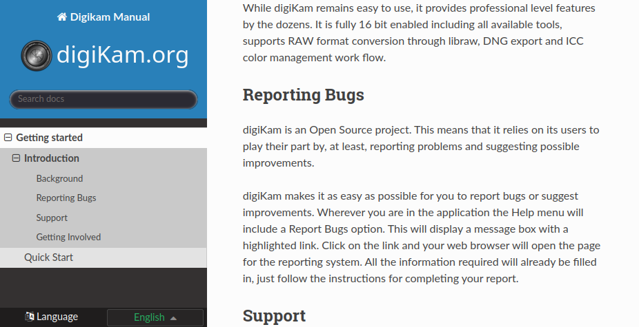
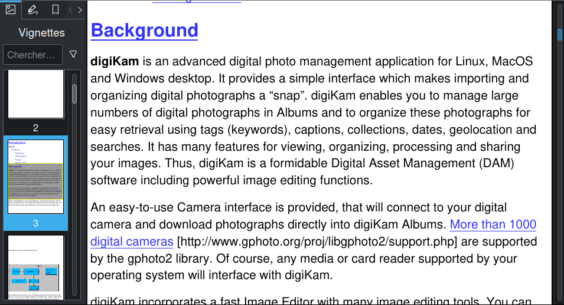

 This repository hosts the digiKam handbook based on [Sphinx](https://www.sphinx-doc.org) framework and [ReStructuredText](https://docutils.sourceforge.io/rst.html) format.

[digiKam](https://www.digikam.org/about/features/) is a powerful Open Source Photo Management Software.

This documentation generated as **HTML** can be read online [here](https://docs.digikam.org/en/index.html).

This documentation generated as **EPUB** can be downloaded [here](https://docs.digikam.org/en/epub/DigikamManual.epub).

[](https://binary-factory.kde.org/job/Website_docs-digikam-org/)

## Setting up Development Environment

Under Ubuntu 22.04:

1. First you need to install [Python version 3](https://www.python.org) and **PIP** (`sudo apt install python3-pip`) as it is required to install Sphinx.
2. You can check whether Python was installed successfully (and your version is 3 and not 2) by running `python --version`
3. Now you can install Sphinx and the Sphinx Theme by using `python -m pip install --upgrade sphinx sphinx_rtd_theme`
4. You can check whether Sphinx was installed successfully by running `sphinx-build --version`

Under Ubuntu 22.10:

1. To install Sphinx and the Sphinx Theme use `sudo apt install python3-sphinx`
2. You can check whether Sphinx was installed successfully by running `sphinx-build --version`

## Running Sphinx On Your Computer

After you cloned this repository (only need to be done once), use a command line to go to its root folder (e.g. with `cd /path/to/digikam-docs`)

### Generate an HTML Web Documentation

Under **Linux:** run `make html`

The HTML is generated in `build/html`. Open the web document by double click `index.html`. It must look like this:

[](project/images/digikam_handbook_HTML.png)

### Generate an EPUB E-book

Under **Linux:** run `make epub`

The EPUB ebook is generated in `build/epub`. Open the ebook file by double click `DigikamManual.epub`. It must look like this:

[](project/images/digikam_handbook_EPUB.png)

## Directories Hierarchy

- LICENSES  : all licenses used in the project.
- build     : temporary dir created when documentation is compiled.
- ressources: Sphinx templates customization.
- po        : link to handbook translations files.
- project   : some helpers scripts.
- tests     : scripts to test repository contents with CI

All others directories are used to host sections of the documentation implmeented in ReStructuredText format.

## Get Involved

### File Hierarchies

ReStructuredText Documentation implementation is located in top level directory in .rst files and sub-directories with the same name
corresponding to the handbook sections. The root entry of the manual is **index.rst**.

Each handbook section start with a .rst file from top level directory and a dedicated
sub-directory with the same name including chapters .rst files and a nested **images** sub-directory to host
screen-shots, taken in PNG format. For example, the **getting_started** section will be organized like this:

```
├── index.rst
├── getting_started.rst
└── getting_started
    ├── images
    │   ├── intro-firstrun-step1.png
    │   ├── intro-firstrun-step2.png
    │   ├── intro-firstrun-step3.png
    │   ├── intro-firstrun-step4.png
    │   ├── intro-firstrun-step5.png
    │   ├── intro-firstrun-step6.png
    │   ├── intro-firstrun-step7.png
    │   ├── intro-firstrun-step8.png
    │   ├── intro-firstrun-step9.png
    │   ├── intro-scanprogress.png
    │   └── intro-toolsinterface.png
    ├── introduction.rst
    └── quick_start.rst
```
### The ReStructuredText Format

ReStructuredText is a simple file format for textual data used primarily in the Python programming language
community for technical documentations. It can be edited with a simple Text Editor application as
[Kate](https://kate-editor.org/) featuring syntax highlighting to help documentation writers.

ReStructuredText is part of the [DocUtils project](https://docutils.sourceforge.io/) from the Python Documentation Special Interest Group,
aimed at creating a set of tools for Python. DocUtils can extract comments and information from ReStructuredText,
and format them into various forms of program documentation.

ReStructuredText is a lightweight markup language designed to be both processable by documentation-processing
software such as DocUtils, and easily readable by human who are reading and writing source code.

Take care that ReStructuredText file (.rst) specificities:

- It's an indent featured markup language. Respect well the spaces on front of blocks to prevent compilation warnings.
- Indent must be done with **4 spaces**, never use tabs at all.
- Always save ResStructuredText file using **UNIX end-of-line**, check well your editor settings before.
- Never use space or minus in file name, uses underscore instead.
- Never uses capitalized forms in filenames, always uses lowercase characters.

A good place to learn **ReStructuredText** format used in this documentation, it's recommended to read:

- [Quick-start](https://docutils.sourceforge.io/docs/user/rst/quickstart.html).
- [Cheat-sheet](http://docutils.sourceforge.net/docs/user/rst/cheatsheet.txt).
- [Reference](http://docutils.sourceforge.net/docs/user/rst/quickref.html).

[This StackOverflow entry](https://stackoverflow.com/questions/2746692/restructuredtext-tool-support) list the tools avaialble to work with ResStructuredText files.

### Sphinx Framework

The Python based Sphinx documentation generator translates a set of reStructuredText source files into various output formats,
automatically producing cross-references, indices etc. It just used at run-time with the **make html** command to
render contents, and reports warnings/errors.

Documentation writer will never touch the Sphinx configuration.

### Contribute Workflow

To help us to write this English documentation, you must use a standard git workflow based on the Fork/Merge Request mechanism.
You will not have direct access to this repository.
All new contributors must process as below:

- Create an account at [KDE identity](https://identity.kde.org/).
- Be logged with this account to [KDE git server](https://invent.kde.org/users/sign_in).
- [Fork this project](https://invent.kde.org/documentation/digikam-doc/-/forks/new) to your account.

All contributor changes must be performed in this forked repository. Contributors can use the web interface to edit
existing files or to clone the repository on a computer to process advanced operations such as to create new contents.
At the end, the contributor commits the new files in the forked repository.

When all contributor tasks are done, a Merge Request must be send to the original (Central) project to:

- Notify the coordinator about the contribution.
- Coordinator will review the changes.
- Coordinator can post comments in the Merge Request if something is wrong (aka ReStructuredText compilation fails with the Continuous Integration).
- Contributor must adjust, comment, or rebase changes in the forked repository accordingly with coordinator feedback.
- When all is ready, coordinator merge changes from the forked repository to the original repository.

Later, a contributor can re-use the forked repository to rebase contents with original. The forked repository
will be up-to-date and the contributor can create a new Merge Request with new changes to integrate in the original repository.

This git workflow is well [documented in KDE project](https://community.kde.org/Infrastructure/Git/Simple_Workflow).

### Screenshots Capture

- Always use digiKam AppImage version 8 and later under Linux/Plasma desktop to take screenshots.

- Always use **White Balance** color theme to take screenshots with desktop default icon set (select color theme from Settings/Themes menu).

- No face/people present in photo hosted in screenshots.

- No digiKam version number must be present in screeshots.

- Desktop and application must be in English only. Do not mix languages.

- Use a tool as [Spectacle](https://apps.kde.org/spectacle/) to take a shot. Use the region selection option to capture only important area.

- Remove unecessary buttons and dialog header to limit image file size.

- Always use **PNG** file format to save images to prevent compression artifacts.

### PNG Optimizations

Since the documentation is very good it is also very demanding in terms of volume, 80% whereof are screen-shots.

In order to limit the byte count to the minimum the following command chain shall be used to reduce the png file size.

A factor of 2-4 can be gained. From within the folder where the png resides, use script project/optpng.sh.
This script requires [pngnq](https://pngnq.sourceforge.net/) and [optipng](https://optipng.sourceforge.net/) command line tools installed on your system.

To process all png files in one step use this command line from the root directory of this project:

```
find *.png | xargs -0 ./optpng.sh
```

### Gif Animations

Another format supported inside the documentation is animated Gif. It can be used to present a region of screen
from the application while an operation is under progress. It's perfect to write tutorials. Animated Gif is also
supported into EPUB container.

To prevent huge Gif files, just capture the right area to present in application and limit capture to less than 10 seconds,
with a frames rating set to 12 by seconds.

A good tool to capture video from desktop is [SimpleScreenRecorder](https://www.maartenbaert.be/simplescreenrecorder/).

### Translations

The documentations are internationalized by KDE translator teams. In this repository, only the native English
version is maintained and text is written in ReStructuredText containers. These files are parsed daily by
maintenance scripts which extract strings to translate. Processed contents are exported to dedicated
containers for translators.

The daily script is hosted in **l10n-scripty** repository and call **StaticMessages.sh** from there through [this script](https://invent.kde.org/sysadmin/l10n-scripty/-/blob/master/process-static-messages.sh).

When translations are updated by the translator teams, files are send back by other maintenance scripts to this project,
in order to compile internationalized versions of ReStructuredText files. These files are linked in po/ sub-directories
from this project for conversion to HTML/EPUB.

This project is not involved in the translation workflow. Please contact [KDE translation teams](https://l10n.kde.org/docs/index-script.php)
if you want to contribute to the internationalization.

The status of the digiKam documentation translations is available [here](https://l10n.kde.org/stats/doc/trunk-kf5/package/digikam-doc/).

The infrastrusture configuration to rule translations is located in docs-digikam-org section [of this file](https://invent.kde.org/sysadmin/binary-factory-tooling/-/blob/master/staticweb/custom-jobs.json).

### Rational

See the technical details from [this Phabricator entry](https://phabricator.kde.org/T16036) about the DocBook to Sphinx/ReStructuredText manual conversion.