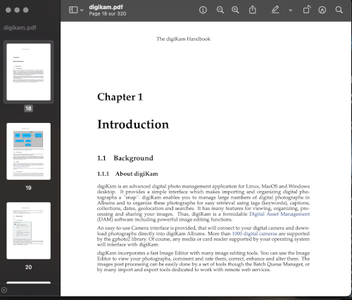

 This repository host the digiKam handbook based on DocBook format.

[digiKam](https://www.digikam.org/about/features/) is a powerful Open Source Photo Management Software.

# How to Build the Handbook

## Dependencies

To compile the documentation, install the following development packages:

* [CMake](https://www.cmake.org) >=3.16.0
* [ECM](https://invent.kde.org/frameworks/extra-cmake-modules) >= 5.55.0
* [KF5::I18n](https://invent.kde.org/frameworks/ki18n) >= 5.55.0
* [KF5::DocTools](https://invent.kde.org/frameworks/kdoctools) >= 5.55.0
* [GetText](https://www.gnu.org/software/gettext) >= 0.20.0

Under Linux Ubuntu, run this command line to install relevant packages:

```
sudo apt install cmake extra-cmake-modules gettext libkf5i18n-dev libkf5doctools-dev build-essential qttools5-dev-tools khelpcenter
```

## Compilation

If you checkout this git repository, and if you resolve the dependencies, DocBook files can be compiled
under Linux from a console using steps below which will create a build/ sub-directory to store
necessary files used during compilation:

```
bootstrap.sh
cd build
make
```

To install the documentations on your system, enter the command below from the build/ sub-directory:

```
sudo make install/fast
```

To uninstall the documentations from your system, enter the command below from the build/ sub-directory:

```
sudo make uninstall
```

## Displaying Installed Documentation

When the documentation is installed on the system, under Linux KDE Plasma desktop you can start the
Help Center desktop application to display the contents. For the the digiKam handbook,
just enter this command line from a console:

```
khelpcenter help:/digikam
```

For the Showfoto handbook:

```
khelpcenter help:/showfoto
```

[](project/images/showfoto_khelpcenter.png)

# Working on this Project

## Continuous Integration

At all changes done in this repository, as commits and Merge Request, the [Continuous Integration](https://en.wikipedia.org/wiki/Continuous_integration)
will recompile automatically all the contents to check the validity of the DocBook files, including the current translations
of the documentations.

The [CI/CD section](https://invent.kde.org/documentation/digikam-doc/-/pipelines) section list the history of
the continuous integration pipelines.

## Continous Deployement

This documentation in English is weekly generated and [published here as HTML and PDF](https://docs.kde.org/index.php?language=en&package=digikam-doc).

If the compilation of the internationalized versions can be completed with the Continuous Deployement workflow,
you can show a translated version of this documentation by selecting a language from the left side of the publication page.

[](project/images/digikam_handbook_HTML.png)

[](project/images/digikam_handbook_PDF.png)

## Directories Hierarchy

- LICENSES : all licenses used in the project.
- digikam  : the main digiKam docbook and png files for the handbook.
- po       : link to handbook translations files.
- showfoto : the Showfoto docbook files, aka the digiKam Image Editor stand alone version.
             Mostly of the Showfoto documentation are shared with the digiKam documentation implementation.
- project  : some helpers scripts.

## Translations

The documentations are internationalized by KDE translator teams. In this repository, only the native English
version is maintained and text are writted in DocBook container. These files are parsed daily by scripts which
extract strings to translate. Contents are finaly exported to dedicated containers for translators.

When translations are updated by the transltor teams, files are re-injected back by others scripts to this project,
in goal to compile internationalized versions of DocBook files. These files are linked in po/ sub-directories from
this project for future conversion to HTML/PDF or for packaging.

This project is not involved to translations workflow. Please contact [KDE translation teams](https://l10n.kde.org/docs/index-script.php)
if you want to contribute to the documentation internationalization.

## Contribute Workflow

To help us to write this English documentation, you must use a standard git worflow based on Fork/Merge Request mechanism.
You will not have a direct access to this repository.
All new contributors must process as below:

- Create an account to [KDE identity](https://identity.kde.org/).
- Be logged with this account to [KDE git server](https://invent.kde.org/users/sign_in).
- [Fork this project](https://invent.kde.org/documentation/digikam-doc/-/forks/new) to your account.

All contributor changes must be performed in this forked repository. Contributors can use the web interface to edit
existing files or to clone the repository on a computer to process advanced operations as to create new contents.
At end, contributor commits new file in the forked repository.

When all contributor tasks are done, a Merge Request must be send to the original (Central) project to:

- Notify coordinator about the contribution.
- Coordinator will review the changes.
- Coordinator can post comments in the Merge Request if something is wrong (aka DocBook compilation fails with the Continuous Integration).
- Contributor must adjust, comment, or rebase changes in the forked repository accordignly with coordinator feedbacks.
- When all is ready, coordinator merge changes from the forked repository to the original repository.

Later, a contributor can re-use the forked repository to rebase contents with original. Forked repository
will be up-to-date and contributor can create a new Merge Request with new changes to integrate in original repository.

This git workflow is well [documented in KDE project](https://community.kde.org/Infrastructure/Git/Simple_Workflow).

## Current Project Tasks

A list of pending tasks to do on this project is available in the [TODO file](TODO).

# Working on The Handbook Contents

## The DocBook Format

The documentation written in English use the [DocBook](https://en.wikipedia.org/wiki/DocBook) format.
DocBook is based on XML and host contents by sections separated by tags, similar than a simplified HTML.
It includes hierarchical paragraphes, use titles to identify sections, and can host screenshots in PNG format.
DocBook can be processed and exported to other format as HTML and PDF for example.

Mostly of the documentation are full English text section written to describe the digiKam features. There are
easy to create and maintain. A simple text editor supporting colors syntax is enough to work on a DocBook file.

If you want to lear more about this format, take a look to [this KDE tutorial](https://l10n.kde.org/docs/doc-primer/index.html)

## File Structures

The substructure of the help files that develop as a tree are created by <chapter> tags.

Respect the file naming convension ordred by chapter name, main section, and title resume, separated by minus.

The digiKam DocBook files are shared with the Showfoto handbook.

## Take a screenshot with Alpha Blending 3D Border

- Never use advanced color theme to take screenshots. Always use desktop default color and icon set.

- Use Festival Import to take a shot. Use region selection option to select only
  important area. Remove buttons and dialog header to limit image file size.
  Always use PNG file format to save image to prevent compression artifacts.

- Use script project/screenshot-dropshadow.sh to add border frame around the shot.
  This script requires ImageMagick command line tools installed on the system.

The script can be run on a single file or in batch mode. To run in batch
mode, call it like this from within the images folder:

```
screenshot-dropshadow.sh -b png
```

where <png> is the file extenion to look for. The script can be used
with additional arguments, see '-h' for more options.

## PNG screenshot optimizations

Since the documentation is very good it is also very demanding in terms of volume, 80% whereof are screenshots.

In order to limit the byte count to the minimum the following command chain shall be used to reduce the png file size.

A factor of 2-4 can be gained. From within the folder where the png reside, use script project/optpng.sh.
This script requires pngnq and optipng command line tools installed on the system.

To process all png files in one step use this command line:

```
find *.png | xargs -0 ./makess.sh
```

# Links

- [Converting handbook in PDF or Epub](https://userbase.kde.org/How_To_Convert_a_UserBase_Manual_to_Docbook#Converting_into_PDF)
- [Get Involved in the KDE Documentation workflow](https://community.kde.org/Get_Involved/documentation)

# Credits

[digiKam team](https://www.digikam.org/support/contact/)

