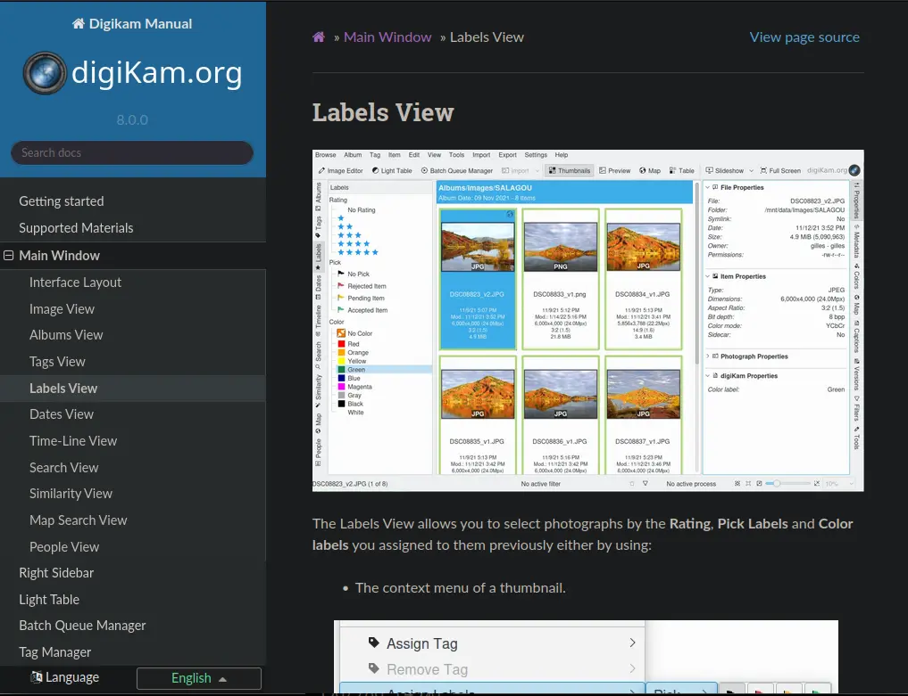
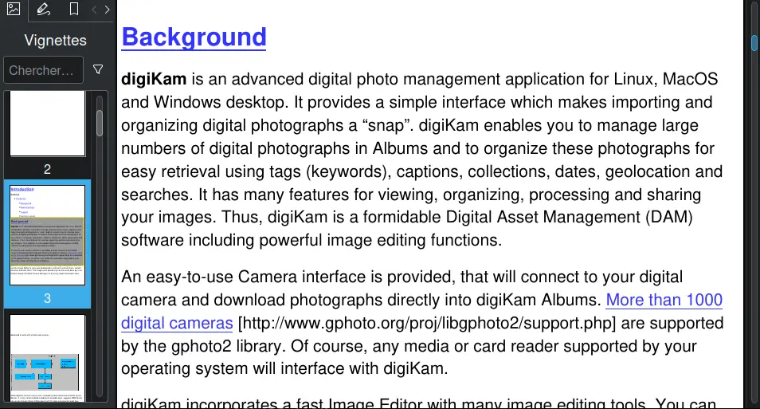

 This repository hosts the digiKam handbook based on [Sphinx](https://www.sphinx-doc.org) framework and [ReStructuredText](https://docutils.sourceforge.io/rst.html) format.

[digiKam](https://www.digikam.org/about/features/) is a powerful Open Source Photo Management Software.

This documentation generated as **HTML** can be read online [here](https://docs.digikam.org/en/index.html).

This documentation generated as **EPUB** can be downloaded [here](https://docs.digikam.org/en/epub/DigikamManual.epub).

[](https://binary-factory.kde.org/job/Website_docs-digikam-org/)

## Setting Up Development Environment

Under Ubuntu 22.04 and later:

1. To install Sphinx and the Sphinx Theme use `sudo apt install python3-sphinx python3-sphinx-rtd-theme`
2. You can check whether Sphinx was installed successfully by running `sphinx-build --version`

## Running Sphinx on Your Computer

After you cloned this repository (only need to be done once), use a command line to go to its root folder (e.g. with `cd /path/to/digikam-docs`)

### Generate an HTML Web Documentation

Under **Linux:** run `make html`

The HTML is generated in `build/html`. Open the file `index.html` in your preferred web browser. It must look like this:

[](project/images/handbook_HTML.webp)

### Generate an EPUB E-book

Under **Linux:** run `make epub`

The EPUB ebook is generated in `build/epub`. Open the file `DigikamManual.epub` in your preferred e-book reader. It must look like this:

[](project/images/handbook_EPUB.webp)

## Directories Hierarchy

- [LICENSES](LICENSES)    : all licenses used in the project.
- build                   : temporary dir created when documentation is compiled.
- [locale](locale)        : link to updated handbook translations files. Files are updated all nights.
- po                      : Obsolete, not used. Replaced by locale directory.
- [project](project)      : some helpers scripts and LibreOffice schemes.
- [ressources](ressources): Sphinx templates customization.
- [tests](tests)          : scripts to test repository contents with Continuous integration.

All others directories are used to host sections of the documentation implemented in ReStructuredText format.

## Get Involved

### File Hierarchies

ReStructuredText documentation implementation is located in top level directory in .rst files and sub-directories with the same name
corresponding to the handbook sections. The root entry of the manual is [index.rst](index.rst).

Each handbook section start with a .rst file from top level directory and a dedicated
sub-directory with the same name including chapters .rst files, a nested **images** sub-directory to host
screen-shots, taken in WEBP format, and a nested **videos** sub-directory to host screen-casts in animated Gif format.

For example, the **getting_started** section will be organized like this:

```
├── index.rst
├── getting_started.rst
└── getting_started
    ├── images
    │   ├── firstrun_step1.webp
    │   ├── firstrun_step2.webp
    │   ├── firstrun_step3.webp
    │   ├── firstrun_step4.webp
    │   ├── firstrun_step5.webp
    │   ├── firstrun_step6.webp
    │   ├── firstrun_step7.webp
    │   ├── firstrun_step8.webp
    │   ├── firstrun_step9.webp
    │   ├── macos_pkg_installer.webp
    │   ├── macos_pkg_security.webp
    │   ├── macos_pkg_warning.webp
    │   ├── models_downloader.webp
    │   ├── scan_progress.webp
    │   └── tools_interface.webp
    ├── installation.rst
    ├── introduction.rst
    ├── quick_start.rst
    └── videos
        └── appimage_startup.webp

```

**getting_started.rst** is the root entry of the **Geting Started** section of this manual.
All others nested **.rst** files hosted in **getting_started** sub-directory are chapters in this section.

### ReStructuredText Sections/Chapters/References Implementation

As example, we will develop how the **getting_started** section of the manual is implemented.

- From the top level **index.rst**, the section is declared like this:

```
Implementation                                                                                              Comments

...                                                                                                         Other previous sections are there

###############
Getting started                                                                                             Section title declared on the front page
###############
.. figure:: images/index_getting_started.webp                                                               Visual preview of the section
    :width: 300px                                                                                           Limit preview size
    :alt:                                                                                                   No alternative description
    :target: getting_started.html                                                                           Preview link on the documentation

.. container:: toctile                                                                                      Chapter from the section will be hosted in a container

    .. container:: tile no-descr                                                                            A sub-container for a chapter

        :ref:`application_intro`                                                                            Link to the 1st chapter

    .. container:: tile no-descr

        :ref:`application_install`                                                                          Link to the 2nd chapter

    .. container:: tile no-descr

       :ref:`quick_start`                                                                                   Link to the 3rd chapter

    .. container:: tile no-descr

        :ref:`database_intro`                                                                               Link to the last chapter

.. toctree::
   :maxdepth: 2                                                                                             We will descend to the 2 level from nested hierarchy
   :hidden:

   getting_started                                                                                          The name of the rst file implementing the section

...                                                                                                         Other next sections are there
```

Next file is the **getting_started.rst** listing all chapters from the section:

```
Implementation                                                                                              Comments

.. meta::                                                                                                   The metadata section of the document
   :description: Do Your First Steps in digiKam Photo Management Program                                    Some words to describe the section
   :keywords: digiKam, documentation, user manual, photo management, open source, free, help, learn         Words list used with the search engine

.. metadata-placeholder                                                                                     The license/credit lists (same for all rst files)

   :authors: - digiKam Team

   :license: see Credits and License page for details (https://docs.digikam.org/en/credits_license.html)

.. _getting_started:                                                                                        Internal reference for this section

###############
Getting started                                                                                             Section title
###############

This section give an overview to start with digiKam.                                                        A small description visible on the page

.. toctree::                                                                                                List of chapters in this section
   :maxdepth: 2
   :caption: Contents:
   :glob:

   getting_started/introduction.rst                                                                         Rst files hierarchy ordered.
   getting_started/installation.rst
   getting_started/quick_start.rst
   getting_started/database_intro.rst
```

And finally, the chapter implementation of the section, here the first one, as all others uses the same kind of code:

```
Implementation                                                                                              Comments

.. meta::                                                                                                   The metadata section of the document
   :description: Introduction to digiKam Photo Management Program                                           Some words to describe the chapter
   :keywords: digiKam, documentation, user manual, photo management, open source, free, learn, easy         Words list used with the search engine

.. metadata-placeholder                                                                                     The license/credit lists (same for all rst files)

   :authors: - digiKam Team

   :license: see Credits and License page for details (https://docs.digikam.org/en/credits_license.html)

.. _application_intro:                                                                                      Internal reference for this chapter

Introduction                                                                                                Chapter title
============

.. contents::

Background                                                                                                  First sub title of this chapter
----------

...                                                                                                         The implementation continue here...
```

### Sphinx Framework

The Python based Sphinx documentation generator translates a set of reStructuredText source files into various output formats, automatically producing cross-references, indices etc. It just used at run-time with the **make html** command to render contents, and reports warnings and errors.

Documentation writer will never touch the Sphinx configuration.

### The ReStructuredText Format

ReStructuredText is a simple file format for textual data used primarily in the Python programming language
community for technical documentations. It can be edited with a Text Editor application as powerful
[Kate](https://kate-editor.org/) featuring syntax highlighting and spellchecking to help documentation writers.

ReStructuredText is part of the [DocUtils project](https://docutils.sourceforge.io/) from the Python Documentation Special Interest Group,
aimed at creating a set of tools for Python. DocUtils can extract comments and information from ReStructuredText,
and format them into various forms of program documentation.

ReStructuredText is a lightweight markup language designed to be both processable by documentation-processing
software such as DocUtils, and easily readable by human who are reading and writing source code.

Take care that ReStructuredText file (.rst) specificity:

- It's an indent featured markup language. Respect well the spaces on front of blocks to prevent compilation warnings.
- Indent must be done with **4 spaces**, never use tabs at all.
- Always save ResStructuredText file using **UNIX end-of-line**, Check your editor settings before.
- Never use space or minus in file name, uses underscore instead.
- Never uses capitalized forms in filenames, always uses lowercase characters.

A good place to learn **ReStructuredText** format used in this documentation, it's recommended to read:

- [Quick-start](https://docutils.sourceforge.io/docs/user/rst/quickstart.html).
- [Cheat-sheet](http://docutils.sourceforge.net/docs/user/rst/cheatsheet.txt).
- [Reference](http://docutils.sourceforge.net/docs/user/rst/quickref.html).
- [Markup Languages Synthesis](https://hyperpolyglot.org/lightweight-markup).

[This StackOverflow entry](https://stackoverflow.com/questions/2746692/restructuredtext-tool-support) list the tools available to work with ResStructuredText files.

### ReStructuredText Syntax Reminders

Type                                 | Syntax
-------------------------------------|------------------------------------------------------------------------------
Menu Entry                           | ``` :menuselection:`View --> Sort Albums --> By Category` ```
Keyboard Shortcut                    | ``` :kbd:`CTRL + w` ```
Internal Reference Definition        | ``` .. _album_view: ```
Link to Internal reference           | ``` :ref:`the Album section <albums_view>` ```
Link to External Url                 | ``` `digiKam Home Page <https://www.digikam.org/>`_ ```
Italic Text                          | ``` *Cancel button* ```
Bold Text                            | ``` **Ok button** ```
File Name                            | ``` :file:`recogintion.db` ```
Raw Text Section (as console output) | ``` .. code-block:: text ```
Inline Icon Declaration              | ``` .. \|icon_fullscreen\| image:: images/mainwindow_icon_fullscreen.webp ```
Inline Icon Usage                    | ``` \|icon_fullscreen\| ```
GUI Elements (button, label, title)  | ``` :guilabel:`Start Encoding...` ```
Section Title Level 1                | ``` ============ ```
Section Title Level 2                | ``` ------------ ```
Section Title Level 3                | ``` ~~~~~~~~~~~~ ```

Table example:
```
============== ========== =======
Title 1        Title 2    Title 3
============== ========== =======
Item 1         Value 1    Value 2
Item 2         Value 1    Value 2
Item 3         Value 1    Value 2
Item 4         Value 1    Value 2
Item 5         Value 1    Value 2
============== ========== =======
```
Nested list
```
- Level 1

    - Level 2
    - Level 2

- Level 1

    - Level 2
    - Level 2
    - Level 2
    - Level 2
```

### Contribute Workflow

To help us to write this English documentation, you must use a standard git workflow based on the Fork/Merge Request mechanism.
You will not have direct access to this repository.
All new contributors must process as below:

- Create an account at [KDE identity](https://identity.kde.org/).
- Be logged with this account to [KDE git server](https://invent.kde.org/users/sign_in).
- [Fork this project](https://invent.kde.org/documentation/digikam-doc/-/forks/new) to your account.

All contributor changes must be performed in this forked repository. Contributors can use the web interface to edit
existing files or to clone the repository on a computer to process advanced operations such as to create new contents.
At the end, the contributor commits the new files in the forked repository.

When all contributor tasks are done, a Merge Request must be send to the original (Central) project to:

- Notify the coordinator about the contribution.
- Coordinator will review the changes.
- Coordinator can post comments in the Merge Request if something is wrong (aka ReStructuredText compilation fails with the Continuous Integration).
- Contributor must adjust, comment, or rebase changes in the forked repository accordingly with coordinator feedback.
- When all is ready, coordinator merge changes from the forked repository to the original repository.

Later, a contributor can re-use the forked repository to re-base contents with original repository. The forked repository
will be up-to-date and the contributor can create a new Merge Request with the new changes to integrate in the original repository.

To have the forked repository sync with the original 'origin' upstream, uses this git command in your fork:

`git fetch origin`

To rebase your fork just call this git command:

`git merge origin/master`

This git workflow is well [documented in KDE project](https://community.kde.org/Infrastructure/Git/Simple_Workflow).

### WEBP Screenshot Capture

- Always use digiKam AppImage version 8 and later under Linux/Plasma desktop to take screenshots.

- Always use **White Balance** color theme to take screenshots. Select theme from **Settings/Themes** menu.

- Always use **Breeze** widget style and icon theme. Select widget/icon theme from **Setup/Miscs/Appearance** configuration dialog page.

- No face/people present as possible in photo hosted in screenshots.

- No digiKam version number must be present in screenshots.

- Desktop and application must be in English only. Do not mix languages.

- Use a tool as [Spectacle](https://apps.kde.org/spectacle/) to take a shot. Use the region selection option to capture only important area.

- Remove unnecessary buttons and dialog header to limit image file size.

- Always use **WEBP** file format to save images.

- Do not use space and capitalized characters in file name.

- WEBP files must be hosted in **images/** sub-folders from each documentation section.

- To include the screenshot in a ReStructuredText file, use the syntax below;

```
.. figure:: images/my_screen_shot.webp
    :alt:
    :align: center

    My Screenshot Legend
```

### Animated WEBP Screen-cast Capture

Another format supported inside the documentation is **Animated WEBP** as video. It can be used to present a region of screen
from the application while an operation is under progress. It's perfect to write tutorials.

Use the same specifications to take screen-cast than for screenshot, aka color theme, widget style, icon theme, etc.

To prevent huge animated WEBP files, just capture the right area from application and limit capture to less than 10 seconds.
You can edit animated WEBP in [The Gimp](https://www.gimp.org/) to reduce size and specify **video in loop** feature.

A good tool to capture video from desktop is [SimpleScreenRecorder](https://www.maartenbaert.be/simplescreenrecorder/).

Configuration:

    - Container : WEBM.
    - Codec : VP8.
    - Bitrate: 5000 kbit/s.
    - Record cursor.

Do not use space and capitalized characters in file name.

This will record a screen-cast in WEBM format. Even if WEBM is supported in HTML and EPUB,
Sphinx framework is not yet able to embed WEBM in EPUB.
Convert it to animated WEBP using [project/webm2webp.sh](project/webm2webp.sh) script.

Loop animated WEBP files must be hosted in **videos/** sub-folders from each documentation section.

- To include the screen-cast in a ReStructuredText file, use the syntax below:

```
.. figure:: videos/my_screen_cast.webp
    :width: 600px
    :alt:
    :align: center

    My Screen-cast Legend
```

### Translations

#### Overview

The documentations are internationalized by KDE translator teams. In this repository, only the native **American English (United States)** version is maintained and text is written in ReStructuredText containers. These files are daily parsed by maintenance scripts to extract strings and exported to dedicated containers for translators.

In the background, a [top level script](https://invent.kde.org/sysadmin/l10n-scripty/-/blob/master/process-static-messages.sh) from **l10n-scripty** repository call **StaticMessages.sh** script from this repository.

When translations are updated by the translator teams, files are send back by other maintenance scripts to this project,
in goal to compile internationalized versions of ReStructuredText files. These files are linked in [locale/](locale) sub-directories
from this project for conversion to HTML/EPUB.

This project is not involved in the translations workflow. Please contact [KDE translation teams](https://l10n.kde.org/docs/index-script.php)
if you want to contribute to the internationalization.

The template files to translate for this documentation must be located on [this i10n Subversion repository](https://websvn.kde.org/trunk/l10n-kf5/templates/messages/digikam-doc/).
All POT file-names starts with **docs_digikam_org** prefix.

The status of the digiKam documentation translations is [available here](https://l10n.kde.org/stats/gui/trunk-kf5/package/digikam-doc/).

Important: Only files listed as **Reviewed** in [TODO](TODO) list are ready for translations.

#### How to Add a New Target Language

The list of current enabled translation languages are in the [locale/](locale) sub-directory.
Corresponding languages must be enabled in the documentation web-site following this list. 4 files needs to be patched:

- The **alllang** list from the [version_switch JavaScript file](resources/static/js/version_switch.js) located at **resources/static/js/** from this git repository.
- The **supported_languages** list from the [404handler PHP file](404handler.php) located at root from this git repository.
- The **script** section from [gitlab CI Yaml config file](.gitlab-ci.yml) located at root from this git repository, where a new line must be add to generate the supported language in the Continuous Integration workflow.
- The section named **docs-digikam-org** from the [custom-jobs Json infrastrusture configuration](https://invent.kde.org/sysadmin/binary-factory-tooling/-/blob/master/staticweb/custom-jobs.json) dedicated to rule translations.

#### How to Compile a Supported Language

By default the make command generate the English version. If you want to test an internationalized version using translations hosted from **locale** directory,
use the syntax below:

`make -e SPHINXOPTS="-D language='fr'" html`

This will generate the French version of the document in HTML. Replace 'fr' by another code to build a translated version, as 'es', 'de', etc.

## TODO List

See [TODO](TODO) file from this repository.

## Continuous Integration

At all changes done in this repository, as commits and Merge Requests, the [Continuous Integration](https://en.wikipedia.org/wiki/Continuous_integration)
will recompile automatically all the contents to check the validity of the ReStructuredText files, including the current translations
of the documentations.

The [CI/CD section](https://invent.kde.org/documentation/digikam-doc/-/pipelines) lists the history of the continuous integration pipelines.

## Continous Deployement

This documentation is automatically updated online (including translations) at each changes passing the CI.

If the compilation of the internationalized versions can be completed with the Continuous Deployment workflow,
you can show a translated version of this documentation by selecting a language from the left side of the publication page.

## Convert EPUB to PDF

Sphinx allows to generate PDF using Latex engine in background, but thid converter as several limitations, as the non support of WEBP and GIF formats used for screenshots and screen-casts.

An alternative is to install [Calibre](https://calibre-ebook.com/) and to convert the EPUB target to PDF like this:

`ebook-convert build/epub/DigikamManual.epub build/epub/DigikamManual.pdf`

The PDF file is generated in `build/epub`. Open the file `DigikamManual.pdf` in your preferred PDF reader.

Note: unlike EPUB, PDF is only for print purpose. During conversion video screen-casts will be converted as still images, and all Internet links will be dropped.

## Rationale

See the technical details from [this Phabricator entry](https://phabricator.kde.org/T16036) about the DocBook to Sphinx/ReStructuredText manual conversion.
