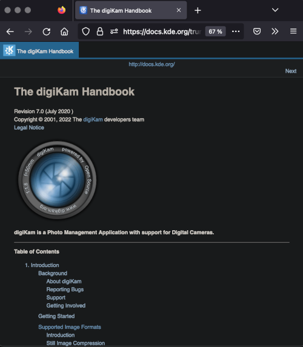
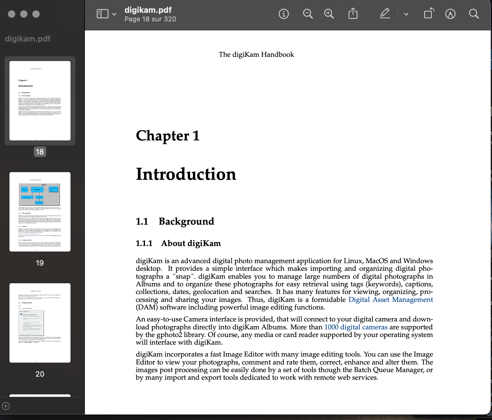

This repository host the digiKam handbook based on [DocBook](https://en.wikipedia.org/wiki/DocBook) format.

[digiKam](https://www.digikam.org/about/features/) is a powerful Open Source Photo Management software.


[](project/images/digiKam_handbook_HTML.png)

[](project/images/digiKam_handbook_PDF.png)

# Dependencies

To compile the documentation, install the following development packages:

* [CMake](https://www.cmake.org) >=3.16.0
* [ECM](https://invent.kde.org/frameworks/extra-cmake-modules) >= 5.55.0
* [KF5::I18n](https://invent.kde.org/frameworks/ki18n) >= 5.55.0
* [KF5::DocTools](https://invent.kde.org/frameworks/kdoctools) >= 5.55.0
* [GetText](https://www.gnu.org/software/gettext) >= 0.20.0

# Compilation

If you checkout this git repository, and if you resolve the dependencies, DocBook files can be compiled
under Linux from a console using steps below which will create a build/ sub-directory to host documentation
temporary files:

```
# bootstrap.sh
# cd build
# make
```

To install the documentions on your system, enter the command below from the build/ sub-directory:

```
# make install/fast
```

To uninstall the documentations from your system, enter the command below from the build/ sub-directory:

```
# make uninstall
```

# Continuous Integration

At all changes in this repository as commits and Merge Request, the [Continuous Integration](https://en.wikipedia.org/wiki/Continuous_integration)
will recompile automatically all the contents to check the validity of the DocBook files, including the current translations
of the documentations.

See the [CI/CD section](https://invent.kde.org/documentation/digikam-doc/-/pipelines) for details.

# Continous Deployement

This documentation in English is weekly generated and [published here as HTML and PDF](https://docs.kde.org/index.php?language=en&package=digikam-doc).

If the compilation of the internationalized versions can be completed with the Continuous Deployement workflow,
you can show a translated version of this documentation by selecting a language from the left side of this page.

# Directories Hierarchy

- LICENSES : host all licenses used in the project.
- digikam  : host the main digiKam docbook and png files for the handbook.
- po       : link to handbook translations files.
- showfoto : host the Showfoto docbook files, the digiKam Image Editor stand alone version.
             Mostly of the Showfoto documentation are shared with the digiKam documentation implementation.
- project  : host some helpers scripts.

# Translations

The documentations are internationalized by KDE translators teams. In this repository, only the native English
version is maintenained and text are writted in DocBook container. These files are parsed daily by scripts to
extract strings to translate. Contents is exported to dedicated containers for translators.

When translations are updated, files are re-injected back by others scripts to compile internationalized versions
of DocBook files, linked in po/ sub-directories of this project for future conversion to HTML/PDF or for packaging.

This project is not involved to translations workflow. Please contact [KDE translation teams](https://l10n.kde.org/docs/index-script.php)
if you want to contribute to the documentation internationalization.

# File Structures

The substructure of the help files that develop as a tree are created by <chapter> tags.

Respect the file naming convension ordred by chapter name, main section, and title resume, separated by minus.

The digiKam DocBook files are shared with the Showfoto handbook.

# How to make a screenshot for the manual with Alpha Blending 3D Border

- Never use advanced color theme to make screenshots. Always use desktop default color and icon set.

- Use Festival Import to take a shot. Use region selection option to select only
  important area. Remove buttons and dialog header to limit image file size.
  _ALWAYS use PNG file format to save image to prevent compression artifacts.

- Use script project/screenshot-dropshadow.sh to add border frame around the shot.
This script requires ImageMagick command line tools installed on the system.

The script can be run on a single file or in batch mode. To run in batch
mode, call it like this from within the images folder:

$> screenshot-dropshadow.sh -b png

where <png> is the file extenion to look for. The script can be used
with additional arguments, see '-h' for more options.

# PNG screenshot optimizations

Since the documentation is very good it is also very demanding in terms of volume, 99% whereof are screenshots.

In order to limit the byte count to the minimum the following command chain shall be used to reduce the png file size.

A factor of 2-4 can be gained. From within the folder where the png reside, use script project/optpng.sh.
This script requires pngnq and optipng command line tools installed on the system.

To process all png files in one step : find *.png | xargs -0 ./makess.sh

# Links

- [Converting handbook in PDF or Epub](https://userbase.kde.org/How_To_Convert_a_UserBase_Manual_to_Docbook#Converting_into_PDF)
- [Get Involved in the KDE Documentation workflow](https://community.kde.org/Get_Involved/documentation)

# Credits

[digiKam team](https://www.digikam.org/support/contact/)

