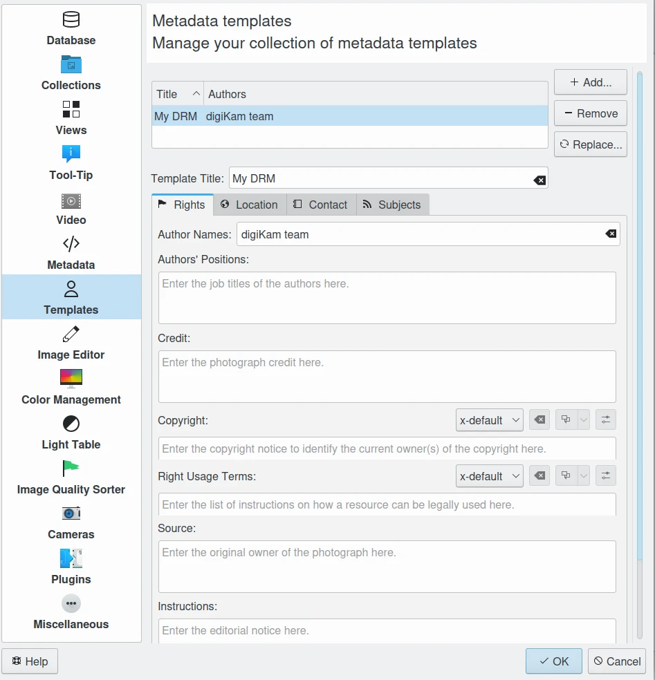
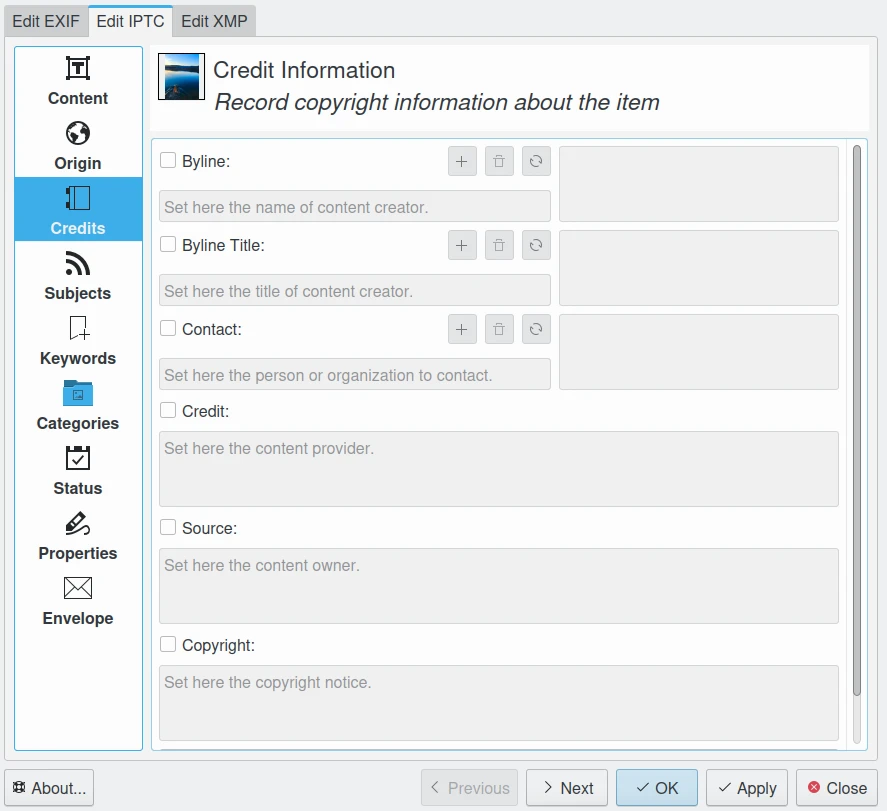

.. meta::
   :description: Protect Your Authorship and Copyright
   :keywords: digiKam, documentation, user manual, photo management, open source, free, learn, easy, watermarking, IPTC and XMP authorship data, export size

.. metadata-placeholder

   :authors: - digiKam Team

   :license: see Credits and License page for details (https://docs.digikam.org/en/credits_license.html)

.. _authorship_copyright:

:ref:`Authorship and Copyright <asset_management>`
==================================================

.. contents::

Strings Metadata
----------------

One of the last steps in tagging your digital images may be to add authorship, ownership, and copyright tags. Unlike 'the good(?) old days' of paper copies, the ubiquitous Internet makes it just too easy to 'steal' a picture from a web site. At the very least, all images that will be exported and/or published in any form, should have embedded authorship and copyright information as part of their metadata. Including this information allows you to legally prohibit others from reproducing, adapting, or distributing copies of your work.

Alternatively, you should embed authorship and **copyleft** information into your images if you want to openly share your images, allowing other people to freely use them, while retaining the tags indicating your authorship.

    - Copyleft, a play on the word copyright, is the practice of using copyright law to remove restrictions on distributing copies and modified versions of a work for others and requiring that the same freedoms be preserved for modified versions.

    - Copyleft licensing often gives every person who receives a copy of a work permission to reproduce, adapt or distribute the work as long as any resulting copies or adaptations are also bound by the same copyleft licensing scheme. A widely used copyleft license is the GNU General Public License. Similar licenses are available through Creative Commons - called Share-alike.

Adding authorship, ownership, and copyright (or copyleft) tags couldn't be more simple with digiKam: you can setup a default identity in :menuselection:`Settings --> Templates` that is used to automatically tag any images digiKam imports.

    The digiKam :ref:`Template Metadata <templates_settings>` Settings Panel

The fields that should be supplied to digiKam's Templates setup page include:

**Author Names** (synonymous with Creator and By-line): This field should contain your name, or the name of the people who created the photograph. If it is not appropriate to add the name of the photographer (for example, if the identity of the photographer needs to be protected), the name of a company or organization can be used. Once saved, this field should not be changed by anyone. This field supports the use of semi-colons as a separator.

**Author Position** (synonymous with By-line title): Linked to Author. This field should contain the job title or position of the photographer. Examples might include titles such as: Staff Photographer, Freelance Photographer, or Independent Commercial Photographer. Since this is a qualifier for the Author field, the Author field must also be filled out.

**Credit** (synonymous to Provider): Use the Provider field to identify who is providing the photograph. This does not necessarily have to be the author. If a photographer is working for a news agency such as Reuters or the Associated Press, these organizations could be listed here as they are 'providing' the image for use by others. If the image is a stock photograph, then the group (agency) involved in supplying the image should be listed here.

**Copyright**: The Copyright Notice should contain any necessary copyright notice for claiming the intellectual property, and should identify the current owner(s) of the copyright for the photograph. Usually, this would be the photographer, but if the image was done by an employee or as work-for-hire, then the agency or company should be listed. Use the form appropriate to your country. For the United States you would typically follow the form of © {date of first publication} name of copyright owner, as in 'copr 2005 John Doe.' The word 'copyright' or the abbreviation 'copr' shall be used in place of the (c) symbol as only ASCII characters are allowed. In some foreign countries only the copyright symbol is recognized and the abbreviation does not work. Using something like (c) where the parentheses form a partial circle is not sufficient. For additional protection worldwide, use of the phrase, 'all rights reserved' following the notice above is encouraged. In Europe you would use: Copyright {Year} {copyright owner}, all rights reserved. In Japan, for maximum protection, the following three items should appear in the copyright field of the IPTC Core: (a) the word, Copyright; (b) year of the first publication; and (c) name of the author. You may also wish to include the phrase *all rights reserved*.

The copyright marking for a Creative Commons Share-alike license might read:

    *This work copyright {Year} by {Author} is licensed under CC BY-SA 4.0*

See `<https://creativecommons.org/licenses/by-sa/4.0/>`_ for details on what the Share-Alike license means.

**Source**: The Source field should be used to identify the original owner or copyright holder of the photograph. The value of this field should never be changed after the information is entered following the image's creation. You should consider this to be a write-once field. The source could be an individual, an agency, or a member of an agency. To aid in later searches, we suggest separating any slashes '/' with a blank space. Use the form 'photographer / agency' rather than 'photographer/agency.' The source may also be different from the Creator and from the names listed in the Copyright Notice.

    The digiKam :ref:`Copyrights View <metadata_editor>` From Metadata Editor

Digital Watermarking
--------------------

Whereas filling-in the author and copyright sections provides some legal protections, these fields do not protect against fraud. Anyone with a bit more than basic computer knowledge can delete or modify embedded image metadata. The solution to this problem is called *digital watermarking*. This might be of little interest to amateur photographers, but digital watermarking is really important for professionals and semi-professionals.

Digital Watermarking refers to an invisible digital watermark that is impressed on photographs as an element of Digital Rights Management (DRM). The watermark contains the same information of authorship and copyright as described above, but the metadata is encrypted and saved in the actual image data (as opposed to the metadata section which is a separate section within the image file).

This invisible imprint has holographic properties so that modifications done to an image (size, color, crop, up to a certain limit) will not destroy the copyright information. Only when an image is resized to a very small fraction like a thumbnail will the embedded information be lost, but then the image is of no value anymore to the copyright infringing party. The digital watermark will be unique per image.

digiKam does not currently support digital watermarking,  but it can pass images to external programs that can add digital watermarks.
