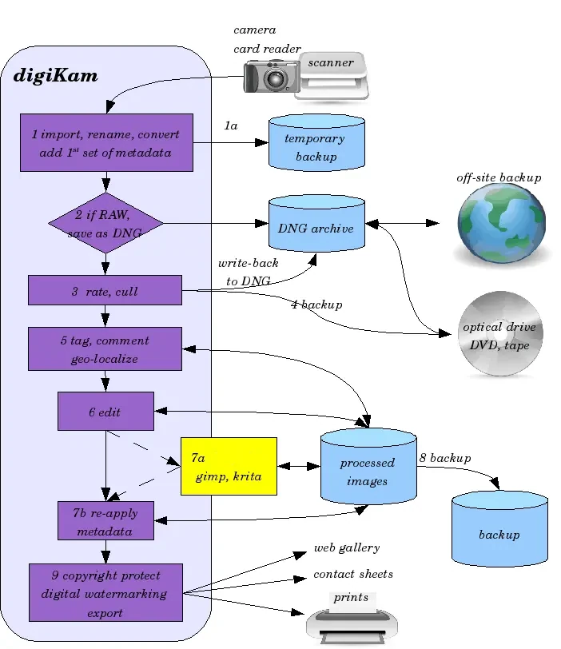

.. meta::
   :description: A Typical Digital Asset Management Workflow
   :keywords: digiKam, documentation, user manual, photo management, open source, free, learn, easy, digital, asset, management, workflow, export

.. metadata-placeholder

   :authors: - digiKam Team

   :license: see Credits and License page for details (https://docs.digikam.org/en/credits_license.html)

.. _dam_workflow:

DAM Workflow
============

.. contents::

- Import images from camera, card reader or scanner. As long as the images are stored on the camera media, you can use that as temporary backup.

- RAW are converted to DNG and stored away into an RAW archive.

    .. figure:: images/dam_workflow_dng_convert.webp
        :alt:
        :align: center

        The DNG Convert Settings From Import Tool

- Rate and cull, write-back metadata to the DNG archive.

    .. figure:: images/dam_workflow_apply_labels.webp
        :alt:
        :align: center

        Applying Labels to Items Using Captions Tab From Right Side-Bar

- Make a backup e.g. on external drive, and optical medium, or a tape.

- Tag, comment, and geo-locate.

    .. figure:: images/dam_workflow_apply_captions.webp
        :alt:
        :align: center

        Applying Descriptions to Items Using Captions Tab From Right Side-Bar

- Edit and improve photographs.

    .. figure:: images/dam_workflow_sharpen_tool.webp
        :alt:
        :align: center

        Sharpening Details In Image Editor Using Refocus Tool

- For layered editing use external applications. Back in digiKam, re-apply the metadata, which was probably lost or curtailed by the other applications.

- Run the routine backup with following data-integrity checks.

- Protect processed images for copyrights with Digital Watermarking. Export to web galleries, slide shows, MPEG encode, contact sheets, printing, etc.

    .. figure:: images/dam_workflow_export_webservice.webp
        :alt:
        :align: center

        The List of Export Tools Available From Image Editor

A typical generic draft of all photograph workflow stages is given below:

    Draft of all Common Tasks Used During a Photographs Workflow
