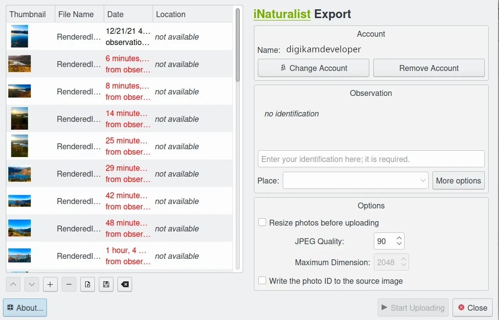
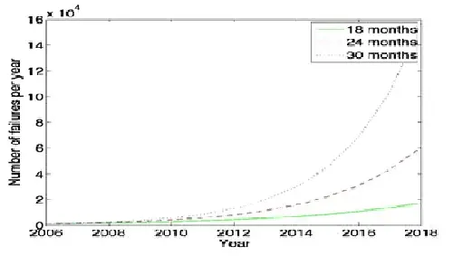
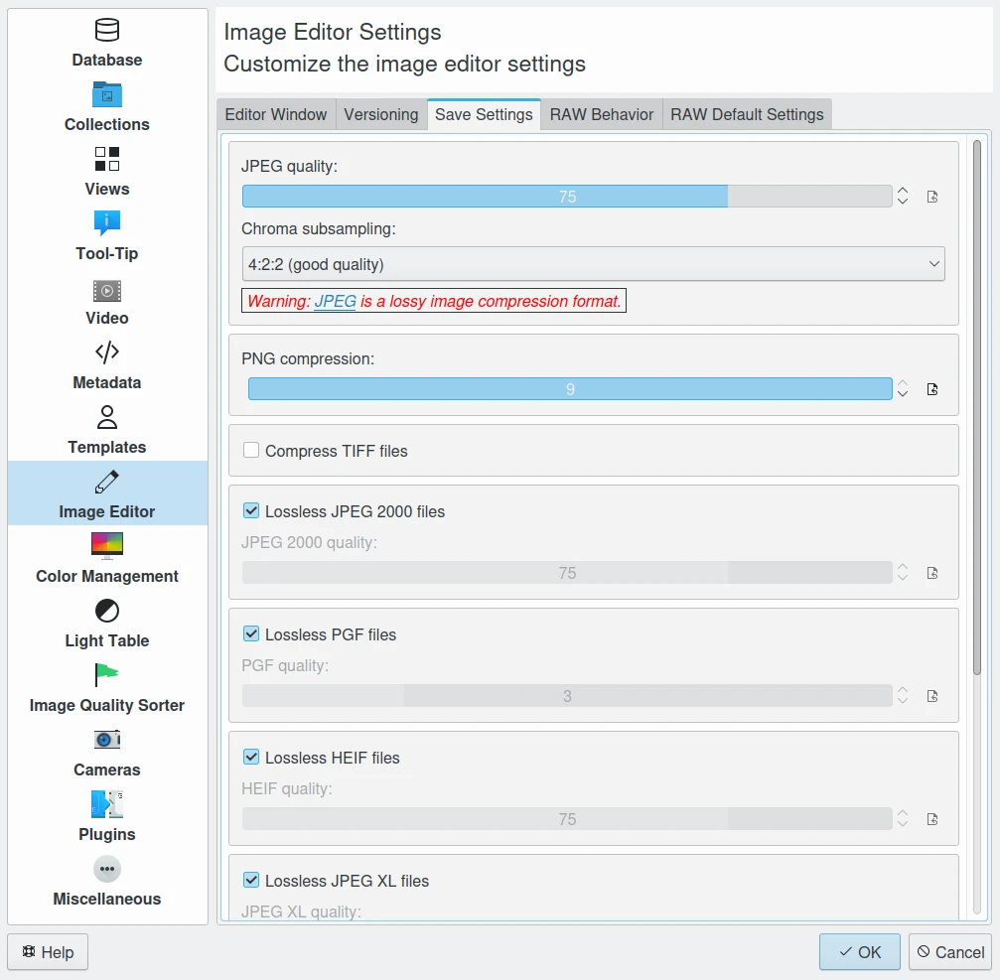
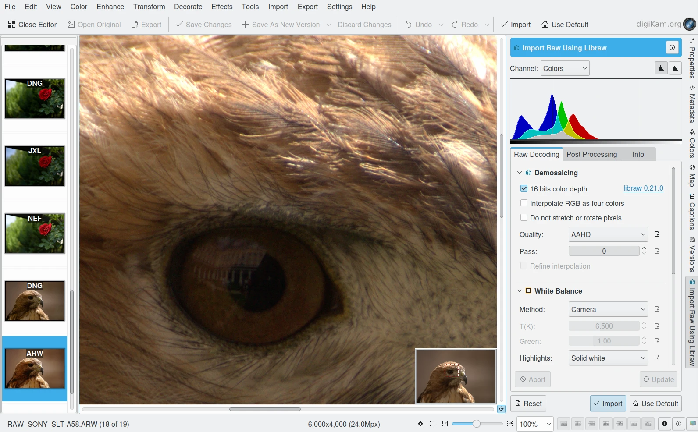
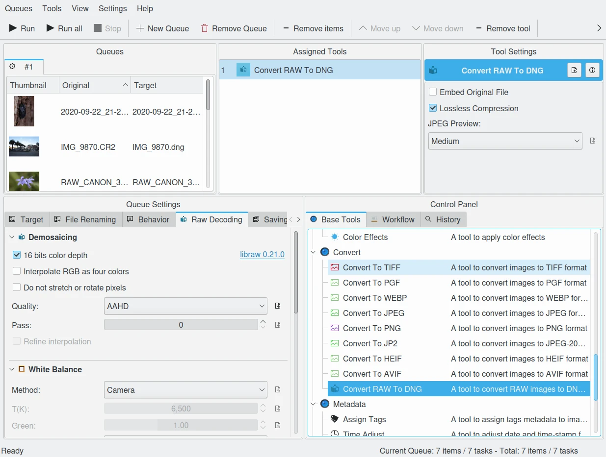
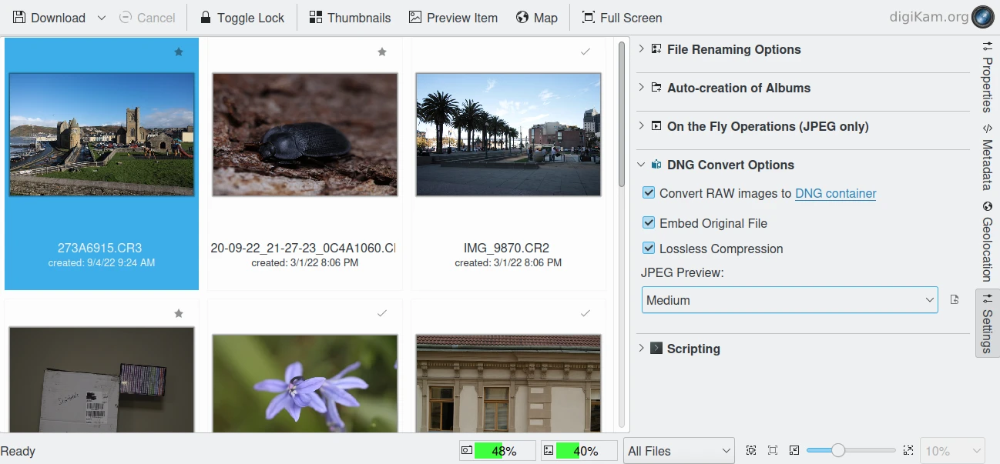
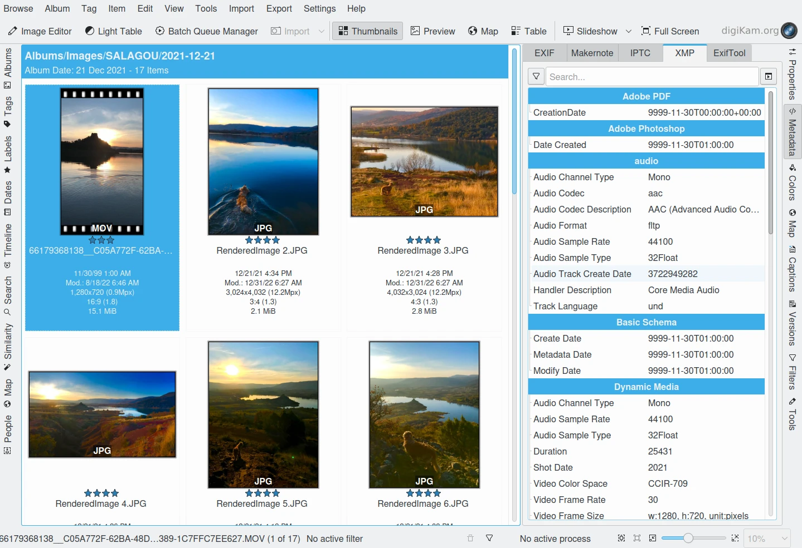
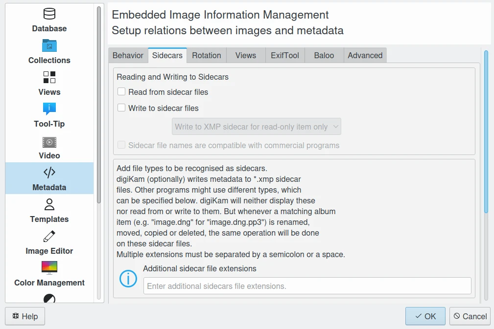

.. meta::
   :description: Protect Your Images from Data Corruption and Loss
   :keywords: digiKam, documentation, user manual, photo management, open source, free, learn, easy, disk errors, disk failures, power surges, ECC, transmission errors, storage media deterioration, recovery, redundancy, disaster prevention, lifetime, temperature, data size, common myths, metadata, IPTC stored in image files, XMP files associated, keep the originals, storage, scalability, media, retrieval of images and metadata, copying image data over to the next generation of media, applications, operating systems, virtualization, viewing device, use of the www, ZFS, BTRFS

.. metadata-placeholder

   :authors: - digiKam Team

   :license: see Credits and License page for details (https://docs.digikam.org/en/credits_license.html)

.. _data_protection:

Data Corruption and Loss
========================

.. contents::

Main Factors of Digital Data Loss
---------------------------------

Of course we're not talking about losing BlueRays on the road or in a fire - that kind of loss is just the same as traditional paper copies or negatives. We are talking about problems with the so called *New Media*.

Problems with digital data can roughly be categorized into the following areas of concern:

    - The physical deterioration of the media (all media deteriorate at different time scales).

    - Undetected transmission errors during data transfer.

    - The lack of support for long-date, undoubtedly proprietary, digital formats.

    - Ancient hardware.

Kroll Ontrack, the worlds largest data recovery firm, have some interesting statistics on what actually causes data loss.

============================== ========== =======
Cause of data loss             Perception Reality
============================== ========== =======
Hardware or system problem     78%         56%
Human error                    11%         26%
Software corruption or problem 7%          9%
Computer viruses               2%          4%
Disaster                       1-2%        1-2%
============================== ========== =======

So let us analyze those cases step by step.

Storage Physical Deterioration
------------------------------

Optical Drives
~~~~~~~~~~~~~~

Physical deterioration of the media happens more rapidly with paper and CD-Rs than the average of film. Yet while film lasts longer (sometimes decades longer) than other forms of media, the right kind of backup of digital media never loses anything. Film decays - digital 1's and 0's do not, and film starts to decay the moment it's created and developed. It will never have the same color, contrast, etc. that it did have a moment before. Digital doesn't do that. However, digital is susceptible to corruption. And yes, physical media such as floppies and magnetic hard drives are also susceptible to the decay of the medium, just like CDs are. They just last longer.

To combat the problem of DVDs/Blue-ray, they need to be properly cared for and not trusted for more than a few years. Thankfully you can purchase archive-quality CDs and DVDs which last longer, though they are much more difficult to obtain and are much more expensive. There are offers out there for gold-plated DVDs, few euros a piece claiming 100 years storage life (if you care to believe it).

DVD/Blue-ray disks may become unreadable, but you can reduce the risk using good disks and a good recorder, and storing them in a correct way. The best DVD recorders are not much more expensive than the cheapest, but they write in a much more reliable way. It's a matter of choosing the right one.

Essentially,  DVDs/Blue-ray are very prone to errors, even in a freshly written state. That's why they are heavily protected with a checksum mechanism (75% of data are effective data, the rest is formatting and checksum overhead). But even with that massive amount of protection they will suffer deterioration from chemical aging, ultra-violet exposure, scratches, dust, etc.

For damaged DVDs/Blue-ray, Wikipedia `list all common applications <https://en.wikipedia.org/wiki/Data_recovery#List_of_data_recovery_software>`_ designed to get data from damaged floppies, hard drives, flash media such as camera memory and USB drives, and so forth.

Dual-layer optical media Blu-ray disk can store 50 GB, almost six times the capacity of a dual layer DVD at 8.5 GB. Everything that has been said about CDs/DVDs applies to Blu-ray disks as well.

Best practice: burn them slowly with a good recorder on archive quality media in an open, non-proprietary format, read the data back to verify, label them with some descriptive text + date & author, lock them away where it is clean, dark, animal safe and dry. And do not forget to copy them over to the next generation of media before you throw away your last piece of hardware or software able to read them.

Hard Disks 
~~~~~~~~~~

Hard Disk (HDD) manufacturers keep their statistics to themselves. A manufacturer guaranty buys you a new disk, but no data. Google for One has done a large scale study on `HDD <https://en.wikipedia.org/wiki/Hard_disk_drive>`_ failure mechanisms: `Disk Failures study <https://research.google.com/archive/disk_failures.pdf>`_.

In a nutshell: Disks run longest when operating between 35°C and 45°C, at lower temperatures the error rates increases dramatically. Controller parts (electronics) are the foremost sources of failure, SMART does not diagnose any of this. Some `SMART <https://en.wikipedia.org/wiki/Self-Monitoring,_Analysis_and_Reporting_Technology>`_ errors are indicative of imminent failure, in particular scan errors and relocation counts. Lifetime expectancy is 4-5 years.

In general and contrary to intuition or ecological considerations, running a hard drive permanently results in a longer lifetime than switching it on and off all the time. It has even been reported that aggressive power management spinning down the drive can harm it quickly. Making it working hard shortens the lifetime somewhat. The worst factors for HDD probably are vibrations, shocks, and cold temperatures.

If your disk is making weird noises, normal file recovery software isn’t going to work. Do a quick backup if that is going to happen to you. (Use dd utility if possible, not a normal file backup since dd reads in a smooth, spiraling stream from beginning to end and doesn't stress the mechanics). There are specialist companies that can recover data from otherwise destroyed drive, but they are very expensive.

Linux `SmartMonTools <https://en.wikipedia.org/wiki/Smartmontools>`_ suite allows to query the storage hardware devices for future failure. We highly recommend to use this kind of tool on your computer.

Solid State Drives
~~~~~~~~~~~~~~~~~~

`SSDs <https://en.wikipedia.org/wiki/Solid-state_drive>`_ are mechanically more robust than HDDs and suffer much less on that front when they are plugged into the computer. They will replace HDD in time as capacity, robustest, and price become more and more a good solution as permanent data storage devices.

In case of use as external device, one major cause for data loss (often recoverable) is the unsafe removal of SDDs from a computer. Before data is saved from a computer memory to any attached device, it remains for some time in buffers. In hard drives this means seconds at most, whereas with SDDs it can be tens of minutes. Therefore, before you disconnect a flash device, always activate data flushing through software (often called *safely remove device*).

.. important:

    **In all cases SSDs as internal devices are the solution to host the database and the collections.**

Magnetic Media
~~~~~~~~~~~~~~

Magnetic tapes are used in backup systems, much more in professional environments than in home use. Tapes have issues with data retention and changing technology, but they are safer in one aspect than CDs and DVDs: they are less exposed to scratches and dirt and writing deficiencies. On the other hand they are susceptible to magnetic fields. Throw a magnet next to a tape and it's gone. Tapes should be re-copied every 5-8 years, otherwise too many bits will fail and escape the checksum protection. The downside of magnetic tapes is often the recorder price and the restore time (20x longer than from HDD). Tape backup system have seen their best days.

Power Supply Failures
---------------------

Power Surges
~~~~~~~~~~~~

As much as 1% of all computers are affected by lightning and power surges every year.

This is about total data loss due to power surges. Of course you can have the occasional data loss due to power loss before saving files. But those losses can normally be restored without major difficulty.

You don’t have to wait for the next thunderstorm to be concerned about how a sudden fluctuation in electric power may affect your computer system. Recent statistics have shown that as much as 63 percent of all electronics casualties are due to power problems, and most computers are subject to two or more power anomalies a day. Since power surges or blackouts can occur anywhere and at any time, it only makes sense to protect your computer by investing in some sort of surge protection device.

How Surges Happen
~~~~~~~~~~~~~~~~~

A power surge occurs when the power line voltage increases over nominal values for more than 10 milliseconds. Sixty percent of all power surges are caused from within the home or office, generally when a device with a motor (such as a hair dryer, refrigerator, or water pump) shuts off and the power it was using is diverted elsewhere as excess voltage. The remaining 40 percent of power surges are generated by factors such as lightning, utility grid switching, line slapping, poor wiring, and so on.

While most average electricity-using devices are not affected by power surges, devices relying on computer chips and high-speed microprocessors are susceptible to serious damage. For your computer, power anomalies can result in keyboard lockup, complete data loss, hardware degradation, damaged motherboards, and more. Failure to protect yourself from the inevitable can result in a loss of both time and money.

Surge Protectors
~~~~~~~~~~~~~~~~

The most common defense against power surges is a surge protector or suppressor, a device that works by absorbing some of the excess energy and diverting the rest of it to the ground. These are usually found in the form of a power strip (one of those long devices that have six or so outlets and a single, grounded plug). Bear in mind, however, that not every power strip serves as a surge protector.

When selecting your surge protector, you want to be sure it is listed as meeting the UL 1449 standard, which guarantees a certain minimum of protection. You should also look for one that offers protection against lightning (not every one does) and provides insurance for equipment that is properly attached.

Because a power surge can follow any path to your computer, be sure that each peripheral connected to your system is protected. This includes your phone line or cable modem, as power can surge through these routes as well. A number of manufacturers are now producing surge suppressors that feature a phone jack for your modem along with the electrical outlets, while others have coaxial cable jacks for those who use a cable modem or TV tuner card.

If you have a notebook computer, you will want to carry a surge suppressor as well. A variety of suppressors designed specifically for notebooks are available, small in size and possessing both electric and phone outlets that make them ideal for use on the road.

Uninterruptible Power Supply 
~~~~~~~~~~~~~~~~~~~~~~~~~~~~

While a surge suppressor will protect your system from minor fluctuations in the power lines, it won’t help you if the power should black out completely. Even an outage of just a few seconds can result in the loss of valuable data, so you might find it worthwhile to invest in an Uninterruptible Power Supply (UPS).

Besides serving as surge suppressors, these devices automatically switch to battery power when a power outage occurs, giving you the opportunity to save data and shut down your system. Some models will even allow you to keep working until power is restored. When purchasing a UPS, be sure that it has the same qualities that you would seek in a surge suppressor, but also check out the battery life and included software.

Considering the potential risk to your computing system, ensuring its safety from power disturbances is a worthwhile investment. A quality surge suppressor or a 500W UPS are not too expensive for the peace of mind you’ll gain knowing your computer is well protected. In the very least pull all lines to your computer when you go on holidays.

Saveguarding Against Logical Errors
-----------------------------------

Web Storage Services
~~~~~~~~~~~~~~~~~~~~

Amazon Web Services includes S3 - Simple Storage Service. With appropriate configuration, you can mount S3 as a drive on Linux, Mac, and Windows systems, allowing you to use it as a backup destination for your favorite software. Google Shared Storage is another popular offer where one can store infinite amount of data.

It is expensive compared to hard drives at home. And you have to transfer the images over the (a comparatively slow) Internet.

We think as a safeguard against localized data loss of the most essential images it's not a bad idea at all, but it is not a general backup solution, much too slow for that.

Google Photo, and Flickr provide online storage services specialist on photographie. Their free space is limited and you don't want to have full resolution images online. But the pro-accounts offer more.

In terms of data retention the web space solution is probably pretty safe. Transmission errors are corrected (thanks to the TCP protocol) and the big companies usually have backup included plus distributed storage so that they are disaster proof within themselves.

    digiKam Provide a Tool to Export Items to iNaturalist Web Service

Transmission Errors
~~~~~~~~~~~~~~~~~~~

Data does not only get lost from storage devices, it also gets lost when traveling inside the computer or across networks (although the network traffic itself via TCP is error protected). Errors occur on buses and in memory spaces. Consumer hardware has no protection against those bit errors, whereas it is worthwhile to look into such. You can buy ECC (error code correction) protected memory (which is expensive, granted). With `ECC RAM <https://en.wikipedia.org/wiki/ECC_memory>`_ at least the memory will be scrubbed for single bit errors and corrected. Double bit errors would escape that scheme but they occur too infrequently.

    The Data Workflow Between Application and Storage Media

This diagram depicts the transmission chain elements in a computer, all transitions are susceptible to transmission errors. The Linux `ZFS <https://en.wikipedia.org/wiki/ZFS>`_ and `BTRFS <https://en.wikipedia.org/wiki/Btrfs>`_ file system at least ensure the OS to disk path of data integrity under Linux.

The Byte Error Rate (BER) for memory and transmission channels is in the order of 1 in 10 Million (10E-7 bit). That just means that 1 in 3000 images has an error only due to transmission problems. Now how dramatic that is for an image is left to chance, it could mean that the image is destroyed or that a pixel somewhere changed its value, due to the compression used on almost all images one cannot predict the gravity of a single bit error impact. Often one sees some partial images instead of the full image.

The worst of all that is that nobody tells you when a transmission error occurs, not your hardware. All those glitches go down unheard until one day you open the photograph, and to your surprise it's broken. It is quite worrisome that there should be no protection within a computer, nobody seems to have thought of it. The Internet (TCP protocol) is much saver as a data path than inside a computer.

Flaky power supplies are another source of transmission losses because they create interference with the data streams. With normal files systems those errors go unnoticed.

    The Storage Media Number of Failure Per Year

Even if you are not overly concerned today with transmission problems, have a look into the future at illustration. Already in 2010 we'll see thousands of errors per year.

Future of File-system with ZFS
~~~~~~~~~~~~~~~~~~~~~~~~~~~~~~

`ZFS <https://en.wikipedia.org/wiki/ZFS>`_ from Oracle seems to be one of two candidates to deal with disk errors on a low level, and it is highly scalable. It is Open Source, heavily patented, comes with an GPL incompatible license, and is available on Solaris and macOS.

Oracle has also started an initiative with its `BTRFS <https://en.wikipedia.org/wiki/Btrfs>`_ file system. It employs the same protection technique as **ZFS** does, and it's available on Linux.

Human Errors
------------

Theft And Accidents
~~~~~~~~~~~~~~~~~~~

Do not underestimate it. Those two factor account for 86% of notebook and 46% for desktop system data losses. For notebooks, theft counts for 50% alone.

Malware
~~~~~~~

Data loss due to viruses is less grave than common wisdom make you believe. It accounts for less damage than theft or re-installations, for example. And it is limited to Microsoft OS users. Apple users experience very few viruses and under Linux they haven't been around for quite some time now.

Panic is a Factor in Data Loss
~~~~~~~~~~~~~~~~~~~~~~~~~~~~~~

Human error, as in everything, is a major problem in data loss. Take a deep breath and stop. Panic is a common reaction, and people do really stupid things. Experienced users will pull the wrong drive from a `RAID <https://en.wikipedia.org/wiki/RAID>`_ array or reformat a drive, destroying all their information. Acting without thinking is dangerous to your data. Stop stressing about the loss and don’t do anything to the disk. Better yet, stop using the computer until you have a plan. Sit down and explain you plan to a laymen or better, laywoman. You will be amazed how many stupid ideas you'll discover yourself in such an exercise.

If your disk is making weird noises, normal file recovery software isn’t going to work. Do a quick backup if that is going to happen to you. If the drive is still spinning and you can’t find your data, look for a data recovery utility and backup to another computer or drive. An Universal and powerful solution can be to use  `CloneZilla open-source suite <https://en.wikipedia.org/wiki/Clonezilla>`_. The important thing is to download them onto another drive, either on another computer, or onto a USB thumb drive or hard disk. It is good practice to save the recovered data to another disk. `dd tool <https://en.wikipedia.org/wiki/Dd_(Unix)>`_ is your friend on Linux systems.

Common Myths Dispelled
~~~~~~~~~~~~~~~~~~~~~~

We would like to dispel some common myths:

    - Open Source file systems are less prone to data loss than proprietary systems: Wrong, NTFS is rather a tiny notch better than ext4, ReiserFs, JFS, XFS, to name just the most popular file systems that often come as default storage format disk used by distributions.

    - Journaling files systems prevent data corruption/loss: Wrong, they only speed up the scan process in case of a sudden interrupt during operation and prevent ambiguous states. But if a file was not entirely saved before the mishap, it'll be lost.

    - `RAID <https://en.wikipedia.org/wiki/RAID>`_ systems prevent data corruption/loss: Mostly wrong, RAID0 and 1 prevent you from nothing, RAID5 can prevent data loss due to disk-failures (but not from disk or file system errors). Many low-end RAID controllers (most mother board controllers are) don’t report problems, figuring you’ll never notice. If you do notice, months later, what is the chance that you’ll know it was the controller’s fault? One insidious problem is corruption of RAID 5 parity data. It is pretty simple to check a file by reading it and matching the metadata. Checking parity data is much more difficult, so you typically won’t see parity errors until a rebuild. Then, of course, it is too late.

    - Viruses are the biggest thread to digital data: Wrong. Theft, and human errors are the primary cause of data loss. 

Storage Volume Estimation
-------------------------

Digital camera sensors are 1-2 aperture stops away from fundamental physical limitations. What we mean is this: as technology evolves, there is a natural limit to its progress. Sensitivity and noise characteristics for any kind of light sensor are not far from that limit.

Today's cameras tend towards 50 mega pixels sensors, although this resolution is already too high for compact cameras and deteriorates the end result. Given the sensor size and quality of optics, 12 mega pixels are optimum for compact cameras. Even DSLR cameras run into their limits at 20-24 mega pixels, for higher resolutions one has to go for full frame sensors (24x36mm) or even bigger formats.

So, taking into account the manufacturer mega pixel propaganda it seems save to say that the bulk of future cameras will see less than 30 mega pixels. This gives us an estimation for the necessary storage space per photograph in the long run: <40 MB per image. Even if file versioning will be introduced (grouping of variations of a photograph under one file reference), the trend is to implement scripting of changes so that a small overhead will be recorded only and not a whole different image per version. With faster hardware this concept will see it's maturity quite soon.

In order to estimate the amount of storage space you have to plan for, simply determine the number of photographs you take per year (easy with :ref:`digiKam's timeline sidebar tab <timeline_view>`) and multiply it by 40 MB. Most users will keep less than 2000 pictures per year which requires less than 80 GB/year. Assuming that you will change your hard disk (or whatever media in the future) every 4-5 years, the natural increase in storage capacity will suffice to keep you afloat.

The more ambitious ones out there will need more space, much more maybe. Think of buying a file server, Giga-Ethernet comes integrated into motherboards today and it's a flick to fetch the files over the local network. Speaking about modern mobos: they now the capability to SATA media through an USB connectors. This makes it really a trifle to buy an external SATA drive and hook it up to your machine. 4000 GB drives will hit the market in 2020. These are terrific compact storage containers for backup swapping: keep one drive at home and one somewhere else.

Backup and Recover
------------------

A 4 TB HDD is not very expensive today. Do not blame anybody else for data loss. 6% of all PCs will suffer an episode of data loss in any given year. Backup your data often according to a plan, and back it up and test the backup before you do anything dramatic like re-installing your OS, changing disks, resizing partitions and so on.

Disaster Prevention
~~~~~~~~~~~~~~~~~~~

Say, you religiously do your backups every day on a external SATA drive. Then comes the day where lightning strikes. Happy you if the external drive was not connected at that moment.

Disasters strike locally and destroy a lot. Forget about airplane crashes: fire, water, electricity, kids and theft are dangerous enough to our data. They usually cover a whole room or house.

Therefore disaster control means de-localized storage. Move your backups upstairs, next house, to your bureau (and vise versa), whatever.

There is another good aspect to the physical separation: as said above, panic is often the cause of destroying data, even the backup data. Having a backup not at hand right away may safe your ass one day.

Backup Technicalities Explained
~~~~~~~~~~~~~~~~~~~~~~~~~~~~~~~

    - **Full Backup**: A complete backup of all the files being backed up. It is a snapshot without history, it represents a full copy at one point in time.

    - **Differential Backup**: A backup of only the files that have changed since the last full backup. Constitutes a full snapshot of two points in time: the full backup and the last differential one.

    - **Incremental Backup**: A backup of only the files that have changed since last whatever backup. Constitutes multiple snapshots. You can recreate the original state at any point in time such a backup was made. This comes closest to a versioning system except that it is only sampled and not continuous. 

Backup The Data
~~~~~~~~~~~~~~~

The Best practice at all is to backup the data:

    - Do a **full backup** in a external storage device.

    - Verify its **data integrity** and put it away (disaster control).

    - Have another storage device for **frequent backups**.

    - **Swap the devices** every other month after having verified data integrity.

A Useful Tool to Backups
~~~~~~~~~~~~~~~~~~~~~~~~

Linux `rsync <https://en.wikipedia.org/wiki/Rsync>`_ is a wonderful little utility that's amazingly easy to set up on your machines. Rather than have a scripted FTP session, or some other form of file transfer script - rsync copies only the differences of files that have actually changed, compressed and through ssh if you want to for security. That's a mouthful.

A reasonable backup approach for images could be this one:

    - Backup important images right away (after dumping them to a computer) to optical media.

    - Do daily incremental backup of the work space.

    - Do a weekly differential backup and delete integral backups of week-2 (two weeks ago).

    - Do a monthly differential backup and delete backup of month-2.

    - If not physically separated already, separate it now (swapping-in another backup drive).

This protocol tries to leave you enough time to spot losses and to recover fully at the same time keeping the backup volume at <130% of the working space. You end up with a daily version of the last 7-14 days, a weekly snapshot for at least one month, and a snapshot of every month. Any more thinning should be done by hand after a full verification.
Preserve your images through the changes of technology and owners

In order for your valuable images to **survive the next 40 years** or so (because that's about the time that you will become really interested to revisit those nice old photographs of you as a child, adolescent etc.) there are two strategies to be observed:

    - **Keep up with technology**, don't lag behind more than a couple of years.

    - Save your photos in an open, **non-proprietary standard**.

Keep Up With Technology
-----------------------

As the future is unforeseeable by nature, everything said today is to be taken with caution, and to be reviewed as we advance. Unfortunately there is no shortcut possible to some basic vigilance. Every 5-8 years at least one should ask oneself the question of backwards compatibility of current systems. The less variants we used in the past the less questions are to be answered in the future.

Of course every time you change your computer system (machine, operating system, applications, DRM) you have to ask yourself the same questions. Today, if you want to switch to Windows, you have to ask yourself three times if you still can import your pictures, and, more important so, if you are ever able to move them onto some other system or machine. Chances are good that you cannot. We see many people struggling around us, because Windows enforces a strict DRM regime. How can you proof to Windows that you are actually the owner of your pictures copyright?

Basically the questions should be answered along the line explained in this document: use and change to open standards supported by a manifold of applications.

Virtualization becomes available now for everybody. So if you have an old system that is important for reading your images, keep it, install it as a virtual machine for later.

Otherwise the advice is quite simple: every time you change your computer architecture, your storage and backup technology, your file format, check it out, go through your library and convert to a newer standard if necessary. And keep to open standards.

Scalability
~~~~~~~~~~~

Scalability is the tech-geek expression of the (easy) capability of a system to be resized, which always means up-sized.

Lets assume you planned for scalability and dedicated the container you want to increase to a separate disk or partition. On Linux system you then can copy and resize the container to the new disk.

.. _dam_fileformats:

Use Open File Formats
~~~~~~~~~~~~~~~~~~~~~

The short history of the digital era in the past 20 years has proven over and over again that proprietary formats are not the way to go when you want your data to be intelligible 10 years into the future. Microsoft is certainly the well known culprit of that sort because of its domineering market share. But other companies are actually (if inadvertently) worse since they may not stay long enough in the market at all or have a small user/contributor base only. In the case of Microsoft one has at least the advantage of many people sharing the same problems. Finding a solution has therefore much more success. Still, in some cases Microsoft is using Open Source documentation to understand their own systems, so badly maintained have been their own documentation. Usually with any given MSoffice suite one cannot properly read a document created with the same application two major versions earlier.

Image formats have had a longer live time than office documents and are a bit less affected by obsolescence.

Open Source standards have the huge advantage of having an open specification. Even if one day in the future there'll be no software to read it anymore, one can recreate such software, a task becoming simpler every year.

    digiKam Image Editor Default Save Settings For Common Image Formats

**JPEG** has been around for a while now, and whilst it's a lossy format losing a bit every time you make a modification and save it, it is ubiquitous, supports JFIF, Exif, IPTC and XMP metadata, has good compression ratios and can be read by all imaging software. Because of its metadata limitation, lossy nature, absence of transparency and 8 bit color channel depth, we do not recommend it. JPEG2000 is better, can be employed lossless, but lacks in user base.

**GIF** is a proprietary. patented format and slowly disappearing from the market. Don't use it.

**PNG** has been invented as a Open Source standard to replace GIF, but it does much more. It is lossless, supports XMP, Exif and IPTC metadata, 16 bit color encoding and full transparency. PNG can store gamma and chromaticity data for improved color matching on heterogeneous platforms. Its drawback are a relatively big footprints (but smaller than TIFF) and slow compression. We recommend it.

**TIFF** has been widely accepted as an image format. TIFF can exist in uncompressed form or in a container using a lossless compression algorithm (Deflate). It maintains high image quality but at the expense of much larger file sizes. Some cameras let you save your images in this format. The problem is that the format has been altered by so many people that there are now 50 or more flavors and not all are recognizable by all applications.

**PGF** "Progressive Graphics File" is another not so known but open file image format. Wavelet-based, it allows lossless and lossy data compression. PGF compares well with JPEG 2000 but it was developed for speed (compression/decompression) rather than to be the best at compression ratio. At the same file size a PGF file looks significantly better than a JPEG one, while remaining very good at progressive display too. Thus it should be well-suited to the web but at the moment few browsers can display it. For more information about the PGF format see the `libPGF homepage <https://libpgf.org/>`_

    digiKam Image Editor Raw Import Tool

**RAW** format. Some, typically more expensive, cameras support RAW format shooting. The RAW format is not really an image standard at all, it is a container format which is different for every brand and camera model. RAW format images contain minimally processed data from the image sensor of a digital camera or image scanner. Raw image files are sometimes called digital negatives, as they fulfill the same role as film negatives in traditional chemical photography: that is, the negative is not directly usable as an image, but has all of the information needed to create an image. Storing photographs in a camera's RAW format provides for higher dynamic range and allows you to alter settings, such as white balance, after the photograph has been taken. Most professional photographers use RAW format, because it offers them maximum flexibility. The downside is that RAW image files can be very large indeed.

We recommend clearly to **abstain from archiving in RAW format** (as opposed to shooting in RAW format, which we recommend). It has all bad ingredients: many varieties and proprietary nature. It is clear that in a few years time you cannot use your old RAW files anymore. We have already seen people changing camera, losing their color profiles and having great difficulty to treat their old RAW files correctly. Better change to DNG format.

**DNG** Digital Negative file format is a royalty free and open RAW image format designed by Adobe Systems. DNG was a response to demand for a unifying camera raw file format. It is based on the TIFF/EP format, and mandates use of metadata. A handful of camera manufacturers have adopted DNG already, let's hope that the main contenders Canon and Nikon will use it one day.

    digiKam Provide a Tool to Convert in Batch RAW to DNG

We strongly recommend converting RAW files to DNG for archiving. Despite the fact that DNG was created by Adobe, it is an open standard and widely embraced by the Open Source community (which is usually a good indicator of perennial properties). Some manufacturers have already adopted DNG as RAW format. And last not least, Adobe is the most important source of graphical software today, and they of course support their own invention. It is an ideal archival format, the raw sensor data will be preserved as such in TIFF format inside DNG, so that the risk associated with proprietary RAW formats is alleviated. All of this makes migration to another operating system a no-brainer.

    digiKam Provide a Tool to Convert RAW to DNG during Download from Camera

**XML** (Extensible Mark-up Language) or **RDF** (Resource Description Framework). XML is like HTML, but where HTML is mostly concerned with the presentation of data, XML is concerned with the *representation* of data. On top of that, XML is non-proprietary, operating-system-independent, fairly simple to interpret, text-based and cheap. RDF is the WC3's solution to integrate a variety of different applications such as library catalogs, world-wide directories, news feeds, software, as well as collections of music, images, and events using XML as an interchange syntax. Together the specifications provide a method that uses a lightweight ontology based on the Dublin Core which also supports the "Semantic Web" (easy exchange of knowledge on the Web).

IPTC Goes XMP
~~~~~~~~~~~~~

That's probably one of the reasons why, around 2001, that Adobe introduced its XML based XMP technology to replace the "Image resource block" technology of the nineties. XMP stands for **Extensible Metadata Platform**, a mixture of XML and RDF. It is a labeling technology that lets users embed data about a file in the file itself, the file info is saved using the extension *.xmp* (signifying the use of XML/RDF).

`XMP <https://en.wikipedia.org/wiki/Extensible_Metadata_Platform>`_: As much as ODF will be readable forever (since its containing text is written in clear text), XMP will preserve your metadata in a clearly understandable format XML. No danger here of not being able to read it later. It can be embedded into the image files or as a separate accompanying file (**Sidecar** concept). XMP can be used in PDF, JPEG, JPEG2000, GIF, PNG, HTML, TIFF, Adobe Illustrator, PSD, PostScript, Encapsulated PostScript, and video files. In a typical edited JPEG file, XMP information is typically included alongside Exif and IPTC data.

    digiKam can display XMP Contents from Image and Video

Embedding metadata in files allows easy sharing and transfer of files across products, vendors, platforms, customers, without metadata getting lost. The most common metadata tags recorded in XMP data are those from the Dublin Core Metadata Initiative, which include things like title, description, creator, and so on. The standard is designed to be extensible, allowing users to add their own custom types of metadata into the XMP data. XMP generally does not allow binary data types to be embedded. This means that any binary data one wants to carry in XMP, such as thumbnail images, must be encoded in some XML-friendly format, such as Base64.

Many photographers prefer keeping an original of their shots (mostly RAW) for the archive. XMP suits that approach as it keeps metadata separate from the image file. We do not share this point of view. There could be problems linking metadata file and image file, and as said above, RAW formats will become obsolete. We recommend using DNG as a container and putting everything inside.

The `Dublin Core Metadata Initiative <https://www.dublincore.org/>`_ is an open organization engaged in the development of interoperable online metadata standards that support a broad range of purposes and business models. DCMI's activities include work on architecture and modeling, discussions and collaborative work in DCMI Communities and DCMI Task Groups, annual conferences and workshops, standards liaison, and educational efforts to promote widespread acceptance of metadata standards and practices.

    digiKam Support Sidecar Files With many Options From Settings Panel

Protect Your Data
-----------------

    - Use surge protectors (UL 1449 standard), possibly combined with a UPS.

    - Use ECC memory to verify correct data transmission (even just saving files).

    - Watch your hard drives (temperature, noise...), make backups.

    - Keep backups at another location, locked up, use web storage space.

    - Use archival media and burners.

    - Don't panic in case of data loss, explain your recovery plan to a layperson.

    - Choose you file system, partitions, folders to cater for easy scalability.

    - Use open, non-proprietary standards to manage and save photographs.

    - Do a technology/migration review at least every 5 years.
