.. meta::
   :description: Build a System to Organize and Find Your Photographs
   :keywords: digiKam, documentation, user manual, photo management, open source, free, learn, easy, hierarchy, tags, rating, captions, geolocation, date, albums, filenames, versioning, exporting

.. metadata-placeholder

   :authors: - digiKam Team

   :license: see Credits and License page for details (https://docs.digikam.org/en/credits_license.html)

.. _organize_find:

Organize and Find
=================

.. contents::

Experience suggests that if you have more than 1000 photographs on your computer without the use DAM tools, it takes you too long to find any particular image. And if you don't know how many images are on your computer, you're surely not using digiKam. digiKam supports a dual approach of storing image metadata in a database *and* within the image files, guaranteeing ultra-fast search and secure archiving that is easily accessible to other applications, platforms and formats.

But just as there is no such thing as a free lunch, there is no effort-free cataloging or DAM solution - those who spend the initial time and effort to systematically organize and label their images will be better off as time passes, and the number of photographs in their collection grows. The return on investment for DAM has been estimated in different studies to be greater than 10 to 1. Even larger gains can be anticipated if one plans further into the future when the upcoming semantic web will easily integrate imagery that has been labelled in a DAM environment.

Use-Cases with digiKam
~~~~~~~~~~~~~~~~~~~~~~

digiKam provides a number of methods to classify photographs: filenames, albums, collections, time-stamp, tags, rating, GPS position and captions. As if this was not enough, you can search most standard metadata items like camera model, lens, coordinates, image size and many more. The metadata categories listed here are in fact different **views** of your photo library. Combining these views is a very powerful method to narrow down a search to quickly find a file. Imagine having 800 photos of your loved one. Searching for **Salagou**, having more than **3 rating stars**, shot in **France** will surely leave you with very few candidates. Compared to most other DAM systems, digiKam's search and selection capabilities are complete, versatile, fast, scalable, accurate and based on open standards.

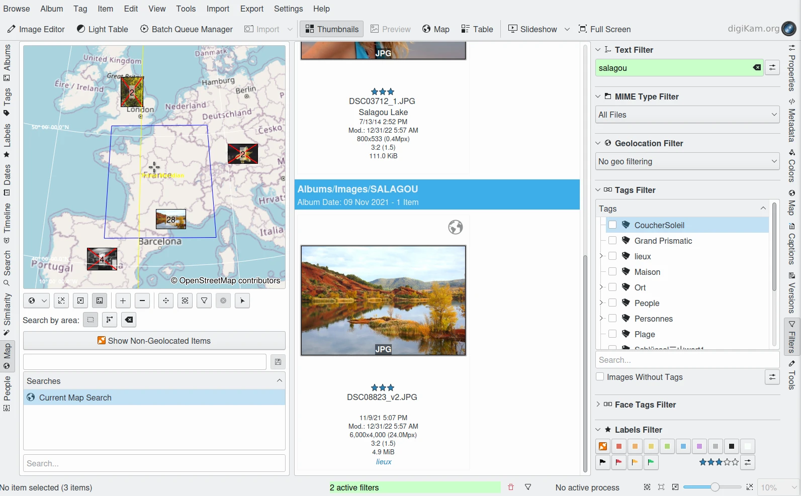

    A :ref:`Geolocation Search <mapsearch_view>` Results in France :ref:`Filtered <filters_view>` by a String and Rating Value

The key thing to remember is that you don't know how you or somebody else will try to find an image a number of years from now. It's a fact of life that you will remember past events in a different context. So if you can narrow down your search by remembering a place, or a time, or a camera, or a theme, or a rating, or an owner, then you stand an infinitely better chance to find an image quickly, especially if you can remember more than one of those criteria. At the time you take each photograph, all of the metadata that the camera does not record, is in your head. If you do not transcribe some of that information into your DAM system, that information in your head will be lost, as your memory of the event fades into oblivion.

Some may have concerns about recording **private metadata** into what might one day become public files.  One could say that all file-embedded attributes are potentially **public metadata** since the images may be exported, sold to other people, and copied to other places. On the other hand, all metadata in digiKam's local database that are not embedded into the images can be considered private as they stay in the database and go nowhere else. By adjusting digiKam's settings accordingly you can control what kind of data remains private, and what data will be embedded so it may eventually become public.

Folder Organization
~~~~~~~~~~~~~~~~~~~

The first step in establishing a DAM system is to build an information structure (as opposed to a data structure). You must first decide where you should store your files - should they be stored on a dedicated drive or on a network drive. And should others have access to your photographs via sharing. When thinking about storage, keep in mind that you'll have to regularly backup your files, and one day you'll have to migrate your files onto a bigger volume.

Once you decide on a location, you will have to decide on how to organize your image files into folders. The folder organization should be simple, unified and scalable. The folder organization should also be independent of the storage medium on which the files are hosted.

Do not make the folders too small, several thousand images in one folder is not unreasonable, but keep the folders small enough so that they can fit onto a backup medium like an optical drive. Remember that the archive will grow all the time.

The specific structure you choose will likely depend on your use case. For example, a casual photographer may likely take pictures of family, events in their life, holidays and so on. It could be efficient to create a structure based on calendar years plus some special folders for holidays and files to export. Such a structure could look like this:

.. code-block:: text

    2006
    2007
    2008
       01
       02 Paris photos
       02 Marie's wedding
    Holidays
       Location A
       Location B
       Location C
    Export
    Fun stuff

Holiday pictures in this structure can be quickly found by the location name in the subfolder - a good approach unless the photographer goes to the same place every year. The rest of the images will be organized by date. If you shoot enough pictures each year, you may want to create monthly folders within the year folders, e.g. 2008-01, 2008-02, etc. And you may want to name some or all of the subfolders with titles of the event or locations. *Export* would be a folder to store images to print or to put onto a website.

The more professional photographer will have very different needs, as there will be versions of photographs, archives, workflows, a constant influx of images of diverging themes, and a large quantity of everything. Within 10 years you'll have 95% archives and 5% work space files and you won't want to organize your structure around content.

Here are some things to consider when deciding on folder organization:

    - What kind of files go together? Segregation of file type makes batch processing easier. Keep new and old files separate.

    - How can you make the structure scalable?

    - Segregation of original and working files makes it easier to execute a backup strategy and migration. You will always know if you are looking for an original or a derivative.

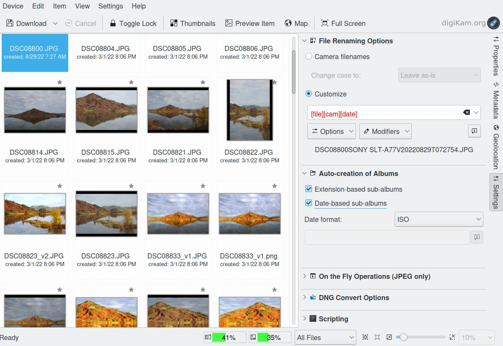

    The digiKam :ref:`Import Tool <advanced_import>` Allows You to Create Albums and Rename Files Based on Item Properties

Automatic Metadata
~~~~~~~~~~~~~~~~~~

So how do you go about all this metadata business? First, your images already contain a lot of **automatically generated metadata**, such as Exif data and Makernotes. If you have configured a digiKam Template with your identity, all imported images can automatically be imprinted with this data set which includes author information, copyrights, etc. If you record a GPS track at the same time as you are taking photographs, you can add geolocation metadata to the images in a single action using the Geolocation tool. Even if you brought back 1000 images from a shooting session, it shouldn't take more than 10 minutes to add identity and location data.

At this point, you'd have all camera settings of every shot, lens data like zoom, focus, aperture etc., date and time, shooting location, copyrights, authorship, program used, and more. Not bad, but we could have done more when importing: we could have changed the file names to include the date, or place or theme; we could have changed the format to a lossless 16 bit per channel format; or we could have automatically separated JPEG and RAW files into separate folders.

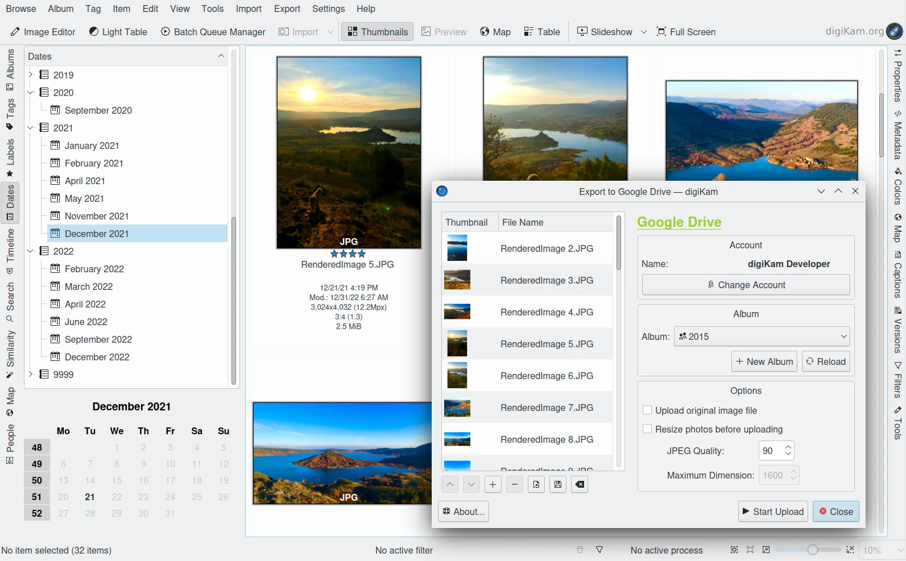

    digiKam with a Hierarchical View of :ref:`Shooting Dates <dates_view>` that can be Easily Exported to a Remote Web Service

We actually recommend auto-renaming files to match an event, a place or a theme. digiKam provides automatic date/calendar related grouping so there's no real need for coding the date into the file name. But you can code in the date if you'd like to browse your albums with another application that is not calendar savvy.

Odds are that you will buy a new camera one day. The numbering scheme of that new camera will start over again, typically at IMG_0001.JPG, creating identical file names to the files you have already. By renaming files on import, you lessen the chance of inadvertently overwriting other files at a later date. If you do decide to rename files, keep the new names clean: use alphanumerics, dashes, underscores and a single period prior to the file extension.

We also recommend switching-on the **Save Metadata** options in the :ref:`digiKam settings page for metadata <metadata_settings>`. This will ensure that Exif, IPTC and XMP information is written into the file. If you forgot to do that, you can always catch up by copying the metadata in the database to the files in one go (from the **Album** menu).

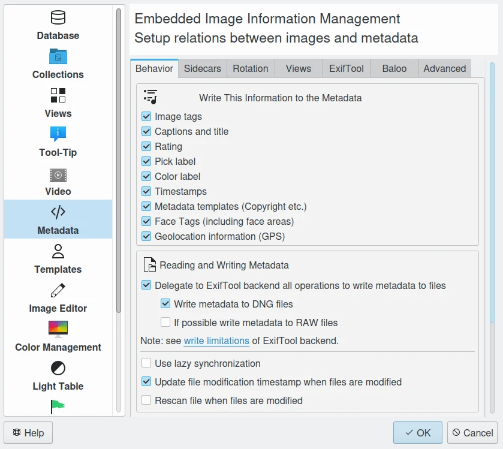

    The digiKam Metadata Workflow Settings Panel

Now we have a lot of stuff already in our database, but what if we need to change some of it? digiKam provides a :ref:`Metadata Editor <metadata_editor>` for editing a selected number of the most important attributes.

.. figure:: images/dam_metadata_editor.webp
    :alt:
    :align: center

    The digiKam :ref:`Metadata Editor <metadata_editor>` Modify XMP Properties

The real work begins with the application of **Tags**, **Captions** and a **Rating** to every photograph. This is not as time consuming as it may sound since one or more attributes can be applied to any number of selected images in a single action. There are even tools to automatically assess and assign tags to images based on image quality, or the people who appear in the image.

Specifically, digiKam provides **automatic tagging** features based on deep-learning:

    - :ref:`Image Quality Sorting <maintenance_quality>` automatically assigns a **Pick Label** of either **Rejected**, **Pending** or **Accepted** to items based on aesthetic factors.
    - :ref:`Face Detection <face_detection>` automatically detects faces in images and records face areas in the database.
    - :ref:`Face Recognition <face_recognition>` automatically assigns people tags based on existing face tags.

    .. figure:: images/dam_maintenance_tool.webp
        :alt:
        :align: center

        digiKam Maintenance Tool is The Best Way to Auto-tag items by :ref:`Quality <maintenance_quality>` or for :ref:`Faces <maintenance_faces>`

These kinds of tools require extra data model files to run, which can be installed during digiKam's first run, or from :menuselection:`Settings --> Configure --> System --> Download Required Binary Data...`.

.. _rating_ranking:

Rating and Ranking
~~~~~~~~~~~~~~~~~~

After automatic tagging, it's best to start with image ratings, because they allow you to concentrate further work on just the best shots.

The ranking system implemented in digiKam uses a 5 star rating tool. In fact there are 6 levels, zero through five stars (*) can be attributed to an image. Note when rankings are saved into IPTC metadata, the levels are translated to ensure compatibility with other programs. A rating can be rapidly applied with digiKam to one or more photographs by using keyboard shortcuts or the mouse. The rating can then be entered as a search criteria or a selection criteria directly from the status bar quick filters.

However, before you start attributing stars everywhere, please take a moment to establish your personal criteria for ranking. The best practice is to write down a qualitative description of each rating that defines what you actually mean when assign a given number of stars.

One such rating system might be:

    - 0 stars: Unrated: Images have not been rated.
    - 1 star : OK. Photo has flaws, but valuable enough to keep.
    - 2 stars: Good. Photo good enough for small prints, composition is OK.
    - 3 stars: Very Good. Photo good enough for large prints, good composition and lighting
    - 4 stars: Excellent. Photo 100% sharp, great composition and lighting. A real keeper.
    - 5 stars: Perfect. Professional level photo.

Your system may vary, but there should be far fewer images rated with each increase in the numbers of assigned stars. A ratio of 3-10 between each level has proven useful.

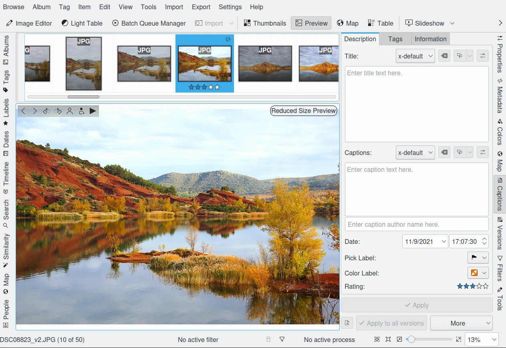

    The Edit :ref:`Rating Properties <labels_edit>` From Thumb-bar

Picking a ratio between levels will get you quite far in distinguishing your rating pyramid. Say, you choose a ratio of 7 between levels. For every five-star image you'll then have 7 four-star images, 49 three-star images and so on, resulting in almost 20000 pictures. Amazing? Yes, and 16807 of them you didn't have to rate at all!

You even can define a different rating scheme depending on the kind of use, 2 stars for commercial use, may mean something different than 2 stars for holiday photos. It is also a good practice to define a neutral rating, where everything below is actually a negative rating.  Or you could assign purposes to your ratings, like this:

    - 0 stars for *can throw away*.
    - 1 star for images in quarantine (decide later).
    - 2 stars for gallery export.
    - 3 stars for printing.
    - 4 stars for selling.
    - 5 stars for *have to work on*.

Decide on an approach that most suits your needs. The following table illustrates a possible evolution for a professional photographer using a ranking ratio of roughly 7 over the next 12 years. It is evident that the good shots can be easily found, even within millions of photos.

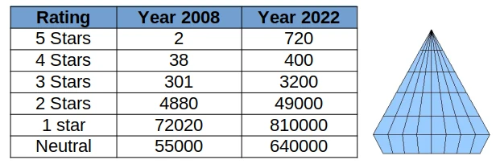

    The Rating Pyramid

.. _asset_tags:

Tagging and Keywords
~~~~~~~~~~~~~~~~~~~~

Let's next consider **Tags** (which are also called keywords or categories in other applications).

Tags are a hierarchical labeling system that is created by simply adding new tags to the hierarchy. The important thing to do is to create a system of keywords that suits your needs and habits. Are you a (semi) professional who wants to sell photographs to agencies, do you want to publish on a web gallery, or are you just the occasional amateur managing your family's visual memories?

In any case, you want to design a tag structure that is adapted to your use case. You can configure digiKam to write the whole tag hierarchy into XMP fields so that your photographic agency can use whatever application they want to automatically create **Titles** and **Captions** for exporting to the web based on the embedded tags. Or you can simply add keywords so you can quickly find a specific picture again.

.. figure:: images/dam_assign_tags.webp
    :alt:
    :align: center

    The digiKam Image Editor Assigning More Than One Tag at the Same Time Within the :ref:`Right Sidebar <captions_view>`

A keyword hierarchy will provide you with automatic groupings. For example, if you start a typical private use hierarchy with the top-level tags *Activities*, *People*, *Places*, *Themes*, and *Projects*, everything you tag with a sub-tag of these will be grouped together into a virtual album. digiKam has a dedicated view in the left sidebar for these virtual albums. But it gets even better.

For example, a good tag to add to a photo taken along the Okavango River might be: *Places/Africa/Botswana/Okavango*.

As you continue adding sub-tags to the keyword hierarchy, not only will you be able to search and filter for these keywords, but the right sidebar tag filter allows you to select combinations of tag groups. Let's say you select the virtual album *People* in the left sidebar tag panel and you have 12 different tags for people in there. You can then combine it with the right sidebar to choose only images tagged with *Peter*, *Paul* and *Mary* out of the 12.

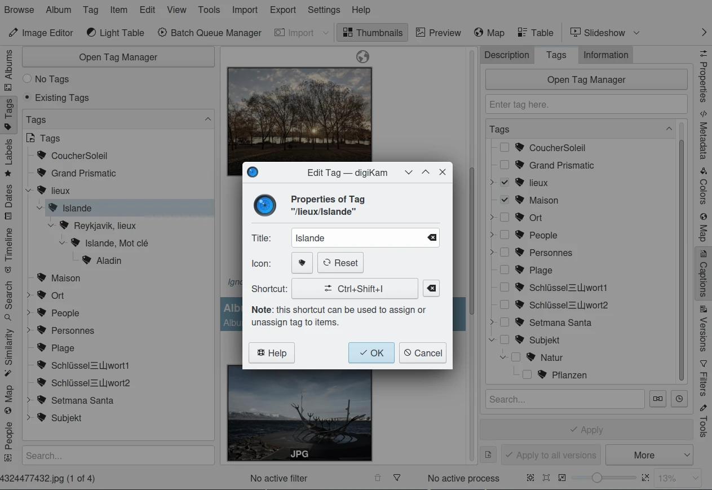

    The digiKam :ref:`Tag Properties Dialog <managing_tags>`

In the long run you will forget the subjects of your pictures, or any details about the shot, as the metadata in your brain fades. It is therefore paramount that you **choose general and generic categories** to tag your shots. You will always remember that a particular shot was set at a river bank in a country or continent (aka river, continent), but you'll forget which river it was. Instead of only tagging it with *Places/Africa/Botswana/Okavango*, tagging the same image with *river/Africa* can give you another place to find the image in the tag hierarchy. Additional details can either be stored into another tag, or into the **Captions** properties that are discussed in the next section. One trick that may help is to use keywords corresponding to the words you might use to perform a search on an Internet search engine.

Another categorization might be task-oriented as in *print jobs*, *web export*, *personal*, *galleryXYZ*, *clients*, *slideshow*, etc. Create groups as you need them, but no more than you need. You should be able to remember all of your top-level tags, otherwise the differentiations will become useless. Don't forget that you have all the other attributes to narrow down the search. The right sidebar tag filter combines with any view of the left sidebar (albums, calendar, timeline, tag and search). Workflow categorizations can also be easily assigned to **Color Labels** in digiKam.

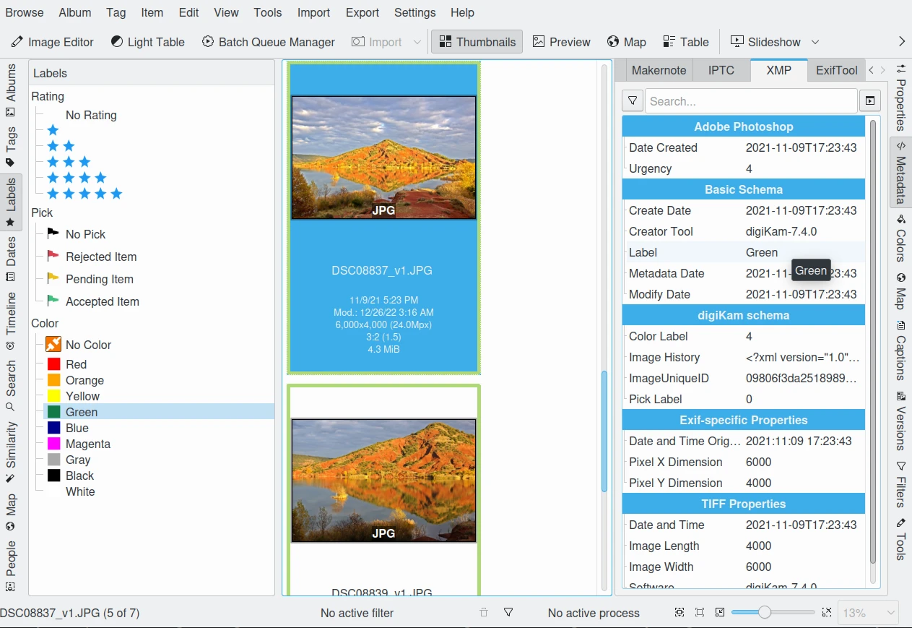

    The digiKam :ref:`Color Labels <labels_view>` Can be Used to Group Items For Your Workflow Stages

Another digiKam feature is the **Pick Labels** used to categorize shots by quality and identify which item will be **Rejected**, **Pending**, or **Accepted** in your workflow. You can assign these properties manually of course, but there is a better solution: digiKam can automatically perform image quality analysis using a deep-learning based tool named **Image Quality Sorter**. This tool evaluates image features such as noise, blur, form, shape, contents, etc., and gives an evaluation of the quality of the shot. This tool is available in the :menuselection:`Tools --> Maintenance...` menu and in the **Batch Queue Manager**.

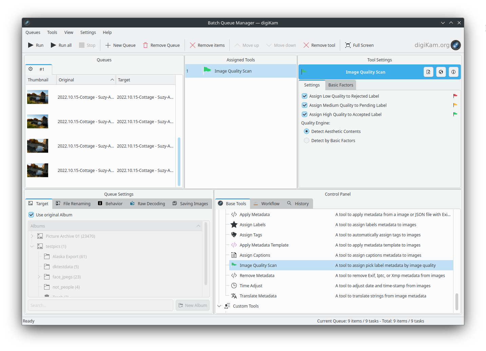

    The digiKam Pick Labels can be Assigned Automatically Depending on the  :ref:`Quality of Shot in Batch Queue Manager <bqm_qualitysort>`

When you import cataloged images from other sources that already have embedded tags, digiKam will automatically create the keyword trees for you, adding the appropriate tags in the right place. The hierarchy tree can be easily rearranged by using drag and drop to move a sub-tree to another place in the hierarchy. The changed tags will be updated as digiKam traverses through the branches.

The graphic below shows how different digiKam item properties overlap. This is a very coarse representation, as each block of metadata will in itself be subdivided into many sections. **File-names** and **Files-dates** data are properties of all images taken from the file system if necessary.

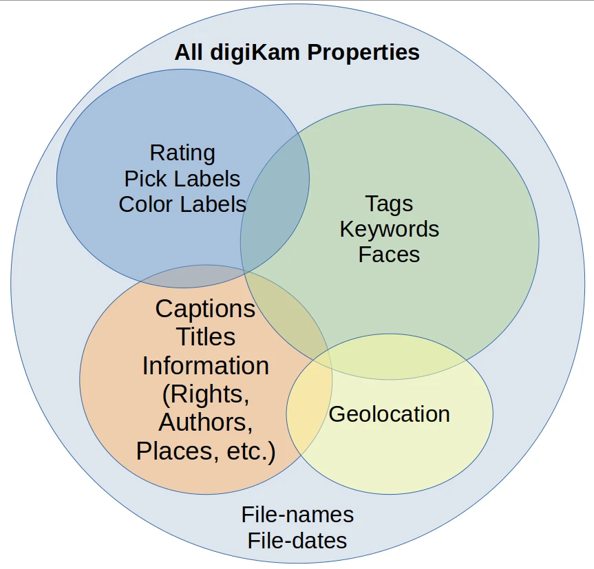

    The Different Item Properties Available in digiKam

.. _captions_comments:

Captions and Comments
~~~~~~~~~~~~~~~~~~~~~

**Captions** are another kind of metadata that can be used to store text that describes the image.

Whereas **Tags** offer a hierarchical description suited to finding and grouping images, **Captions** are prose descriptions containing details and anecdotal information. Captions serve the purpose of provided unformatted information about the image. Captions could have been called comments, but digiKam uses the term Caption in agreement with IPTC usage.

Captions can also be used to filter the catalog, but this is not their primary purpose. Captions are instead used to remember the story, the event, and the emotions. Captions can make photographs much more interesting to look at. Captions provide context and meaning to photographs. If the picture is an aesthetic statement, the caption should be the emotional and informational complement.

You probably want people to see your photographs. Most people want to share them with friends, family, other photographers, agencies, and the world by putting them on the Internet. And don't tell us you're not interested in how your photos are being received!

So you might have the most beautiful portrait, sunset or landscape and nobody seems to care. Why is that? Look at some good photographs yourself without reading the title, comment or background information. How many of you are interested in depth of field, exposure time, white balance etc.? Some, of course. But everybody will be interested in the story the pictures tell. We are constantly bombarded with meaningless images, so if you want someone to remember your photograph, you need to give them a caption that explains it all.

Take a look at this panorama. From far away, it is not even a nice beach panorama. If you look a bit closer, you start to see some details, people, the space.

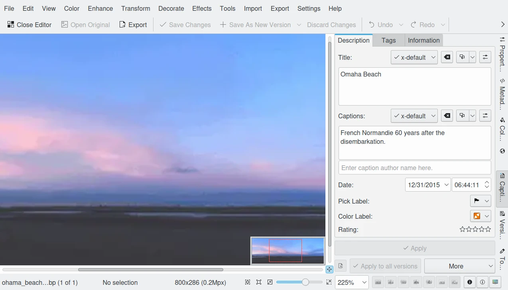

    digiKam Editing Panorama :ref:`Title From Captions Sidebar <comment_editors>` Tab Within Image Editor

But what if the **Caption** tells you that this is *Omaha Beach*, the Allies landing site in French Normandie 60 years after the disembarkation. One starts to dream, have associations, memories. The historical time span is present. You may hear the silence. The **Caption** has totally reframed your perception of this panorama.

For others to appreciate your photographs, the **Title** and **Caption** are probably more important than the image itself for the interest it creates. When you show pictures, tell a story. Remember that the key is to convey meaning to viewers, to help them understand what you understand about the subject and what moved you.

    - Let people know what you understand about the subject, why you love it.

    - Create a red line between the photographs.

    - Oppose or relate them to different epochs.

    - Take notes shortly after shooting to remember.

    - Contemplate, research, watch, and talk - but mostly listen.

    - It's okay if the image is less than perfect because it has the strength to stand on its own merit described in the **caption**.

With digiKam you can enter unlimited amounts of text using an internationalized alphabet (UTF-8) as a caption and title. You can enter a single caption and title for a selection of photos at the same time. When you export images to web services, you can choose to independently include or exclude the caption and title assigned to the images - no need to re-write the story for publishing.

Geolocation and Geo-tagging
~~~~~~~~~~~~~~~~~~~~~~~~~~~

Do you remember the time before GPS? A time when you would find your way to another city without a navigation system? Wasn't the earth a dull blue ball before Google Earth? Well times have changed, and it is easy these days to geo-tag most images to mark where on the globe they were taken.

A few cameras with built-in GPS receivers produce images that are automatically tagged with 3-dimensional coordinates. digiKam can geo-tag images from all other cameras based on a recording of locations made by almost any GPS device. There are three requirements for automatic geo-tagging:

* The clock on the camera should be set to the correct time,
* The GPS receiver has to be switched on, in logging mode, and carried with you while you take your photographs, and
* You need to be able to extract a GPS track from the receiver in GPX file format. There are tools that can help download track data from a receiver into a GPX format, such as `gpsbabel <https://www.gpsbabel.org/>`_.

You then can automatically match a set of photos with the GPS track data using digiKam. The coordinates are written into the JFIF part of the JPG files, depending on your settings, and into the database. Given geo-tagged images, digiKam supports searches based on locations and coordinates. You can even create virtual albums based on geographical areas! In the right sidebar under the metadata tab, you'll find your images located on zoomable and scrollable world map. A further click allows you to use any one of several mapping services on the web, zooming in on details. Even if you don't have a GPS track, you can geo-tag multiple images with a geo-editor. Just navigate on the map and click on the location where the images were shot in order to geo-tag the images.

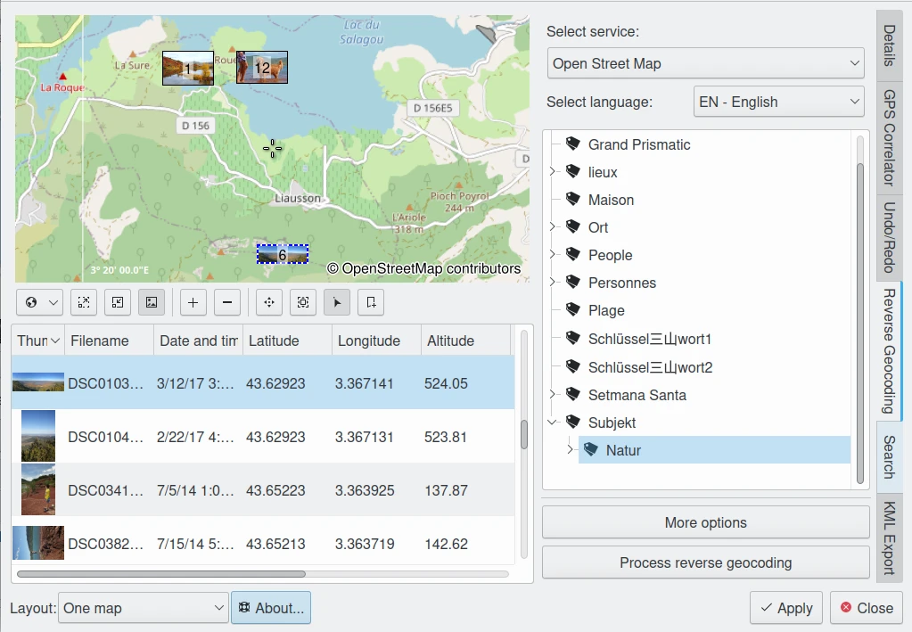

    digiKam Editing Geolocation and Processing :ref:`Reverse Geocoding <geoeditor_reverse>` with OpenStreetMap

The possibilities of exploiting image geolocation are already innumerable and will become pervasive in the future. We are not too far away from the day when we can revisit old trips in a virtual reality based on geo-tagged pictures. digiKam also supports :ref:`exporting to KML files <geoeditor_kmlexport>` that can be opened by GoogleEarth (which in turn will show the photos at their shooting site), exporting to Piwigo, Google Photo, Flickr etc. with OpenStreetMap viewer and more.
