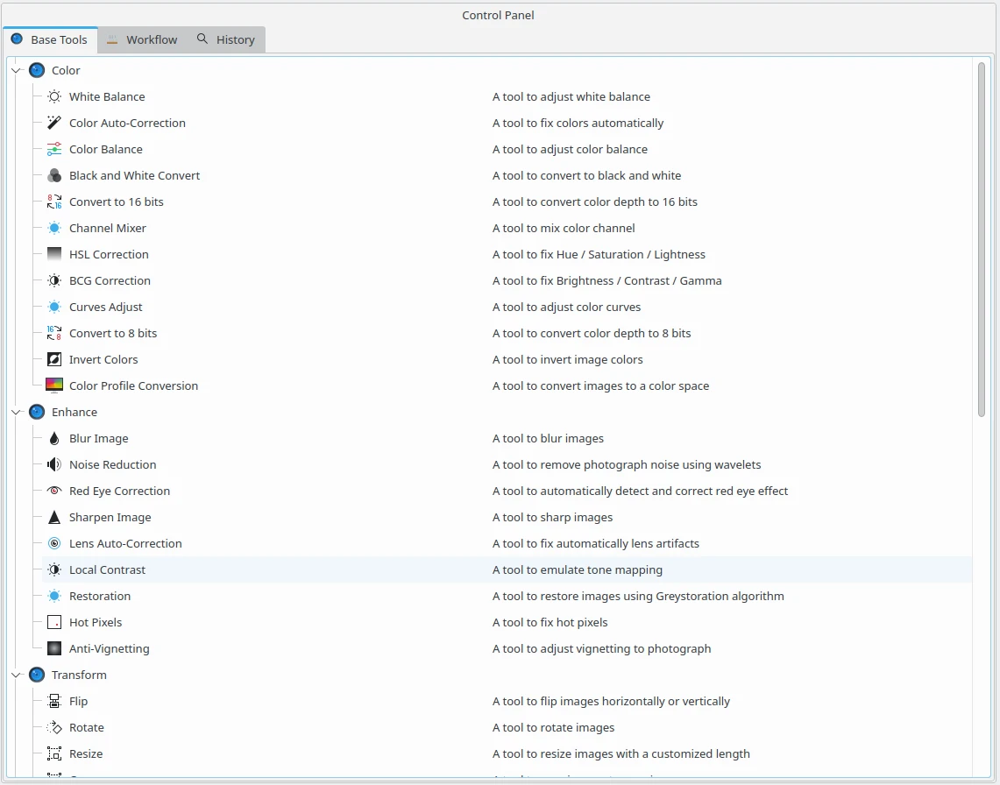

.. meta::
   :description: digiKam Batch Queue Manager Base Tools
   :keywords: digiKam, documentation, user manual, photo management, open source, free, learn, easy, batch, queue, manager, tools, color, enhance, transform, effects, decorate

.. metadata-placeholder

   :authors: - digiKam Team

   :license: see Credits and License page for details (https://docs.digikam.org/en/credits_license.html)

.. _base_tools:

Base Tools
==========

.. contents::

The Batch Queue Manager tools are available as plugins loaded dynamically at startup and configurable in :ref:`Setup dialog <plugins_settings>`. Excepted few ones, mostly all tools share the same fonctionalities than tools from **Image Editor**. The difference with Image Editor tools is the no possibility to preview the tool effects over the images.

    The Batch Queue Manager View to Select Base Tools for Creating a Workflow

List of tools comming from Image Editor and shared in Batch Queue Manager is given below:

    - Image Color Corrections:

        - :ref:`Encoding Depth <color_depth>`

        - :ref:`Color-Space Converter <color_cm>`

        - :ref:`Auto Correction <color_auto>`

        - :ref:`Brightness / Contrast / Gamma <color_bcg>`

        - :ref:`Hue / Saturation / Lightness <color_hsl>`

        - :ref:`Colors Balance <color_balance>`

        - :ref:`Adjust Levels <color_levels>`

        - :ref:`White Balance <color_wb>`

        - :ref:`Curves Adjust <color_curves>`

        - :ref:`Channels Mixer <color_mixer>`

        - :ref:`Black and White <color_bw>`

        - :ref:`Simulate Infrared Film <color_infrared>`

        - :ref:`Simulate Negative Film <color_negative>`

        - :ref:`Invert Colors <color_invert>`

    - Image Enhancement:

        - :ref:`Sharpening (sharpen, unsharp mask, refocus) <enhance_sharpen>`

        - :ref:`Blur Tool <enhance_blur>`

        - :ref:`Red Eyes Removal <enhance_redeyes>`

        - :ref:`Local Contrast <enhance_localcontrast>`

        - :ref:`Noise Reduction <enhance_nr>`

        - :ref:`Hot Pixel Correction <enhance_hotpixels>`

        - :ref:`Lens Distortion Correction <enhance_lensdistortion>`

        - :ref:`Photograph Restoration <enhance_restoration>`

        - :ref:`Vignetting Correction Tool <enhance_vignetting>`

        - :ref:`Lens Auto-Correction Tool <enhance_lensauto>`

        - :ref:`Healing Clone Tool <enhance_clone>`

    - Image Transformation Tools:

        - :ref:`Crop Tool <transform_crop>`

        - :ref:`Change Size <transform_resize>`

        - :ref:`Liquid Rescale <transform_liquidrescale>`

        - :ref:`Free Rotation <transform_freerotation>`

        - :ref:`Perspective Adjustment <transform_perspective>`

        - :ref:`Shearing Tool <transform_shear>`

    - Image Decoration Tools:

        - :ref:`Add Border <decorate_border>`

        - :ref:`Insert Text <decorate_inserttext>`

        - :ref:`Apply Texture <decorate_texture>`

    - Special Effect Filters:

        - :ref:`Color Effects <effects_color>`

        - :ref:`Add Film Grain <effects_filmgrain>`

        - :ref:`Simulate Oil Painting <effects_oilpaint>`

        - :ref:`Simulate Charcoal Drawing <effects_charcoal>`

        - :ref:`Emboss Photograph <effects_emboss>`

        - :ref:`Distortion FX <effects_distortion>`

        - :ref:`Blur FX <effects_blur>`

        - :ref:`Add Rain Drops <effects_raindrops>`
