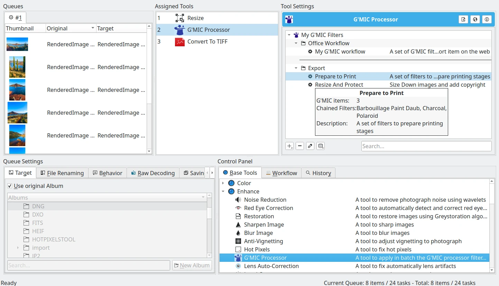
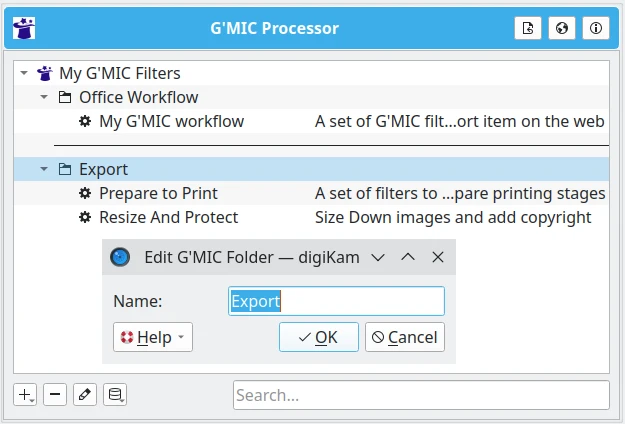
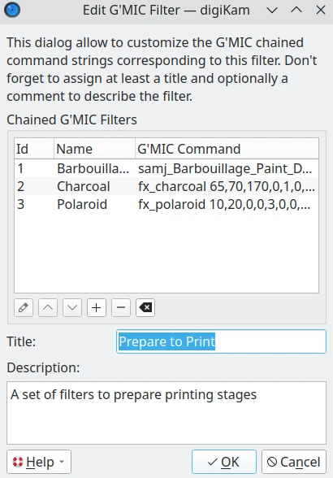
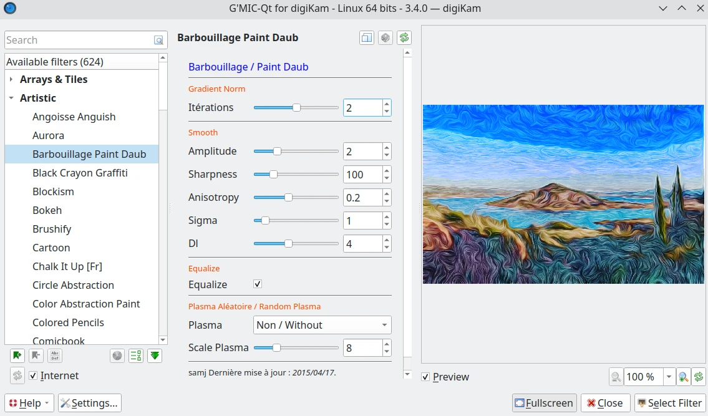

.. meta::
   :description: digiKam Batch Queue Manager Base Tools
   :keywords: digiKam, documentation, user manual, photo management, open source, free, learn, easy, batch, queue, manager, tools, color, enhance, transform, effects, decorate

.. metadata-placeholder

   :authors: - digiKam Team

   :license: see Credits and License page for details (https://docs.digikam.org/en/credits_license.html)

.. _base_tools:

Base Tools
==========

.. contents::

Overview
--------

The Batch Queue Manager tools are available as plugins loaded dynamically at startup and configurable in :ref:`Setup dialog <plugins_settings>`. Except few ones, mostly all tools share the same functionalities than plugins from :ref:`Image Editor <image_editor>`. The difference with Image Editor tools is that there is no possibility to preview the tool effects over the images. Other tools are more designed to **Convert** to file formats, and to apply the :ref:`Digital Asset Management <asset_management>`.

.. figure:: images/bqm_base_tools_view.webp
    :alt:
    :align: center

    The Batch Queue Manager View to Select Base Tools for Creating a Workflow

.. _bqm_editortools:

Shared Image Editor Tools
-------------------------

List of tools coming from Image Editor and shared in Batch Queue Manager is given below. This list provide the links to Image Editor chapters from this manual corresponding to the Batch Queue Manager tools.

.. _bqm_colortools:

    - Image Color Corrections:

        - :ref:`Convert to 8 bits <color_depth>`

        - :ref:`Convert to 16 bits <color_depth>`

        - :ref:`Color Profile Conversion <color_cm>`

        - :ref:`Color Auto-Correction <color_auto>`

        - :ref:`BCG Correction <color_bcg>`

        - :ref:`HSL Correction <color_hsl>`

        - :ref:`Colors Balance <color_balance>`

        - :ref:`White Balance <color_wb>`

        - :ref:`Curves Adjust <color_curves>`

        - :ref:`Channels Mixer <color_mixer>`

        - :ref:`Black and White Convert <color_bw>` (including also the :ref:`Simulate Infrared Film <color_infrared>`)

        - :ref:`Invert Colors <color_invert>`

    .. note::

        **Adjust Levels** and **Simulate Color Negative Film** are not available in Batch Queue Manager.

.. _bqm_enhancetools:

    - Image Enhancement:

        - :ref:`Sharpen Image (sharpen, unsharp mask, refocus) <enhance_sharpen>`

        - :ref:`Blur Image <enhance_blur>`

        - :ref:`Red Eyes Correction <enhance_redeyes>`

        - :ref:`Local Contrast <enhance_localcontrast>`

        - :ref:`Noise Reduction <enhance_nr>`

        - :ref:`Hot Pixel Correction <enhance_hotpixels>`

        - :ref:`Restoration <enhance_restoration>`

        - :ref:`Anti-Vignetting <enhance_vignetting>`

        - :ref:`Lens Auto-Correction Tool <enhance_lensauto>`

    .. note::

        **Healing Clone Tool** and **Lens Distortion Correction** are not available in Batch Queue Manager.

.. _bqm_transformtools:

    - Image Transformation Tools:

        - :ref:`Crop Tool <transform_crop>`

        - :ref:`Resize <transform_resize>`

        - :ref:`Rotate <transform_freerotation>`

        - :ref:`Flip <transform_rotationflip>`

        **Liquid Rescale**, **Perspective**, **Shearing Tool**, and **Proportional Crop Tool** are not available in Batch Queue Manager.

.. _bqm_decoratetools:

    - Image Decoration Tools:

        - Add Watermark (more powerful tool than **Insert Text** from Image Editor)

        - :ref:`Insert Text <decorate_inserttext>`

        - :ref:`Add Texture <decorate_texture>`

.. _bqm_effecttools:

    - Special Effect Filters:

        - :ref:`Color Effects <effects_color>`

        - :ref:`Add Film Grain <effects_filmgrain>`

    .. note::

        **Simulate Oil Painting**, **Simulate Charcoal Drawing**, **Emboss Photograph**, **Distortion FX**, **Blur FX**, and **Add Rain Drops** are not available in Batch Queue Manager.

.. _bqm_converttools:

Convert Tools
-------------

These tools allow to save images to new file formats. These are mostly placed at end of your list of **Assigned Tools** from your **Workflow**.

    - :ref:`Convert to TIFF <image_formats>`

    - :ref:`Convert to PGF <image_formats>`

    - :ref:`Convert to HEIF <image_formats>`

    - :ref:`Convert to AVIF <image_formats>`

    - :ref:`Convert to PNG <image_formats>`

    - :ref:`Convert to JPEG <image_formats>`

    - :ref:`Convert to JPEG 2000 <image_formats>`

    - :ref:`Convert to WEBP <image_formats>`

    - :ref:`Convert RAW to DNG <dng_converter>` (this specific tool must be placed on to top of your list of **Assigned Tools** from your **Workflow**).

.. _bqm_metadatatools:

Metadata Tools
--------------

    - :ref:`Image Quality Sort <bqm_qualitysort>`

    - :ref:`Apply Metadata Template <bqm_assigntemplate>`

    - :ref:`Translate Metadata <bqm_translatemetadata>`

    - :ref:`Assign Captions <bqm_assigncaptions>`

    - :ref:`Assign Labels <bqm_assignlabels>`

    - :ref:`Remove Metadata <bqm_removemetadata>`

    - :ref:`Time Adjust <bqm_timeadjust>`

.. _bqm_customtools:

Custom Tools
------------

    - :ref:`User Shell Script <custom_script>`

.. _bqm_gmictools:

G'MIC Processor
---------------

Introduction
~~~~~~~~~~~~

G'MIC (GREYC's Magic for Image Computing) is a free and open-source framework for image processing. It defines a script language that allows the creation of complex macros. Originally usable only through a command line, this tool allows to run the G'MIC processor in batch over more than one item previously hosted in a queue.

The Tool View
~~~~~~~~~~~~~

The tool provides a tree-view of the user customized G'MIC filters, chained and applied on all images, one by one. The selection of the G'MIC filter settings is done using the Gmic-Qt interface which provides a preview of the filters based on the current selected item from the queue. A complete description of the G'MIC-Qt interface is done in the dedicated section of the :ref:`Image Editor tool <enhance_gmicqt>`.

The G'MIC filters tree-view in the Batch Queue Manager can be customized as a hierarchy of folders where the chained G'MIC filters can be grouped by categories. A separator can be also appended to the view to well differentiate the groups.

    The G'MIC Batch Queue Manager Tool Tree-View

For each entry, a tree-view shows the title and the description. A tool-tip is also provided to easily select the right item on the list. The tool-tip shows the title, the number of chained filters, the filters names, and the description.

On the bottom of the tree-view, a tool-bar will provide all actions available to manage the contents. From the left to right, the buttons are:

 - *Plus* icon to add an entry, as a new filter, a folder, or a separator.
 - *Minus* icon to remove the currently selected entry.
 - *Edit* icon to open the properties dialog for the currently selected entry.
 - *Database* icon to import or export the hierarchy from the disk using the XML format.

On the right side of the tool-bar, a search text field can be used to filter the tree-view using keywords included in the entries titles.

The Property Dialog
~~~~~~~~~~~~~~~~~~~

The property dialog allows editing the G'MIC filter and folder settings. They can be opened directly by a mouse double-click on one tree-view entry.

The folder dialog allows you to create or rename a sub-directory hosted in the tree-view.

    The G'MIC Folder Properties Dialog

The filter dialog allows you to create or edit a G'MIC filter in the tree-view. You can customize all the settings for one entry, as:

 - The list of chained G'MIC commands.
 - The order of the G'MIC Command.
 - The main title of the tree-view entry.
 - The description of the tree-view entry.

    The G'MIC Filter Properties Dialog

On the bottom of the G'MIC commands list, a tool-bar provides the main command to manage the contents. From the left to right, the buttons are:

 - *Edit* icon to customize the current G'MIC command using the filter selector dialog.
 - *Up* icon to move the current G'MIC command to the top of the list.
 - *Down* icon to move the current G'MIC command to the bottom of the list.
 - *Plus* icon to add a new G'MIC command in the list using the filter selector dialog.
 - *Minus* icon to remove the current G'MIC command from the list.
 - *Clear* icon to erase the contents of the list.

The Filter Selector
~~~~~~~~~~~~~~~~~~~

The filter selector dialog allows you to choose the G'MIC filter command for one entry of the G'MIC filter properties dialog. They can be opened directly by a mouse double-click on one entry.

This dialog is mostly the same as the G'MIC-Qt dialog available in :ref:`Image Editor <enhance_gmicqt>`, except that filter preview is done over a reduced version of the currently selected item from the Queue.
Also, the chosen filter is not applied to the image. Only the G'MIC command settings are captured and passed to the list.

    The G'MIC Filter Selection Dialog

Integrating The Procesor
~~~~~~~~~~~~~~~~~~~~~~~~

To use the G'MIC processor in the Batch Queue Manager, place the tool in your Assigned List of tools, and select the desired G'MIC filter to run with your queued images.

Between the Batch Queue Manager sessions, the G'MIC tree-view will remember the last used filter. It will be the same behavior if you save the Assigned List of tools as a Batch Queue Manager workflow.
