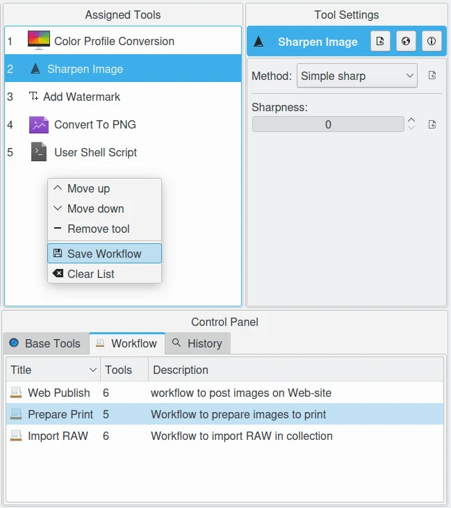
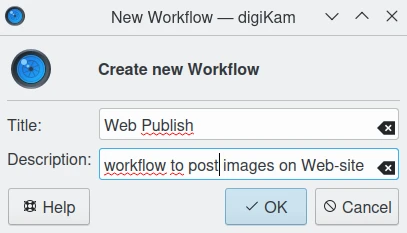
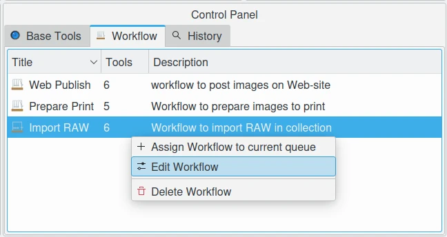

.. meta::
   :description: digiKam Batch Queue Manager Workflow
   :keywords: digiKam, documentation, user manual, photo management, open source, free, learn, easy, batch, queue, manager, tools, workflow

.. metadata-placeholder

   :authors: - digiKam Team

   :license: see Credits and License page for details (https://docs.digikam.org/en/credits_license.html)

.. _bqm_workflow:

Workflow
========

.. contents::

On the bottom right, the Batch Queue Manager has a tab named **Workflow** which is empty by default. This view is a list where user can store the preferred set of tools to assign to queues. This list is saved and restored between sessions and can be re-used as well.

A workflow store:

    - The order of tools to run over a queue from the **Assigned Tools** view.
    - For each tools, all settings customized in **Tools Settings** view.
    - All settings from the **Queue Settings** view.

 This allows to reproduce easily the items batch processing adjusted for your use cases. A workflow has tree properties to be identified in the **Workflow** tab:
 
    - A **Title** as text to name the workflow.
    - A **Description** as text to give details about a workflow.
    - The amount of tools registered.

 All this information is stored in an XML file hosted in your home directory.

    The Batch Queue Manager Workflow Stores all Settings to Apply on a Queue

To create a new Workflow, select your tools from **Base Tools** tab and drag and drop items to **Assigned Tools** list to create your sequence. When all is done, right click with mouse over the list to show the pop-up menu and select the **Create Workflow** option. A dialog will appears to fill the workflow **Title** and **Description** properties. Press **OK** to append the new item on the **Workflow** tab.

    The Batch Queue Manager Workflow Create Dialog

Later, with a new Queue, if you want to apply a workflow with your precious tools/settings, just double click over an item from **Workflow** tab, or drag and drop the item from **Workflow** tab to **Assigned Tools**. The Workflow will be assigned to the current Queue abd will be ready to run.

To manage a workflow entry, right-click with mouse over an entry from the **Workflow** tab to enable the context menu. This allows to edit a workflow properties or to delete it.

    The Batch Queue Manager Worflow Context Menu
