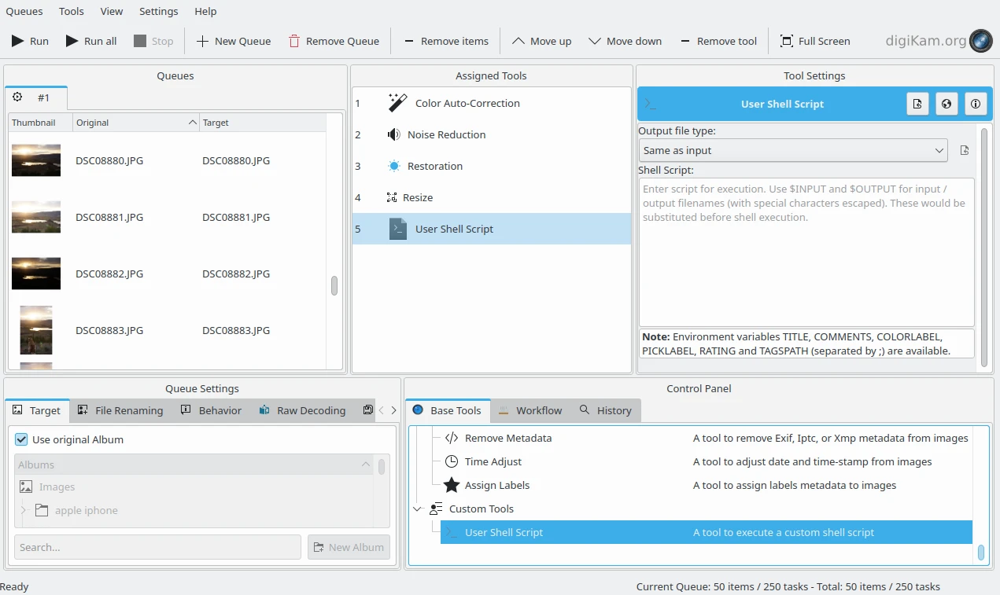

.. meta::
   :description: digiKam Custom Script from Batch Queue Manager
   :keywords: digiKam, documentation, user manual, photo management, open source, free, learn, easy, batch, custom, script

.. metadata-placeholder

   :authors: - digiKam Team

   :license: see Credits and License page for details (https://docs.digikam.org/en/credits_license.html)

.. _custom_script:

Custom Script
=============

.. contents::

Overview
--------

The Batch Queue Manager allows you to customize a **Workflow** by adding the **Custom Script** tool to run a script to process your images with external tools such as `ImageMagick <https://imagemagick.org/>`_ or `ExifTool <https://en.wikipedia.org/wiki/ExifTool>`_.

The tool named **Custom Script** is available from the **Custom Tools** category of the **Base Tools** list. The tool is designed to execute the source code for a shell script that can call one or more command line programs for each item in the Queue. the shell script is written by the user entirely within the plugin. These scripts can include a set of environment variables that specify filenames and few types of metadata.

    The Batch Queue Manager Including a Custom Script in a Workflow

The tool provides these options:

    - **Output Image Type**: specifies the expected image format at the output of your script. The default is **Same as input**, but you can set **JPEG**, **PNG**, or **TIFF**. Please note that JPEG is a lossy compression format, only supports 8-bit color depth, and does not support transparency.

    - **Shell Script**: this text field is where you enter the source code for your shell script. `Bash script <https://en.wikipedia.org/wiki/Bash_(Unix_shell)>`_ is supported under **Linux** and **macOS**. `Batch script <https://en.wikipedia.org/wiki/Batch_file>`_ is supported under **Windows**.

The keywords that you can use in your script code are listed below. The tool will replace all occurrences of keywords in the shell script at run time before the script execution. Note that the keywords are case sensitive.

    - **$INPUT** is replaced by the workflow input filename (with special characters escaped).

    - **$OUTPUT** is replaced by the workflow output filename (with special characters escaped).

.. important::

    A new file is always expected on **$OUTPUT**. Script programs that do not create a new file (e.g. changing metadata with ExifTool), must first copy **$INPUT** to **$OUTPUT** with the appropriate command for the operating system, before making any changes to **$OUTPUT**.

The environment variables that you can use in your shell script are:

    - **TITLE**: to use the digiKam **Title** item property from the database.

    - **COMMENTS**: to use the digiKam **Caption** item property from the database.

    - **COLORLABEL**: to use the digiKam **Color Label** item property from the database.

    - **PICKLABEL**: to use the digiKam **Pick Label** item property from the database.

    - **RATING**: to use the digiKam **Rating** item property from the database.

    - **TAGSPATH**: to use the digiKam **Tags** item property from the database.

.. note::

    Under Linux and macOS, environment variables can be accessed in the script with **$** as a prefix for variable names (for example **$INPUT**). The interpreter used to run the script is **/bin/bash**.

    Under Windows, environment variables can be accessed in the script with **%** as a prefix and suffix of variable names (for example **%INPUT%**). The interpreter used to run the script is **cmd.exe**.

Return Value
------------

By convention, a **Bash script** under Linux and macOS returns 0 on success or an integer in the range 1-255 for an error. Use **exit < error_code >** to pass the return value back to the workflow.

Under Windows, a **Batch script** returns 0 on success and another value for an error, but the value is a signed integer, so a negative value is possible. Use **EXIT /B < error_code >** to pass the return value to the workflow.

The Batch Queue Manager handles the value returned by your script. If zero is returned, the workflow will continue as expected, otherwise the workflow is interrupted and the Batch Queue Manager stops processing.

Examples
--------

Proof of Concept
~~~~~~~~~~~~~~~~

This First example shown below does nothing special. It prints on the console the input/output file names and item properties passed from the Batch Queue Manager to the script, and copies the input file to the output file (this stage is required to prevent the Batch Queue Manager from returning an error because the target file does not exist). The script returns the value from the file copy command, which is parsed by the Batch Queue Manager to for each item in the workflow.

.. code-block:: bash

    echo "INPUT FILE: $INPUT"
    echo "OUTPUT FILE: $OUTPUT"

    echo "TITLE: $TITLE"
    echo "COMMENT: $COMMENT"
    echo "COLORLABEL: $COLORLABEL"
    echo "PICKLABEL: $PICKLABEL"
    echo "RATING: $RATING"
    echo "TAGSPATH: $TAGSPATH"

    cp "$INPUT" "$OUTPUT"
    exit $?

If you have started digiKam from a terminal and enabled the debug traces on :ref:`Setup/Miscs/System dialog page <system_settings>`, you will see something like this:

.. code-block:: text

    digikam.general: Action Thread run  1  new jobs
    digikam.general: Tool : index=  1  :: name=  "UserScript"  :: group=  Digikam::BatchTool::CustomTool  :: wurl=  QUrl("file:///mnt/data/Images/SALAGOU")
    digikam.general: path:  "/mnt/data/Images/SALAGOU/BatchTool-EpEjEz-9e1c7a12.digikamtempfile.JPG"
    digikam.general: Tool:        "User Shell Script"
    digikam.general: Input url:   QUrl("file:///mnt/data/Images/SALAGOU/DSC08833.JPG")
    digikam.general: Output url:  QUrl("file:///mnt/data/Images/SALAGOU/BatchTool-EpEjEz-9e1c7a12.digikamtempfile.JPG")
    digikam.dplugin.bqm: Script stdout "INPUT FILE: /mnt/data/Images/SALAGOU/DSC08833.JPG\nOUTPUT FILE: /mnt/data/Images/SALAGOU/BatchTool-EpEjEz-9e1c7a12.digikamtempfile.JPG\nTITLE: Salagou Trip\nCOMMENT: \nCOLORLABEL: 5\nPICKLABEL: 3\nRATING: 3\nTAGSPATH: Places;Places/France;Places/France/Salagou Lake\n"
    digikam.dplugin.bqm: Script stderr ""
    digikam.dplugin.bqm: Script exit code: 0

The digiKam information taken from the database are:

    - Item processed is **/mnt/data/Images/SALAGOU/DSC08833.JPG**.
    - Target filename is **/mnt/data/Images/SALAGOU/BatchTool-EpEjEz-9e1c7a12.digikamtempfile.JPG** (a temporary file generated by Batch Queue Manager).
    - Item Title is **Salagou Trip**.
    - Item Comment is null.
    - Item Color Label is **5** (Green).
    - Item Pick Label is **3** (Accepted).
    - Item Rating is **3 stars**.
    - Item Tags are **Places**, **Places/France**, **Places/France/Salagou Lake**.

Add a Watermark with ImageMagick
~~~~~~~~~~~~~~~~~~~~~~~~~~~~~~~~

The second example below is more complex and uses the **ImageMagick** command line tool to add visible watermarks by superimposing a multiline text field over each image in the Queue.

.. code-block:: bash

    watermark="This image is\ncopyrighted and\navailable with\nlimited usage"

    in_file="$INPUT"
    out_file="$OUTPUT"

    convert -size 2000x1000 xc:none -gravity center \
        -stroke yellow -pointsize 120 -font Courier-BoldOblique -strokewidth 3 -annotate +100+100 "${watermark}" \
        -blur 0x25 -level 0%,50% \
        -fill white -stroke none -annotate +100+100 "${watermark}" \
        "${in_file}"  +swap -gravity center -geometry +0-3 \
        -composite  "${out_file}"

.. note::

    In this example, there is no explicit **exit** call to return a value to the Workflow. Bash uses the last called method as the returned value from the script, here the ImageMagick command line tool **convert**.

This give a result like below.

    The result of the Script Using ImageMagick to Apply a Watermark
