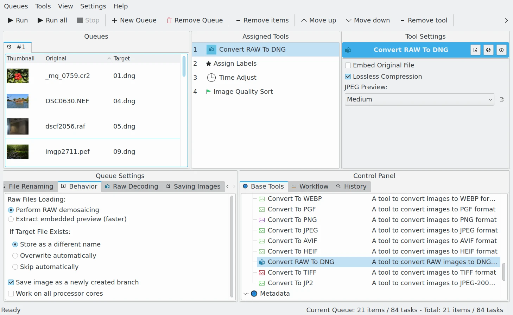

.. meta::
   :description: digiKam DNG Converter from Batch Queue Manager
   :keywords: digiKam, documentation, user manual, photo management, open source, free, learn, easy, batch, dng, converter

.. metadata-placeholder

   :authors: - digiKam Team

   :license: see Credits and License page for details (https://docs.digikam.org/en/credits_license.html)

.. _dng_converter:

DNG Converter
=============

.. contents::

digiKam comes with a nifty batch utility that allows you to convert RAW files to the DNG format. The question is, of course, why you would want to do that. After all, digiKam can handle RAW files without any problem, so what’s the point of adding one more step to your photographic workflow?

As you might know, RAW is not a file format, but rather an umbrella term that describes multiple file formats controlled by multiple hardware manufacturers. The RAW formats themselves are specific to digital camera manufacturers. For example, Canon cameras store RAW files in the CR3 format, while Nikon cameras use the NEF format. Besides being proprietary, RAW formats are often poorly documented and encumbered by patents.

`The Digital Negative (DNG) <https://fr.wikipedia.org/wiki/Digital_Negative>`_ format introduced by Adobe Systems, Inc in 2004 is designed to overcome these shortcomings by providing an open, well-documented universal format based on TIFF-EP standard for storing RAW files. If you would like to know more about the DNG format, see the :ref:`Digital Asset Management section <dam_fileformats>` from this manual. The `the DNG articles and links Web site <http://www.barrypearson.co.uk/articles/dng/>`_ provides also a wealth of valuable information on the topic.

Being an open and well-documented format, DNG is suited particularly well for long-term archiving of digital photos. Of course, the CR3 and NEF and other RAW formats are widely adopted and supported, so they are not going away anytime soon. But there is no reason why you shouldn’t save your RAW files in the DNG format to be on the safe side. After all, storage is cheap nowadays, and the Batch Queue Manager DNG Converter utility makes it supremely easy to convert RAW files to the DNG format.

    The Batch Queue Manager With a Workflow to Convert RAW files to DNG Container by Applying Metadata Adjustments

Using the Batch Queue Manager DNG Converter is easy to use. **Place the tool on the top of workflow list** (this point is mandatory), add the RAW files to the queue, specify a few options, and hit the **Start** button. For complete peace of mind, you might want to enable the **Embed Original File** option which embeds the source RAW data into the resulting DNG file.

**Lossless Compression** enable a non destrictive compression method to encode image data.

**

