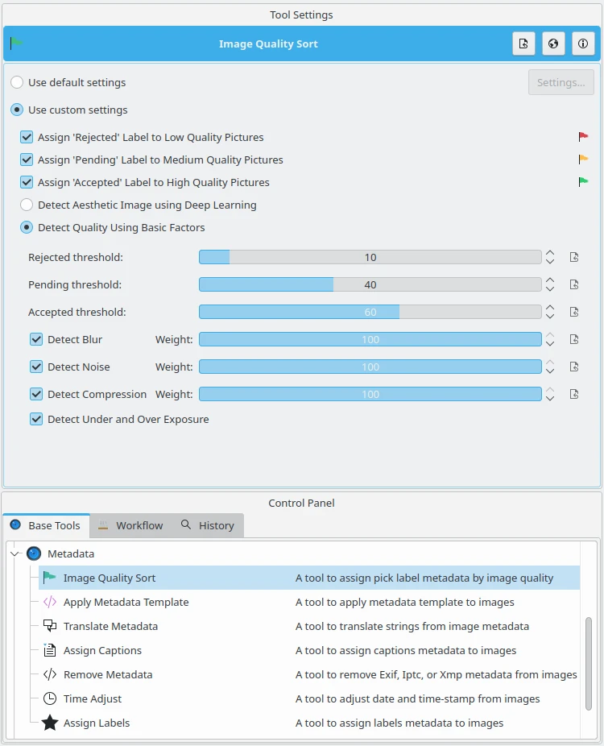
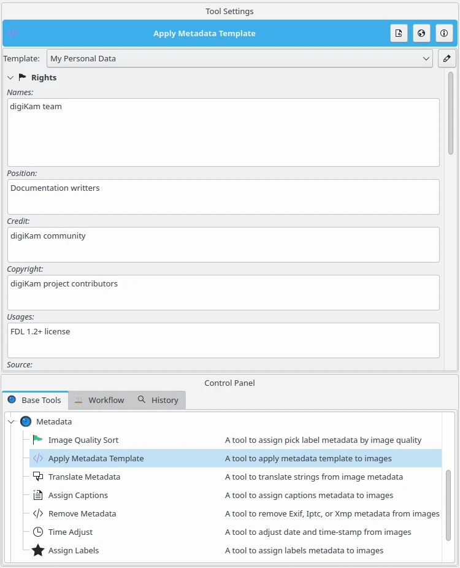
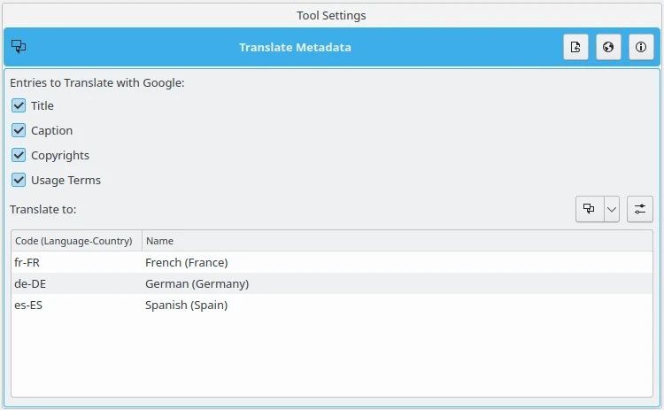
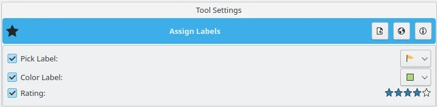
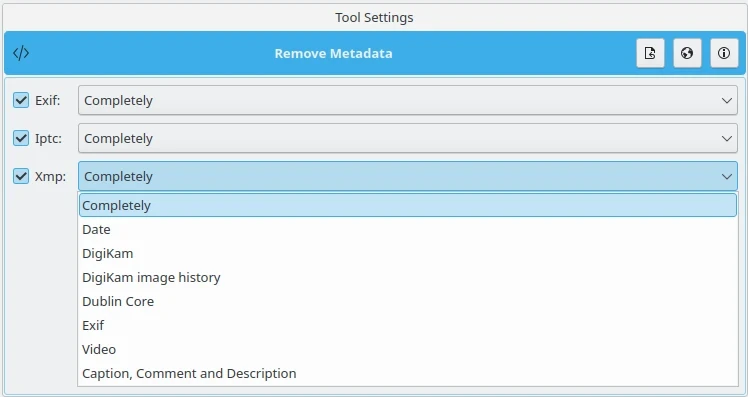
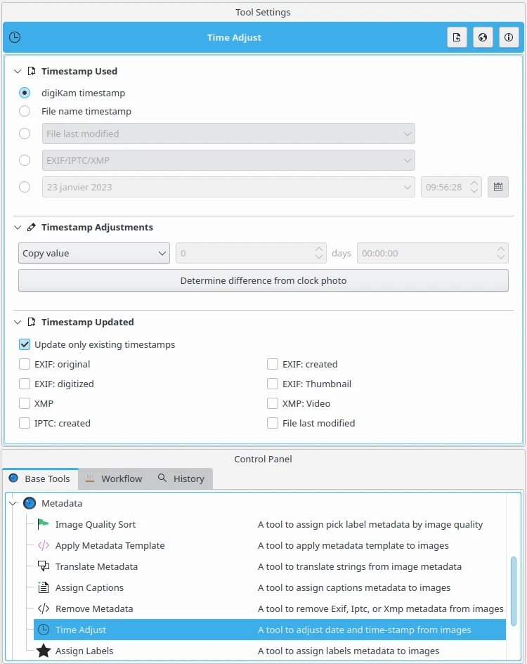

.. meta::
   :description: digiKam Batch Queue Manager Metadata Tools
   :keywords: digiKam, documentation, user manual, photo management, open source, free, learn, easy, batch, metadata, pick, labels, rating, color, comment, caption, title

.. metadata-placeholder

   :authors: - digiKam Team

   :license: see Credits and License page for details (https://docs.digikam.org/en/credits_license.html)

.. _metadata_tools:

Metadata Tools
==============

.. contents::

The Batch Manager metadata tools are used to apply the :ref:`Digital Asset Management <asset_management>` by managing metadata values in items hosted in a Queue, to help to classify contents in your collection or to prepare for sharing outside the box.

Quality Sort
------------

This tool parse your items to assign a **Pick Label** automatically depending of the aesthetic value of the contents. You can use the full automated solution based on depp-learning engine (recommended), or use a manual settings for each criterias. These settings are fully explained in the :ref:`Setup Quality <imgqsort_settings>` section from this manual.

    The Batch Queue Manager Tool to Sort Items by Image Quality

.. _bqm_applytemplate:

Apply Template
--------------

This tool is dedicated to apply a metadata template to your items in order to set copyright and description information about the contents. The **Template** drop-down field lets you choose one of your metadata templates you customized in :ref:`Templates Settings <templates_settings>`. You can access the **Template Manager** also with the edit button to the right of the drop-down field.

    The Batch Queue Manager Tool to Apply Metadata Template

.. _bqm_translatemetadata:

Translate Strings
-----------------

This tool allows to translate automatically some alternative language string from metadata using an online translator service. Translatable entries are:

    - :ref:`Title <captions_comments>`.
    - :ref:`Captions <captions_comments>`.
    - :ref:`Copyrights <authorship_copyright>`.
    - :ref:`Usage Terms <authorship_copyright>`.

The translations settings can be tuned with the dedicated :ref:`Localize Setup Panel <localize_settings>`. A list of languages to append or fix in selected alternative language strings. To add a new language in this list, use the drop-down button on the left of **Translate to** option. To remove a language, use the context menu over this list.

    The Batch Queue Manager Tool to Translate Strings in Metadata

.. _bqm_assigncaptions:

Assign Captions
---------------

This tool allows to assign **Title**, **Captions**, and **Author** properties to items from a Queue. For details about these properties, take a look to the :ref:`Captions section  <captions_view>` from this manual.

.. figure:: images/bqm_metadata_captions.webp
    :alt:
    :align: center

    The Batch Queue Manager to Assign Captions to Items

.. _bqm_assignlabels:

Assign Labels
-------------

    The Batch Queue Manager to Assign Labels to Items

.. _bqm_removemetadata:

Remove Metadata
---------------

    The Batch Queue Manager to Remove Metadata from Items

.. _bqm_timeadjust:

Time Adjust
-----------

    The Batch Queue Manager to Adjust Items Time
