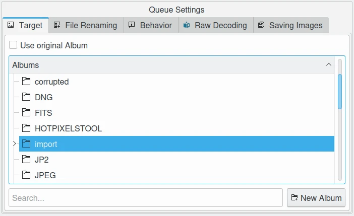
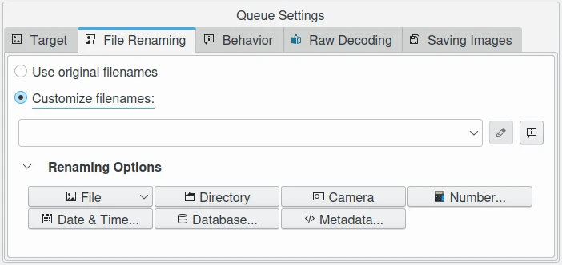
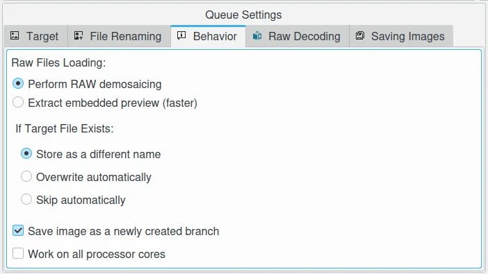
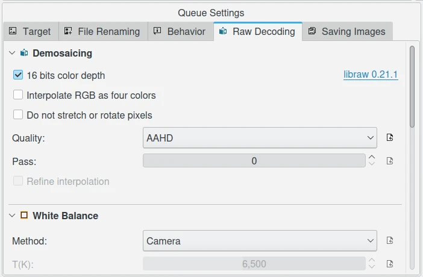
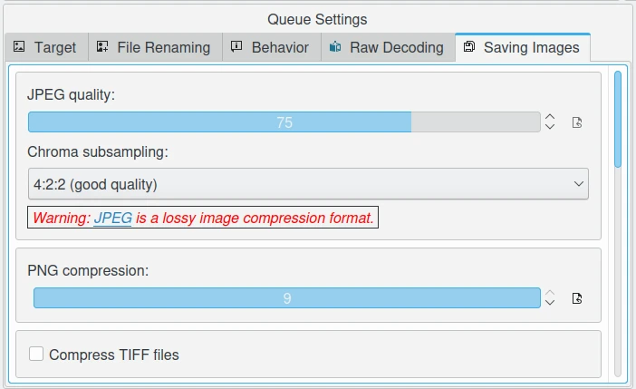

.. meta::
   :description: digiKam Batch Queue Manager Queue Settings
   :keywords: digiKam, documentation, user manual, photo management, open source, free, learn, easy, batch, queue, manager, settings

.. metadata-placeholder

   :authors: - digiKam Team

   :license: see Credits and License page for details (https://docs.digikam.org/en/credits_license.html)

.. _queue_settings:

Queue Settings
==============

.. contents::

On the bottom left of the Batch Queue Manager, a view dedicated to host the settings for a queue is available to tune the configurations categorized in five tabs. Batch Queue Manager allows to host many queues to process at the same time on the top left side. Each queue can have a different settings than other one. You switch from one to one by clicking on the wanted queue tab on the top.

.. note::

    With the Workflow feature, you can store your prefered queue settings for a later use. See :ref:`this section <bqm_workflow>` of the manual for details.

Target Album
------------

This view allows to select where the target files processed will be stored. Two choices are possible: at the same album than original files, or a dedicated album. The search field on the bottom allows to filter album tree-view with huge collections.

    The Batch Queue Manager Queue Settings View to Customize Target Album to Store Processed Items

File Renaming
-------------

This view allows to customize the file renamings rules. On the **Queues** view, the **Orignal** and the **Target** file names will give you a feedback about the file renaming.

The renaming settings is exactly the same than **Advanced Rename** tool avaialble from **Main Window**. See :ref:`this section <renaming_photograph>` from the manual for details.

    The Batch Queue Manager Queue Settings View to Customize the File Rename Rules

Behavior
--------

This view allows to customize important rules while the queue is processed.

The **RAW Files Loading** setting configure how the RAW files will be processed: Using the **RAW Decoding** settings to process standard demosaicing (see below), or tho use the **Embeded Preview**. This last one is very fast compared to RAW decoded.

The **Target File Exists** setting allow to customize the behavior when target file exists. You can **Store as a Different file Name**, **Overwrite Automatically** the file, or **Skip Automatically** to don't touch the target file. In all cases, Batch Queue Manager will not ask you about this behavior while running.

The **Save Image as a Newly Created Branch** setting will use **Image Versionning** to name target files. It's the same behavior when you export file from **Image Editor** when Versionning feature is enabled.

The **work on all Processor Cores** setting will use more than one core to process items in parallel from the same queue.

    The Batch Queue Manager Queue Settings View to Customize the Behavior

RAW Decoding
------------

    The Batch Queue Manager Queue Settings View to Customize the RAW Decoding

Saving Images
-------------

    The Batch Queue Manager Queue Settings View to Customize the File Saving

