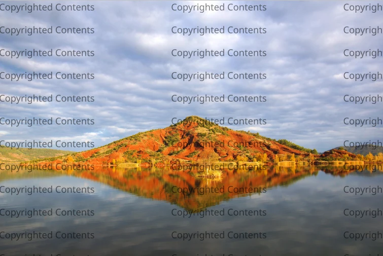

.. meta::
   :description: digiKam Batch Queue Manager Base Tools
   :keywords: digiKam, documentation, user manual, photo management, open source, free, learn, easy, batch, queue, manager, watermark, image, text

.. metadata-placeholder

   :authors: - digiKam Team

   :license: see Credits and License page for details (https://docs.digikam.org/en/credits_license.html)

.. _watermark_tool:

Watermark
=========

While there are many ways to protect your photos from unauthorized use, watermarking still remains the simplest and probably the most effective technique that can help you to identify you as the creator and make it difficult to use your works without permission.

Although digiKam supports watermarking. The watermarking function in digiKam is available under the Batch Queue Manager tool which you can use to watermark multiple photos in one go. Drag the photos you want to watermark from a digiKam album onto the **Queues** pane to add them to the current queue. Click on the **Base Tools** tab in the **Control Panel** pane and double-click on the **Decorate/Add Watermark** tool to add it to the **Assigned Tools** pane.

.. contents::

Lead Settings
-------------

digiKam can use **Text** or **Image** as watermarks, and you can choose the desired watermark type in the the top of the Tool Settings pane with the **Watermark type** option. Check **Use Absolute Size** option if you want the watermark to use the given size of the font or the image without any adjustment to the actual image.

.. figure:: images/bqm_watermark_lead_settings.webp
    :alt:
    :align: center

    The Batch Queue Manager Watermark Tool Lead Settings

Image Settings
--------------

If you want to use the **Image** watermark type, make sure that you already have a graphics file handy, and select it from the file system. Check **Ignore Watermark aspect Ratio** option if you want the watermark to ignore its own aspect ratio and use the image's aspect ratio instead. Check **Add transparency to watermark image** if you want watermark to be transparent and tune the **Opacity** value in percents with the option just below.

.. figure:: images/bqm_watermark_image_settings.webp
    :alt:
    :align: center

    The Batch Queue Manager Watermark Tool Image Settings

Text Settings
-------------

The **Text** watermark is more simple to use as it do not requires an external source of contents to generate the mark over the images. In **Watermark text** field, enter the desired string to use a superimposed contents. Below, you can tune the **Font** properties to write text on images, as the **name**, the **style**, and the **color** (the **size** is auto calculated). With **Text opacity** you can adjust the transparency of the watermark text, where 100 is fully opaque and 0 is fully transparent. Finally, the **Use background** allows to draw the text over a colored background where you can choose the color and the transparency level.

.. figure:: images/bqm_watermark_text_settings.webp
    :alt:
    :align: center

    The Batch Queue Manager Watermark Tool Text Settings

Geometry Settings
-----------------

Specify in this view the watermark geometry settings such as **Placement Position**, **Rotation**, **Size**, and **Margins**.

.. figure:: images/bqm_watermark_geometry_settings.webp
    :alt:
    :align: center

    The Batch Queue Manager Watermark Tool Geometry Settings

Once you are satisfied with the settings, hit the **Run** button, and once digiKam’s finished, you’ll find the watermarked photos in the target folder. See below a sample of text watermark applied to an image with transparency.

    Sample of Text Watermark Applied to and Image Using Transparency
