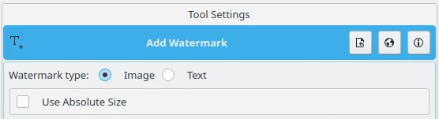
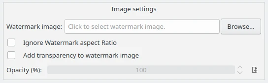
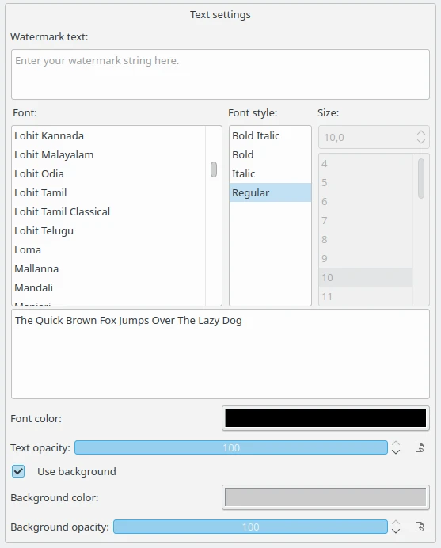
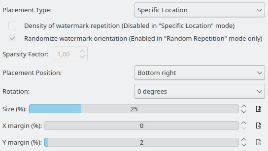

.. meta::
   :description: digiKam Batch Queue Manager Base Tools
   :keywords: digiKam, documentation, user manual, photo management, open source, free, learn, easy, batch, queue, manager, watermark, image, text

.. metadata-placeholder

   :authors: - digiKam Team

   :license: see Credits and License page for details (https://docs.digikam.org/en/credits_license.html)

.. _watermark_tool:

:ref:`Watermark <batch_queue>`
==============================

While there are many ways to protect your photos from unauthorized use, watermarking still remains the simplest and probably the most effective technique that can help identify you as the creator and make it difficult to use your works without permission.

.. contents::

digiKam supports watermarking using the Batch Queue Manager tool, allowing you to watermark multiple photos in a single operation. Drag the photos you want to watermark from a digiKam album onto the **Queues** pane to add them to the current queue. Click on the **Base Tools** tab in the **Control Panel** pane and double-click on the **Decorate/Add Watermark** tool to add it to the **Assigned Tools** pane.

Initial Settings
----------------

digiKam can use **Text** or an **Image** as watermarks, and you can choose the desired watermark type at the top of the Tool Settings pane with the **Watermark type** option. Check **Use Absolute Size** option if you want the watermark to use the given size of the font or the image without any adjustment to the actual image.

    The Batch Queue Manager Watermark Tool Initial Settings

Image Settings
--------------

If you want to use the **Image** watermark type, make sure that you already have a graphics file handy, and select it from the file system. Check the **Ignore Watermark aspect Ratio** option if you want to ignore the watermark's aspect ratio and use the image's aspect ratio instead. Check **Add transparency to watermark image** if you want the watermark to be transparent and adjust the **Opacity** value in percentages with the option just below.

    The Batch Queue Manager Watermark Tool Image Settings

Text Settings
-------------

The **Text** watermark is simpler to use, as it does not require an external file to generate the watermark. Enter the string to be superimposed over the images in the **Watermark text** field. The controls below allow you to set the **Font**, **Font style**, and **Font color** for the watermark text. The **Size** is auto-calculated, unless you selected **Use Absolute Size**. **Text opacity** adjusts the transparency of the watermark text, with 100 being fully opaque and 0 being fully transparent. Finally, the **Use background** option allows the watermark text to be drawn over a colored background with a color and transparency of your choosing.

    The Batch Queue Manager Watermark Tool Text Settings

Geometry Settings
-----------------

Below the controls to specify the watermark image or text, are a set of controls to specify the watermark geometry settings such as **Placement Position**, **Rotation**, **Size**, and **Margins**.

    The Batch Queue Manager Watermark Tool Geometry Settings

The first control sets the **Placement Type** which in turn enables or disables other options in this view. **Specific Location** sets a static position for the watermark. **Systematic Repetition** places multiple copies of the watermark to cover the images. While **Random Repetition** places the watermark randomly over the images.

**Density of watermark repetition** is Disabled in **Specific Location** mode. When you choose to have the watermark repeated many times in the **Placement Type**, checking this option increases the density of the repetition.

**Randomize watermark orientation** is enabled in **Random Repetition** mode only. When you choose to have the watermark repeated randomly in the **Placement Type**, and this option is checked, the watermarks will be randomly rotated 0, 90, 180, or 270 degrees.

The **Sparsity Factor** provides more control over the sparsity of the watermark repetition. Larger values mean fewer watermarks. Use floating point values, with typical values lying between 1.0 and 3.0, although values less than 1.0 can also be used.

**Placement Position** specifies the area on the image to write the watermark. Available values are **Top left**, **Top right**, **Bottom left**, **Bottom right**, **Center**, **Top center**, and **Bottom center**.

**Rotation** specifies the angle in degrees to rotate the watermark. Available values are **0 degrees**, **90 degrees CW**, **180 degrees**, and **270 degrees CW**.

**Size** setting specifies the size of watermark, as a percentage of the marked image.

**X margin** and **Y margin** specifies the margin from the edge in X and Y directions, as a percentage of the marked image.

Results
-------

Once you are satisfied with the settings, hit the **Run** button, and when digiKam finishes, you’ll find the watermarked photos in the target folder. Samples of text and image watermarks applied to the same image using transparency are shown below.

    Sample of Centered Image Watermark Applied to a photo Using Transparency

.. figure:: images/bqm_watermark_example_text.webp
    :width: 300px
    :alt:
    :align: center

    Sample of Systematic Repeated Text Watermark Applied to a photo Using Transparency
