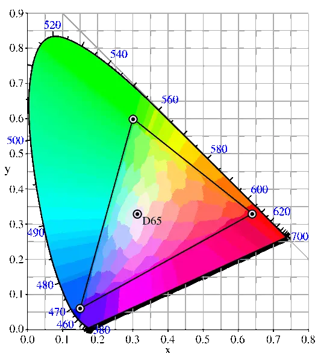
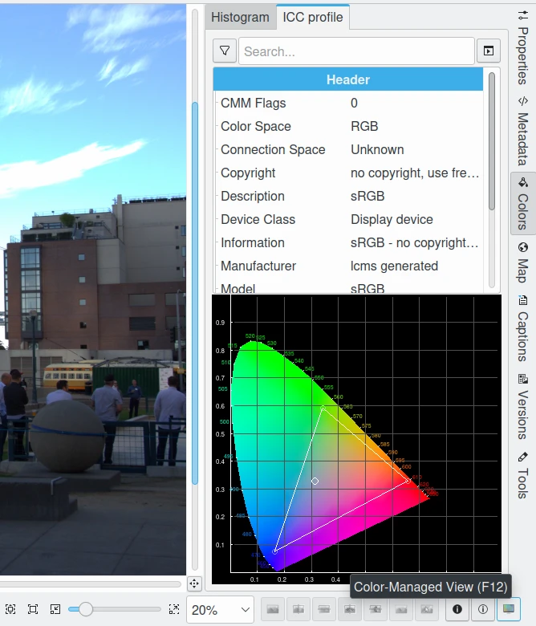
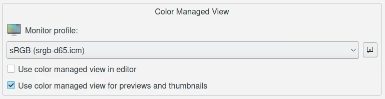
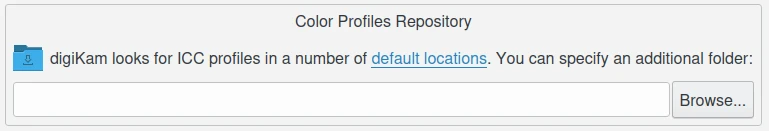

.. meta::
   :description: Color Management and Monitor Profiles
   :keywords: digiKam, documentation, user manual, photo management, open source, free, learn, easy, image editor, color management, icc, profile, srgb

.. metadata-placeholder

   :authors: - digiKam Team

   :license: see Credits and License page for details (https://docs.digikam.org/en/credits_license.html)

.. _monitor_profiles:

The Monitor Profiles
====================

sRGB Color space
----------------

sRGB is widely accepted as a standard color profile by virtually everyone involved with consumer-oriented imaging. sRGB was proposed in 1996 by Hewlett Packard and Microsoft as a standardized color space for consumer-oriented applications. As stated in the initial HP/MS proposal:

    - Hewlett-Packard and Microsoft propose the addition of support for a standard color space, sRGB, within the Microsoft operating systems, HP products, the Internet, and all other interested vendors. The aim of this color space is to complement the current color management strategies by enabling a third method of handling color in the operating systems, device drivers and the Internet that utilizes a simple and robust device independent color definition. This will provide good quality and backward compatibility with minimum transmission and system overhead. Based on a calibrated colorimetric RGB color space well suited to Cathode Ray Tube (CRT) monitors, television, scanners, digital cameras, and printing systems, such a space can be supported with minimum cost to software and hardware vendors... 

    - Currently, the ICC [International Color Consortium]... tracks and ensures that a color is correctly mapped from the input to the output color space... by attaching a profile for the input color space to the image in question. This is appropriate for high end users. However, there are a broad range of users that do not require this level of flexibility and control. Additionally, most existing file formats do not, and may never support color profile embedding, and finally, there are a broad range of uses [that] actually discourage people from appending any extra data to their files. A common standard RGB color space addresses these issues ... by merging the many standard and non-standard RGB monitor spaces into a single standard RGB color space. Such a standard could dramatically improve the color fidelity in the desktop environment. For example, if operating system vendors provide support for a standard RGB color space, the input and output device vendors that support this standard color space could easily and confidently communicate color without further color management overhead in the most common situations. (archived copy) 

To summarize, the point of the by-now almost universally adopted sRGB color space was and is to make life easier for consumers (no need to worry about color management), less expensive for manufacturers (no need to worry about compatibility between consumer-level digital cameras or scanners, monitors, printers, and so forth), and more convenient for displaying images on the Internet (don't worry about embedding and reading icc profiles - just assume sRGB).

So if sRGB works so well and makes life so easy for everyone, why use any other color space and thus be forced to worry about color management issues?

sRGB was designed to contain colors easily displayed on consumer-oriented monitors and printed by consumer-oriented printers manufactured in 1996. This least-common-denominator set of viewable and printable colors - the technical term is "color gamut" - is much smaller than the set of colors we can see in the real world, much smaller than the set of colors today's digital cameras can capture, much smaller than the set of colors today's printers can print, and much smaller than the color gamut of the new wide gamut monitors that are beginning to enter the consumer market. For anyone who wants to make use of the wider color gamuts available today even at the consumer level, the gamut of sRGB is too small. Conversely, if you don't intend to make use of an expanded gamut of colors at any point in your digital imaging workflow, then you don't need to worry about non-sRGB color spaces and all the attending intricacies of color management.

sRGB Limitations
----------------

A visual representation of the limitations of sRGB compared to the colors we actually see in the real world is presented here after. It shows a two-dimensional representation of all the colors we can see (the horseshoe-shaped region) and the colors contained in the sRGB space (the smaller triangular region).

    The Gamut of sRGB Color Profile 

If you would like to see a two-dimensional representation of sRGB compared to some of the larger working color spaces, see Bruce Lindbloom's excellent site, click on *Info* then on *Information About RGB Working Spaces*.

Profiling Your Monitor
----------------------

If I choose to work exclusively in the sRGB color space, do I need to calibrate my monitor? Whether you stay within the color gamut provided by sRGB or not, you need a properly calibrated monitor because sRGB assumes that your monitor is calibrated to sRGB. Your monitor calibration closes the loop. If you work within the color gamut provided by sRGB then you need to calibrate your monitor to the sRGB standard (or produce and use an accurate monitor profile, or both). What are the consequences of working with an uncalibrated monitor?

There are several possible consequences, none of them good. Every monitor, calibrated or otherwise, has a native (uncalibrated) white point, expressed as a temperature in degrees Kelvin. The white point of a monitor (calibrated or not) is the color you see when you are looking at a patch of pure white on your screen. Pure white is when the RGB values in your image all equal 255 (as expressed in 8-bits), such as the plain white background of a web page or an office document. You are thinking, "white is white" but if you were able to line up several monitors calibrated to different white points, you would see that the higher the temperature of the monitor's white point, the bluer the screen looks in comparison with monitors with lower white points. If you can find the controls of your own monitor, change the temperature up and down (remembering to put it back to its initial setting when you are done, unless you decide you want a different white point). Your eyes, which adapt quickly to a constant white point, will easily discern the screen getting bluer and yellower as you move the white point higher and lower. If your uncalibrated monitor is too blue (native CRT color temperature is typically 9300K and sRGB assumes 6500K), as you edit your image you will overcompensate and produce images that will look yellowish and too warm on a properly calibrated monitor. Conversely, if your monitor is too yellow because the color temperature is set too low (I believe LCD native color temperature is around 5500K), your images will look blueish/too cool on a properly calibrated monitor.

Setting a proper white point is only part of monitor calibration. You also need a proper black point, brightness (luminance), and gamma (transfer) function. If your monitor is too dark because the black point is set too low, you will overcompensate and produce images that look washed out on a properly calibrated monitor. Conversely, if your monitor black point is set too high, your images will look took dark and overly saturated on a properly calibrated monitor.

If the brightness/contrast is set too high, you will assume your images have a lot more "pop" than they really have when viewed on a properly calibrated monitor, plus your eyes will hurt and your LCD screen will burn out faster.

    :kbd:`F12` Shortcut Allows to Turn On/Off the Color Management in Image Editor and all digiKam Thumbnail Views

If your monitor gamma is improperly set, your tonal variations from dark to light will be off. That is, the shadows or highlights might be overly compressed or expanded, leading you to compensate in the opposite direction. So when viewed on a properly calibrated monitor, the shadows might be too bright or dark (or the highlights too dark or bright), with the rest of the image suffering from tonal over-compression. And heaven help you if the internal R, G, and B guns (or LCD equivalent) of your monitor are improperly set (each gun has its own black point and gain), because the resulting color casts - too green, too magenta, too orange, etc. that you will inevitably create by "correcting" your image during editing - are very obvious when viewed on a properly calibrated monitor.

Whether or not your monitor is properly calibrated, you might be surprised by the results of comparing an image you've edited on your home monitor to the same image as displayed by other monitors in your house or on your friend's and neighbor's monitors. We certainly were - we have two Sony Trinitron monitors in our home, one with a failing (too high) green gun and one with a failing (too high) blue gun. Every image edited on either monitor looked very wrong on the other monitor, until we purchased a spectrophotometer to calibrate and profile both monitors. Unfortunately, at this point neither of these two monitors can be calibrated to display a proper black point, so they are no longer used for image editing - the point being that an additional benefit of using a spectrophotometer is you know when it's time replace your monitor.

The meaning of **black point** and **brightness** seems pretty clear, but what does "gamma" mean? Gamma compression, also known as gamma encoding, is used to encode linear luminance or RGB values into video signals or digital video file values; gamma expansion is the inverse, or decoding, process... Gamma encoding helps to map data (both analog and digital) into a more perceptually uniform domain. If you wade very deeply into image editing and color management, eventually you will need to make decisions about what gamma (or other encoding/decoding function) you want to use when you calibrate your monitor, profile your digital camera, and choose a working color space. When in doubt (for those of you who just want to know which button to push), gamma=2.2 is a widely-used value, both for monitor calibration and working color spaces.

What's the difference between calibrating a monitor and profiling a monitor? When first learning about color management, many people are confused about the difference between calibrating and profiling a monitor. Calibration is a process where a device is brought into some defined state by making adjustments to its controls or some other physical means. For example, the act of calibrating a monitor involves adjusting its white point, black level, luminosity and gamma to predetermined or standard values using the monitor's controls and by altering the video card gamma ramp... In contrast to calibration, the process of creating a profile is a characterization of the device that does not involve making any changes or adjustments to the device. Rather it is a measurement process that results in a file that contains a precise mathematical description of the device's color and tonality characteristics. This file is an ICC profile. These characteristics include the transfer function from the device's color space to a standardized absolute color space (this is called a Profile Color Space, PCS, in an ICC profile), the device's white point, black point, primaries and other information. Displays are normally characterized (profiled) in their calibrated state. To summarize, calibration makes changes to the device to alter it's color reproduction characteristics to conform to some predetermined state. Profiling or characterization is a measurement process that results in a detailed description of the device's (normally calibrated) color reproduction characteristics.

Calibrating your monitor technically is not really part of color management. But obviously a properly calibrated and/or profiled monitor is a prerequisite for a color-managed workflow. This manual does not cover the important topics of how to calibrate and profile a monitor. The ArgyllCMS and LProf documentations are very good and highly recommended reading. To use either of this software to calibrate and/or profile your monitor, you will need a spectrophotometer. A spectrophotometer (sometimes called a "spider") is a device for measuring the RGB values of color patches projected onto the monitor screen by calibration/profiling software such as Argyll and LProf. The Argyll website maintains an up-to-date list of supported spectrophotometers. LProf can use all the spectrophotometers that Argyll can use, as the two programs share the relevant sections of code.

Calibrating your Monitor
------------------------

There are various methods given on the Internet for calibrating a monitor without using a spectrophotometer. These "eye-ball" methods are better than not calibrating your monitor at all, and depending your eyeball and your monitor, can produce quite usable results. But the eye-ball methods are not a substitute for a properly calibrated and profiled monitor. For the record, calibrating and profiling a monitor with a spectrophotometer, though intimidating at first, is not difficult. Spectrophotometers can be obtained for well under $100 US (if you opt for a more expensive model, make sure you are paying for a better piece of hardware, rather than just a more fully-featured accompanying bit of manufacturer's software that won't run under Linux). Argyll and/or LProf documentation will guide you through the process of calibrating and profiling your monitor, without your having to learn very much color management theory. And if/when you learn enough about color management to realize that you want or need a more detailed monitor profile of a particular type, for a particular purpose, these two softwares have all the advanced capabilities you could possibly hope for.
Assuming I've decided to work exclusively in the sRGB color space, what "digiKam buttons" should I push after I calibrate my monitor?

If your monitor has been calibrated to the sRGB standard and you work exclusively in the sRGB color space, then you can disable color management in digikam. You don't need to tell digiKam what monitor profile to use because digiKam defaults to using the sRGB color space as the monitor color space profile. And you don't need to tell digiKam to use a color-managed workflow because digiKam defaults to using sRGB for your camera, printer, and working space, just as laid out by HP and MS back in 1996.

    The digiKam Monitor Profile Settings from Color Management Setup Page 

But if you want to take the first steps toward a color-managed workflow, then refer to corresponding page of Settings, enable color management, and select sRGB as your monitor profile, your camera profile, your working space profile, and your printer profile. If you've also used Argyll or LProf to produce a monitor profile after you calibrated your monitor - perhaps named "mymonitorprofile.icc" - then tell digiKam to use "mymonitorprofile.icc" instead of sRGB as your monitor profile.

Monitor profiles Storage
------------------------

Under Linux, icc profiles are generally located in the /usr/share/color/icc folder, which is the closest there is at this moment to a standard Linux location for icc profiles. If you use this folder for your icc profiles, likely you will need to change permissions on the folder to allow your user read/write access. Then you just tell digiKam where your profiles are located.

    digiKam Allows to Setup Customized Places Where you can Store your Personal Color Profile

Ambient Light and Monitor
-------------------------

Does the lighting and wall/ceiling/drape/furniture colors near my monitor matter? Good lighting is a prerequisite for proper image editing and for comparing prints to the image on your screen. If the lighting near your workstation is too bright, colors on your monitor look too dark, and conversely. If the light from the fixtures in your workroom have a low CRI (color rendering index, meaning you don't have full spectrum bulbs), or if the light in your workroom comes from a window and so varies as the weather and time of day varies (or worse, is filtered through colored drapery), or if the walls and ceiling are creating color casts on your monitor, then your editing process will "correct" color casts that don't really exist. Best advice, as far as is consistent with maintaining harmony in the family: neutral grey walls and ceiling, cover the windows, wear neutral clothing, set appropriate light levels using appropriate bulbs and fixtures. For more information on what are the appropriate light levels, bulbs and fixtures for editing images and viewing prints, see the following articles:
