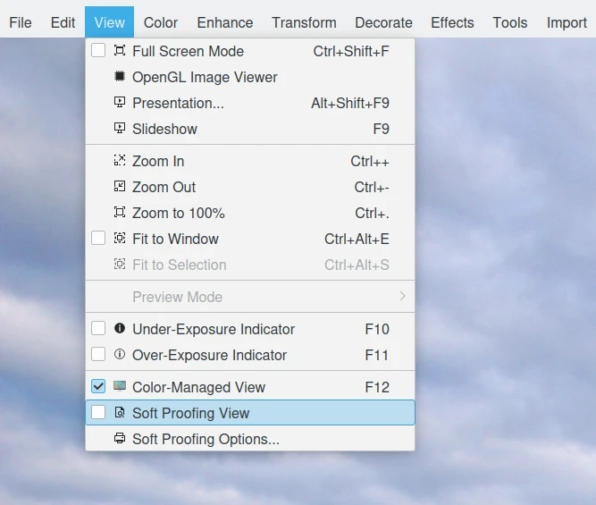

.. meta::
   :description: Color Management and Printer Profiles
   :keywords: digiKam, documentation, user manual, photo management, open source, free, learn, easy, icc, color, management, profile, printer

.. metadata-placeholder

   :authors: - digiKam Team

   :license: see Credits and License page for details (https://docs.digikam.org/en/credits_license.html)

.. _printer_profiles:

:ref:`Printer Profiles <color_management>`
==========================================

.. contents::

Using Printer Profile
---------------------

You are now almost ready to print that image. But where do you get a printer profile? You already know the answer. You can use the generic profile that comes with your printer. You can purchase a professionally produced profile. Some commercial printing establishments will send you their printer profiles (which will with their printers, but not your printer). Or, you can make your own printer profile using `Argyll <http://www.argyllcms.com/>`_, in which case your profile can be tailored to your particular paper, inks, and even image characteristics. For example, if you are printing a series of images with a color palette limited to subdued browns, you don't need a printer profile that tries to make room for saturated cyan and blue.

To set the default printer and soft-proofing profile used in digiKam, navigate to :menuselection:`Settings --> Configure digiKam... --> Color Management page --> Profiles tab`, and select the desired profile. See the :ref:`Color Management Settings <cm_settings>` section of the manual for more information.

.. figure:: images/cm_printer_soft_proofing.webp
    :alt:
    :align: center

    digiKam Color Management Setup Dialog Page for Customizing the Printer and Soft Proofing Color Profile

.. _soft_proof:

Soft Proofing
-----------------

Soft-proofing will show you the differences to be expected between what you see on your screen and what you will see when you make a print. To soft-proof, you need a profile for your printer (actually, for your printer-paper combination, as the paper used affects the ink colors and the white point). If you don't like the soft-proofed image, you can make changes in your working space, before converting the image to your printer space.

Soft-proofing is enabled within the Image Editor by selecting :menuselection:`View --> Soft Proofing View`.

    digiKam Image Editor Soft-Proofing Menu Entries

As illustrated below, options for Soft-proofing can be set by selecting :menuselection:`View --> Soft Proofing Options...` while in the Image Editor.

.. figure:: images/cm_editor_soft_proofing_options.webp
    :alt:
    :align: center

    digiKam Image Editor Soft-Proofing Options

**Perceptual** intent may or may not give the best results with soft-proofing, depending on the respective gamuts of the image and printer/paper combination in question. Usually, the **Colorimetric** intents give clearer, brighter colors, albeit at the cost of having to carefully re-edit the image to avoid clipping highlights and shadows. So while **Perceptual** is always an option, it may not be *the best* option.

**Perceptual** rendering intent is a safe choice because it prevents clipping of shadows and highlights, although possibly at the expense of de-saturating all your colors. So if you don't want to bother doing any soft-proofing, choose the perceptual rendering intent (if you don't want to soft-proof, probably you should also stick with sRGB).

.. _blackpoint_conpensation:

Black Point Compensation
------------------------

**Black point compensation** is a way to make adjustments between the maximum black levels of digital files and the black capabilities of various digital devices, such as a printer.

To turn black point compensation on or off, navigate to :menuselection:`Settings --> Configure digiKam... --> Color Management page --> Advanced tab`. See the :ref:`Color Management Settings <cm_settings>` section of the manual for more information.

Black point compensation results depend on the context. Try soft-proofing with black point compensation on. If you like it, use it. Otherwise, don't use it.

.. figure:: images/cm_editor_print_advanced_settings.webp
    :alt:
    :align: center

    digiKam Image Editor Print Feature Allows Using Your Preferred Printer Color Profile and Tune the Black Point Compensation.
