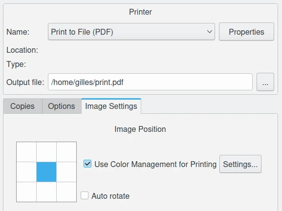
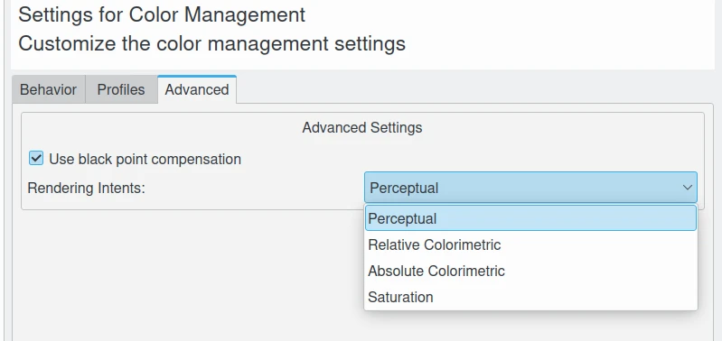
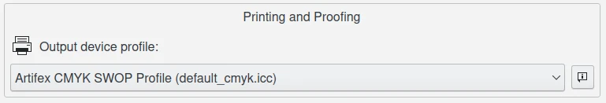

.. meta::
   :description: Color Management and Printer Profiles
   :keywords: digiKam, documentation, user manual, photo management, open source, free, learn, easy, icc, color, management, profile, printer

.. metadata-placeholder

   :authors: - digiKam Team

   :license: see Credits and License page for details (https://docs.digikam.org/en/credits_license.html)

.. _printer_profiles:

The Printer Profiles
====================

Using Printer Profile
---------------------

We are now almost ready to print that image. Where do I get a printer profile? you already know the answer. You can use the generic profile that comes with your printer. You can purchase a professionally produced profile. If you ask, some commercial printing establishments will send you their printer profiles (which won't work with your printer!). You can make your own printer profile using Argyll, in which case your profile can be tailored to your particular paper, inks, and even image characteristics (if you are printing a series of images with a color palette limited to subdued browns, you don't need a printer profile that tries to make room for saturated cyans and blues). I cannot offer any more advice or links to more information on this subject because I've just started to learn about printing images (previously I've only viewed and shared my images via monitor display). But do see this page for an excellent presentation of the benefits of producing your own printer profile, plus a resoundingly positive endorsement of using Argyll for making your printer profile.

    digiKam Image Editor Print Feature Allow to use your Prefered Printer Color Profile

The Rendering intents
---------------------

"Rendering intent" refers to the way color gamuts are handled when the intended target color space (for example, the monitor or the printer) cannot handle the full gamut of the source color space (for example the working space).

There are four commonly-used rendering intents: perceptual, relative colorimetric, absolute colorimetric, and saturation. I have searched the Internet looking for the best write-up on rendering intents and the trade-offs involved in choosing one rendering intent over another. I believe I found that article. See this page. Briefly quoting from the Cambridge in Color article on color space conversion:

    - Perceptual and relative colorimetric rendering are probably the most useful conversion types for digital photography. Each places a different priority on how they render colors within the gamut mismatch region.

    - Relative colorimetric maintains a near exact relationship between in gamut colors, even if this clips out of gamut colors.

    - In contrast, perceptual rendering tries to also preserve some relationship between out of gamut colors, even if this results in inaccuracies for in gamut colors...

    - Absolute is similar to relative colorimetric in that it preserves in gamut colors and clips those out of gamut, but they differ in how each handles the white point... Relative colorimetric skews the colors within gamut so that the white point of one space aligns with that of the other, while absolute colorimetric preserves colors exactly (without regard to changing white point)...

    - Saturation rendering intent tries to preserve saturated colors. 

    digiKam Color Management Setup Dialog Page Allows to Customize the Rendering Intents         

I would quote the entire article (it's that good), but that would involve "unfair usage" I am sure. So go check out the article for yourself. The illustrations in the article really help to clarify what the different rendering intents actually do and the compromises involved in choosing one rendering intent over another.

For another excellent source of information on rendering intents with accompanying illustrations, see this page.

Rendering Intent to Display on Monitor
--------------------------------------

The usual choice is relative colorimetric. I would suggest that you not use absolute colorimetric unless you want very strange results.

.. _soft_proof:

The Soft Proofing
-----------------

Soft-proofing will show you the differences to be expected between what you see on your screen and what you will see when you make a print. To soft-proof, you need a profile for your printer (actually, for your printer-paper combination, as the paper used affects the ink colors and the white point). If you don't like the soft-proofed image, you can make changes (in your working space, not after converting the image to your printer space!) to bring the soft-proofed image more in line with how you want the final print to look.
What rendering intent should I use when I soft-proof?

I've always heard that you ought to use "perceptual intent" when transforming an image from a larger working space to a smaller printer space. But especially in light of reading the aforementioned Cambridge in Color article, it seems that perceptual intent may or may not give the best results, depending on the respective gamuts of the image and printer/paper combination in question. I've been experimenting quite a bit lately with output intents for printing. I find that for my images, the colorimetric intents give clearer, brighter colors, albeit at the cost of having to carefully re-edit the image to avoid clipping highlights and shadows. Perusal of the various photography forums and articles available on the Internet indicates that "perceptual intent" is just an option, not by any means always "the best" option.

    digiKam Color Management Setup Dialog Page Allows to Customize the Printer and Soft Proofing Color Profile

Black Point Compensation
------------------------

The clearest definition I could find about black point compensation is as follows: "BPC is a way to make adjustments between the maximum black levels of digital files and the black capabilities of various digital devices [such as a printer]" (cited from this page).

The article from which this definition comes offers a very clear explanation (albeit Adobe-centric) of how black point compensation works and the practical consequences of using or not using it. The bottom line advice is, it depends. Try soft-proofing with black point compensation on. If you like it, use it. Otherwise, don't use it.

Color Spaces Conversion and Rendering Intents
---------------------------------------------

Rendering intents are available when converting from one profile to another depends on the destination profile. Not every profile supports every rendering intent. What happens when you select an unsupported rendering intent is that Lcms quietly uses the profile's default rendering intent.

For an informative and humorous discussion of myths surrounding the use of various rendering intents, see here and here.

Perceptual Rendering Intent
---------------------------

Perceptual rendering intent a safe choice because it prevents clipping of shadows and highlights, although possibly at the expense of desaturating all your colors. So if you don't want to bother doing any soft-proofing, choose the perceptual rendering intent (if you don't want to soft-proof, probably you should also stick with sRGB).
