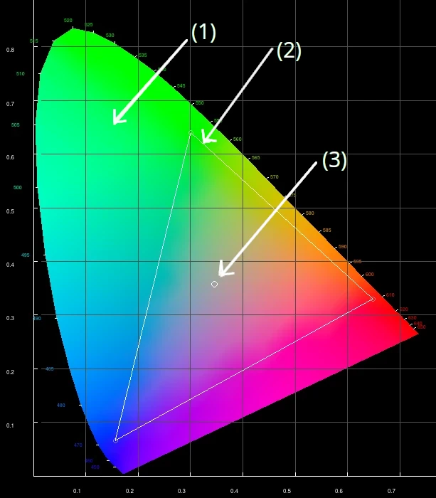
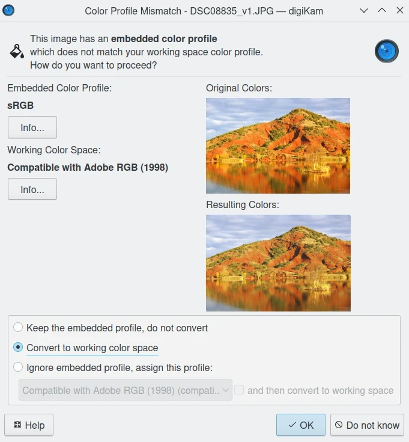
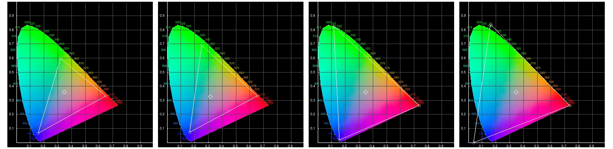
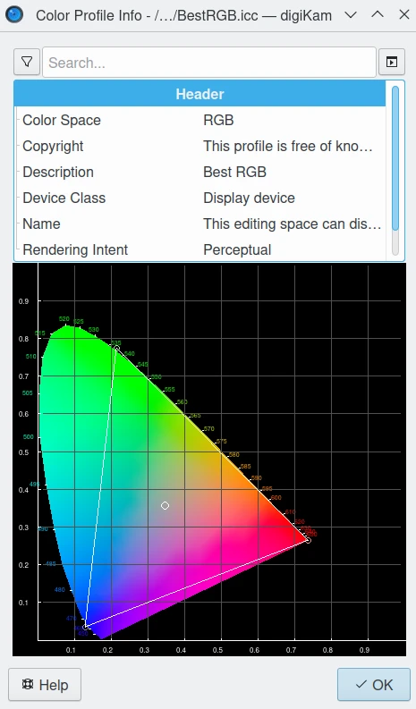

.. meta::
   :description: Color Management and Working Space
   :keywords: digiKam, documentation, user manual, photo management, open source, free, learn, easy, image editor, color management, icc, profile, working space

.. metadata-placeholder

   :authors: - digiKam Team

   :license: see Credits and License page for details (https://docs.digikam.org/en/credits_license.html)

.. _working_space:

:ref:`The Working Space <color_management>`
===========================================

.. contents::

Color Workflow
--------------

Camera or scanner profiles are applied to convert input images, and monitor or printer profiles are applied to convert output images, but they are all used to convert to or from the working color space that is used for editing images. One of the first decisions that need to be made in color management is the choice of a working color space.

But why is this so complicated? Why can't you just edit images in the color space described by the camera profile? After all, the camera profile should provide the best *fit* to the colors recorded by your camera, as processed by your RAW processing procedure, right? Working spaces, such as sRGB or Adobe RGB, are color spaces that facilitate good results while editing. For example when editing an image, pixels with equal values of RGB should appear neutral or colorless. This just means that for any given pixel in an image that has been converted to a suitable working space, if R=G=B you should see a grey or black or white pixel on your screen. Many camera profiles violate this *neutral* condition.

However, there is one other good reason to not want to edit your image in your camera profile color space. If you look at the size of a typical camera profile, it is on the order of a quarter to a half a megabyte or more. In order to get accurate color rendition of the RGB values that come out of the RAW processor, the camera profile contains a lot of information about all the changes that need to be made in different regions of color and tonality in the original scene. The camera profile is accurate (at least for colors in the original target) but not particularly mathematically smooth. Working space color profiles, on the other hand, are very small in size (half a kilobyte instead of half a megabyte) because they describe a color gamut in terms of smooth, continuous mathematical functions, like the function used for gamma correction. Working space profiles don't need to make allowances for the *messiness* of real-world sensors, so the mathematical manipulations performed during image editing can run faster and be more accurate than if you try to edit your image while it is still in the camera color space.

sRGB may be the most common working color space, but also serves as an output color space for images intended for the web and for monitor display. If you have a spiffy new monitor with a gamut larger than the gamut covered by sRGB, you might want to use a monitor profile that takes best advantage of your wonderful and hopefully calibrated and profiled monitor. But please convert your image to sRGB before sending it on to your friends. sRGB is also the color space that a lot of home and mass-production commercial printers expect image files to be in when sent to the printer. It is also the color space that most programs assume if an image does not have an embedded color profile telling the program what color space should be used to interpret (convert) the RGB numbers. So if you choose to not use color-management, your color-management choices are simple -- set everything to sRGB.

Note that color management is not only relevant if you shoot RAW. Color management affects every stage of the image processing pipeline, whether you start with a RAW file that you, yourself demosaic and convert into a TIFF, or if you start with a JPEG or TIFF produced by your camera.

Selecting a Working Space
-------------------------

Which working space should you use in digiKam? Working spaces, such as sRGB or Adobe RGB, are color spaces that facilitate good results while editing. For instance, pixels with equal values of RGB should appear neutral. Using a large gamut working space will lead to posterization, while using a small working space will lead to clipping. This trade-off is a consideration for the Image Editor.

As shown in the figure, most working space profiles are partly characterized by their relationship to the standard **Chromaticity Diagram** `(1)` that shows all colors visible to the average human eye. Values given around the edge of the Chromaticity Diagram passing from blue to green to red, are the wavelengths of the pure spectral colors measured in nanometers.

    - The **Gamut** `(2)` triangle defines the range of RGB colors that the profile spans. In other words, the color space can only represent colors lying within this triangle. RGB primaries define the corners of the triangle. The Red point is on the bottom right corner, Green is on the top, Blue is on the left bottom.

    - The **White point** `(3)` defines the neutral point in the gamut. The total dynamic range of the profile is measured relative to this neutral point.

    - The **Gamma** defines the usually nonlinear transfer function that is applied to the data (not displayed in the gamut).

    The Color Profile Details of CIE Chromaticity Diagram Shown in digiKam

The practical consequences that result from using different RGB primaries, leading to larger or smaller working spaces are discussed below. The practical consequences of using different gammas is also discussed in a following section. But the practical consequences for different choices for the working space white point are beyond the scope of this manual.

To set the working color space for digiKam, navigate to :menuselection:`Settings --> Configure digiKam... --> Color Management page --> Behavior tab`, and select the desired working color space from the menu. See the :ref:`Color Management Settings <cm_settings>` section of the manual for more information.

.. figure:: ../setup_application/images/setup_cm_behavior.webp
    :alt:
    :align: center

    Dialog to set the Working Color Space in digiKam

Once the working color space has been set, then digiKam can also be set to automatically perform conversions to this space if an image has a different color profile, or no assigned profile.

    digiKam can be set to Convert to Working Space When Color Space Mismatch Occurs

You can also switch color spaces from within the Image Editor. Select the Color Space Convertor that can be accessed from the Tools tab in the Right Sidebar.

    .. figure:: images/cm_editor_convert_prorgb.webp
        :alt:
        :align: center

        digiKam Image Editor Color Space Converter can Switch to Another Color Profile

Tonal Steps and Gamut Size
--------------------------

How many discrete tonal steps are there in a digital image? In an 8-bit image, you have 256 tonal steps from solid black to solid white. In a 16-bit image theoretically you have 65536 steps. But remember, those 16-bit values started out as either 10-bit (=1024 steps), 12-bit (=4096 steps), or 14-bit (=16384 steps) pixel readings produced by the camera's A-to-D converter -- the extra bits used to produce a 16-bit value start out as just zero padding. This means the available tones are not distributed evenly from light to dark. In linear gamma mode (as the camera sensor sees things), there's a whole lot more tones in the highlights than in the shadows. Hence the standard advice if you shoot RAW, is to expose to the right but don't blowout the highlights.

One major consideration in choosing a working space is that some working spaces are bigger than others, meaning they cover more of the visible spectrum (and perhaps even include some imaginary colors -- mathematical constructs that don't really exist). These bigger spaces offer the advantage of allowing you to keep all the colors captured by your camera and preserved by the *Lcms* conversion from your camera profile to the really big profile connection space.

    For the Left to Right: sRGB, AbodeRGB, WideGammutRGB, and ProPhotoRGB Color Profile Shown in digiKam

But keeping all the possible colors comes at a price. It seems that any given digital image (pictures of daffodils with saturated yellows being one common exception) likely only contains a small subset of all the possible visible colors that your camera is capable of capturing. This small subset is easily contained in one of the smaller working spaces. Using a very large working space mean that editing your image (applying curves, saturation, etc.) can easily produce colors that your eventual output device (printer, monitor) simply cannot display.

So the conversion from your working space to your output device space (say your printer) will have to remap the gamut colors in your edited image, some of which might even be totally imaginary, to your printer color space with its much smaller gamut. This remapping process will lead to inaccurate colors at best and at worst to banding (posterization - gaps in what should be a smooth color transition, say, across an expanse of blue sky) and clipping (your carefully crafted transitions across delicate shades of red, for example, might get remapped to a solid block of dull red after conversion to your printer's color space).

    The digiKam Color Profile Properties Dialog Displaying BestRGB Information

In other words, large gamut working spaces, improperly handled, can lead to lost information on output. Small gamut working spaces can clip information on input. Here is some oft-repeated advice:

    - For images intended for the web, use sRGB.

    - For the most accuracy in your image editing (that is, making the most of your *bits* with the least risk of banding or clipping when you convert your image from your working space to an output space), use the smallest working space that includes all the colors in the scene that you photographed, plus a little extra room for those new colors you intentionally produce as you edit.

    - If you are working in 8-bits, choose a smaller space rather than a larger space. Use 16-bit images for larger spaces.

    - For archival purposes, convert your RAW file to a 16-bit TIFF with a large gamut working space to avoid losing color information. Then convert this archival TIFF to your working space of choice (saving the converted working TIFF under a new name, of course). See here for more details.

    .. figure:: images/cm_bqm_convert_space.webp
        :alt:
        :align: center

        digiKam Queue Manager Allows You to Batch Convert Color Spaces

.. _rendering_intents:

Rendering Intent
----------------

**Rendering intent** refers to the way color gamuts are handled when the intended target color space (for example, the monitor or the printer) cannot handle the full gamut of the source color space (for example the working space).

There are four commonly-used rendering intents:

- **Perceptual**, also called **Image or Maintain Full Gamut**. This is generally recommended for photographic images. The color gamut is expanded or compressed when moving between color spaces to maintain consistent overall appearance. Low saturation colors are changed very little. More saturated colors within the gamuts of both spaces may be altered to differentiate them from saturated colors outside the smaller gamut space. Perceptual rendering applies the same gamut compression to all images, even when the image contains no significant out-of-gamut colors.

- **Relative Colorimetric**, also called **Proof or Preserve Identical Color and White Point**. Reproduces in-gamut colors exactly and clips out-of-gamut colors to the nearest reproducible hue.

- **Absolute Colorimetric**, also called **Match or Preserve Identical Colors**. Reproduces in-gamut colors exactly and clips out-of-gamut colors to the nearest reproducible hue, sacrificing saturation and possibly lightness. On tinted papers, whites may be darkened to keep the hue identical to the original. For example, cyan may be added to the white of a cream-colored paper, effectively darkening the image. Rarely of interest to photographers.

- **Saturation**, also called **Graphic or Preserve Saturation**. Maps the saturated primary colors in the source to saturated primary colors in the destination, neglecting differences in hue, saturation, or lightness. For block graphics; rarely of interest to photographers.

**Perceptual** and **Relative colorimetric** rendering are probably the most useful conversion types for digital photography. Each places a different priority on how they render colors within the gamut mismatch region. **Relative colorimetric** maintains a near exact relationship between in gamut colors, even if this clips out of gamut colors. In contrast, **Perceptual** rendering tries to also preserve some relationship between out of gamut colors, even if this results in inaccuracies for in gamut colors.

**Absolute** is similar to relative colorimetric in that it preserves in gamut colors and clips those out of gamut, but they differ in how each handles the white point... Relative colorimetric skews the colors within gamut so that the white point of one space aligns with that of the other, while absolute colorimetric preserves colors exactly (without regard to changing white point). **Saturation** rendering intent tries to preserve saturated colors.

To set the rendering intents for digiKam, navigate to :menuselection:`Settings --> Configure digiKam... --> Color Management page --> Advanced tab`.

.. figure:: images/cm_rendering_indents.webp
    :alt:
    :align: center

    digiKam Color Management Setup Dialog Page Allows to Customize the Rendering Intents

The usual choice for Rendering Intent to display contents on a monitor is relative colorimetric. We suggest that you do not use absolute colorimetric unless you want very strange results.

.. warning::

    Rendering intents are available when converting from one profile to another depending on the destination profile. Not every profile supports every rendering intent. Problems can occur when you select an unsupported rendering intent since `Lcms <https://www.littlecms.com/>`_ quietly uses the profile's default rendering intent.

Gamma Properties
----------------

The gamma of a color profile dictates what power transform needs to take place to properly convert from an image's embedded color profile (perhaps your working color space or your camera color profile) to another color profile with a different gamma, such as your chosen working space, or the display profile used to display the image on the screen or perhaps from one working space to another, or perhaps from your working space to your printer's color space. `Libraw <https://www.libraw.org/>`_ outputs a 16-bit image with a linear gamma, which means that a histogram of the resulting image file shows the actual amount of light that each pixel on the camera sensor captured during the exposure. (This is why applying a camera profile to the Libraw output also requires applying an appropriate gamma transform to get to the desired working space, unless the camera profile also uses gamma=1.)

One practical consequence of the gamma of a working space is that the higher the gamma, the more discrete tones are available for editing in the shadows, with consequently fewer tones available in the highlights. Changing the gamma of an image redistributes the number of tones available in the lighter and darker areas of an image. Theoretically, if you are working on a very dark-toned (low key) image you might want a working space with a higher gamma. And if you are working on a high key image, say a picture taken in full noon sunlight of a wedding dress with snow as a backdrop, you might want to choose a working space with a lower gamma, so you have more available tonal gradations in the highlights.

Theory aside, in the real world of image editing, almost everyone uses working spaces with a gamma of either 1.8 or 2.2. sRGB and L*-RGB are two notable exceptions.

sRGB uses a transfer function close to that of a CRT (and thus not necessarily relevant to image editing or to display on an LCD). Unlike most other RGB color spaces the sRGB gamma cannot be expressed as a single numerical value. The overall gamma is approximately 2.2, consisting of a linear (gamma 1.0) section near black, and a non-linear section elsewhere involving a 2.4 exponent and a gamma (slope of log output versus log input) changing from 1.0 through about 2.3, which makes for some complicated math during image processing.

L*-RGB uses as its transfer function the same perceptually uniform transfer function as the CIELab color space. *When storing colors in limited precision values* using a perceptually uniform transfer function *can improve the reproduction of tones*.

In addition to gamma=1.8 and gamma=2.2, the only other gamma for a working space that gets much mention or use is linear gamma, or gamma=1.0. As noted above, `Libraw <https://www.libraw.org/>`_ outputs linear gamma files if you ask for 16-bit output. Linear gamma is used in HDR (high dynamic range) imaging and also if one wants to avoid introducing gamma-induced errors into one's regular low dynamic range editing.

**Gamma-induced errors** is a topic outside the scope of this manual but is caused by incorrectly calculating luminance (or color) in a nonlinear RGB working space. For example, mixing colors in these nonlinear spaces can produce new colors not present in the original image, although there are accurate mixing methods where the new colors are calculated by first transforming all the relevant values back to their linear values.

Unfortunately and despite their undeniable mathematical advantages, linear gamma working spaces have so few tones in the shadows that they are impossible to use for editing if one is working in 8-bit, and still problematic at 16-bit. When the day eventually comes when we are all editing 32-bit files produced by our HDR cameras on our personal supercomputers, we will all be using working spaces with gamma=1.

