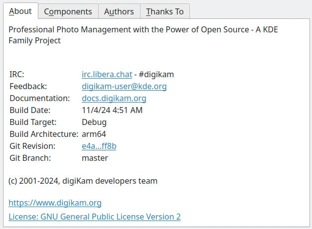

.. meta::
   :description: Copyrights And Notices About This document
   :keywords: digiKam, documentation, user manual, photo management, open source, free, help, learn, credits, license, authors, copyright

.. metadata-placeholder

   :authors: - digiKam Team

   :license: see Credits and License page for details (https://docs.digikam.org/en/credits_license.html)

.. _credits_license:

Credits and License
===================

.. contents::

Documentation copyright
-----------------------

Screenshots and screencasts
    Copyright 2022-2023 licensed under the terms of `Creative Commons License SA 4.0 unless stated otherwise <https://spdx.org/licenses/CC-BY-4.0.html>`_.

Sphinx/ReStructuredText Contents
    Copyright 2001-2023 licensed under the terms of the `GNU Free Documentation License 1.2+ <https://spdx.org/licenses/GFDL-1.2-or-later.html>`_.

Documentation authors
---------------------

.. note::

    Please add your name here if you contribute to the handbook.

- 2001-2023

    `Gilles Caulier <https://invent.kde.org/cgilles>`_

- 2009-2023

    `Yuri Chornoivan <https://invent.kde.org/yurchor>`_

- 2017-2023

    `Antoni Bella Pérez <https://invent.kde.org/bellaperez>`_

- 2023

    `Martin Marmsoler <https://invent.kde.org/marmsoler>`_

    `Geoff King <https://invent.kde.org/gsking>`_

    `Olivier Croquette <https://invent.kde.org/ocroquette>`_

- 2022

    `Mike Morrison <https://invent.kde.org/mikemorr>`_

- 2017-2019

    `Andrey Goreev <https://invent.kde.org/agoreev>`_

- 2017

    `Ahmed Fathi Shaban <https://invent.kde.org/ahmedfathy>`_

- 2016

    `Luigi Toscano <https://invent.kde.org/ltoscano>`_

- 2009-2014

    `Burkhard Lück <https://invent.kde.org/lueck>`_

- 2011-2013

    `Dmitri Popov <https://scribblesandsnaps.wordpress.com/author/dmpop/>`_

- 2011

    `Mohamed Malik <https://www.mohammedmalik.com/>`_

- 2007

    `Kåre Särs <https://invent.kde.org/sars>`_

- 2003-2005

    `Tom Albers <https://invent.kde.org/toma>`_

    `Richard Taylor <https://www.linkedin.com/in/richard-taylor-1300049/>`_

    `Joern Ahrens <https://www.jokele.de>`_

    `Oliver Doerr <http://www.doerr-privat.de/>`_

    Ralf Hoelzer

- 2006

    `Elle Stone <https://ninedegreesbelow.com/about/about.html>`_

    `Anne-Marie Mahfouf <https://behindkde.org/anne-marie-mahfouf>`_

- 2003-2010

    `Gerhard Kulzer <https://www.linkedin.com/in/gerhard-kulzer-8931301>`_

- 2001-2005

    `Renchi Raju <https://www.facebook.com/renchi.raju>`_
