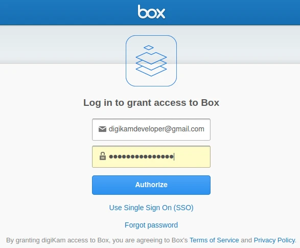
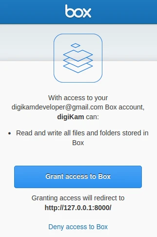
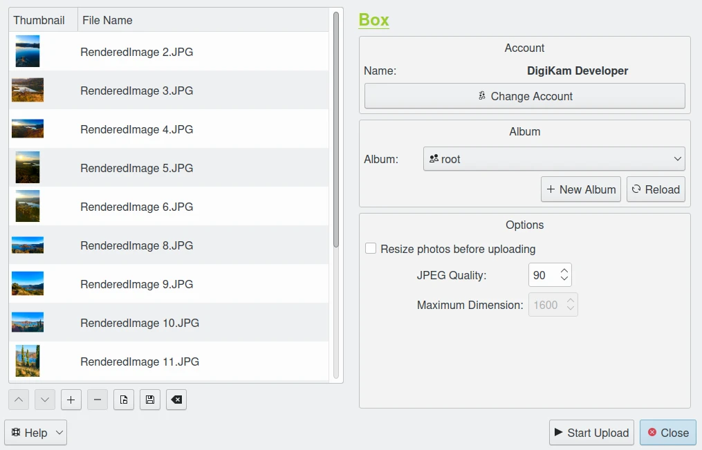
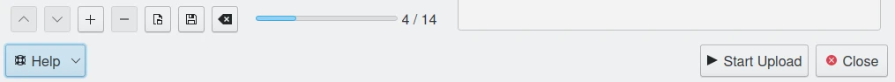
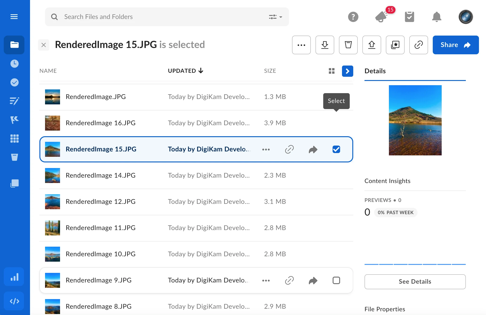

.. meta::
   :description: digiKam Export to Box Web-Service
   :keywords: digiKam, documentation, user manual, photo management, open source, free, learn, easy, box, export

.. metadata-placeholder

   :authors: - digiKam Team

   :license: see Credits and License page for details (https://docs.digikam.org/en/credits_license.html)

.. _box_export:

:ref:`Export To Box <export_tools>`
===================================

This tool allows the user to upload photos to the Box web-service.

`Box <https://en.wikipedia.org/wiki/Box_(company)>`_ is a cloud-based content management, collaboration, and file sharing tool. The application allows users to store and manage files in an online folder system accessible from any device. Users can then comment on the files, share them, apply workflows, and implement security and governance policies.

The tool can be used to upload a selection of images from your collections to the remote Box server using the Internet.

When accessing the tool for the first time from the :menuselection:`Export --> Export to Box` :kbd:`Ctrl+Alt+Shift+B` menu entry, you are taken through the process of obtaining a token which is used for authentication purposes. The following dialog will popup and a browser window will be launched so you can log into Box:

    The Box Login Dialog

After successful sign-up, digiKam will be allowed to send photos to the Box website. You will be presented with the following page:

    The Box Authorize Dialog

Then, simply authorize the application and close the web browser. Returning to the host application dialog, you will see the interface used to upload photos to Box.

    The Box Export Tool Dialog

By default, the tool proposes to export the currently selected items from the icon-view. The **+** Photos button can be used to append more items on the list.

With the **Album** options, you can select the online folder to store files to upload. You can create a **New Album** or **Reload** the list in the combo-box if the online contents have changed in the Box web interface.

If the **Resize photos before uploading** option is selected, the photos will be resized before transferring to Box. The values will be read from the **JPEG quality** and **Maximum Dimension** settings, which can be used to adjust the maximum height and the compression. The width calculation will be done so as to maintain the aspect ratio.

    The Box Export Uploading in Progress

Press the **Start Upload** button to transfer items. You can click on the **Close** button to abort the uploading of photos.

Finally, you can view the uploaded photos by visiting the Box website.

    The Box Online Account Displaying the Uploaded Contents
