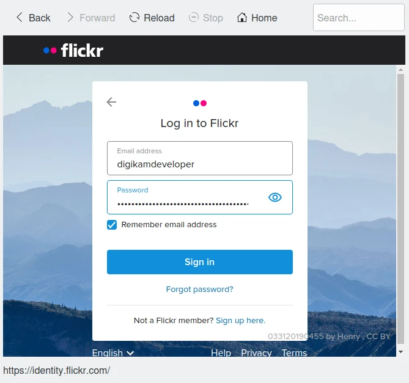
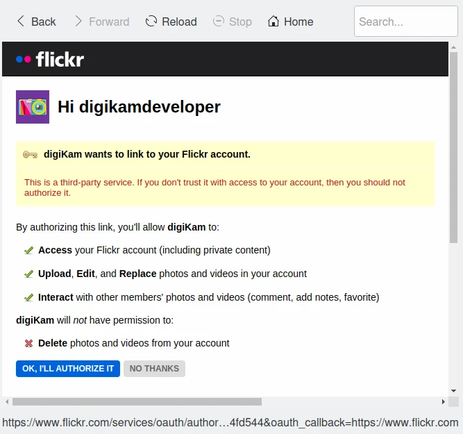
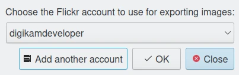
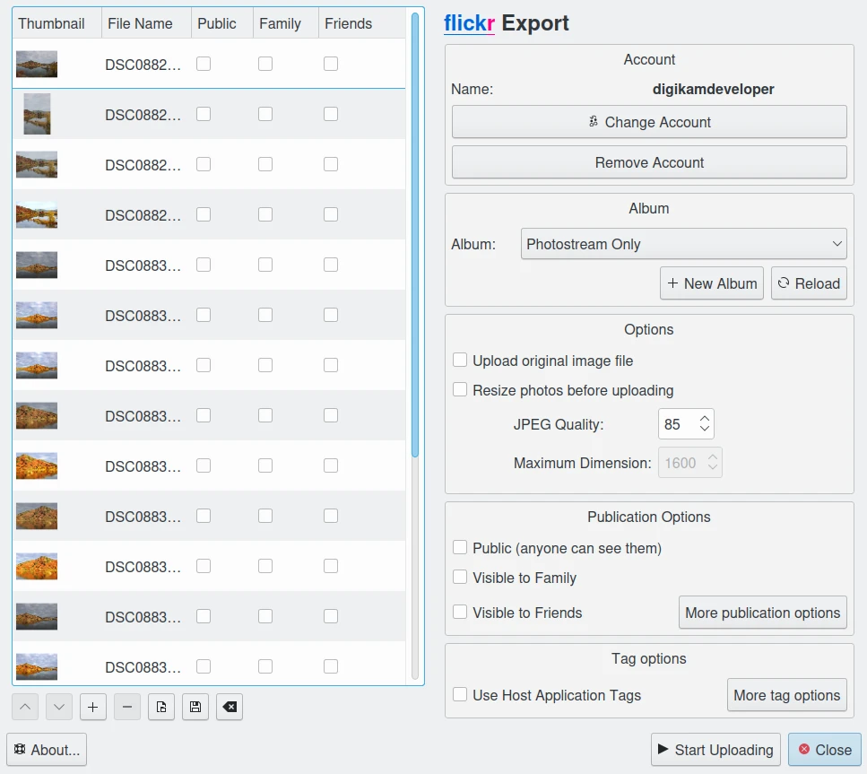
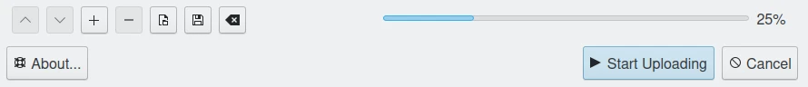
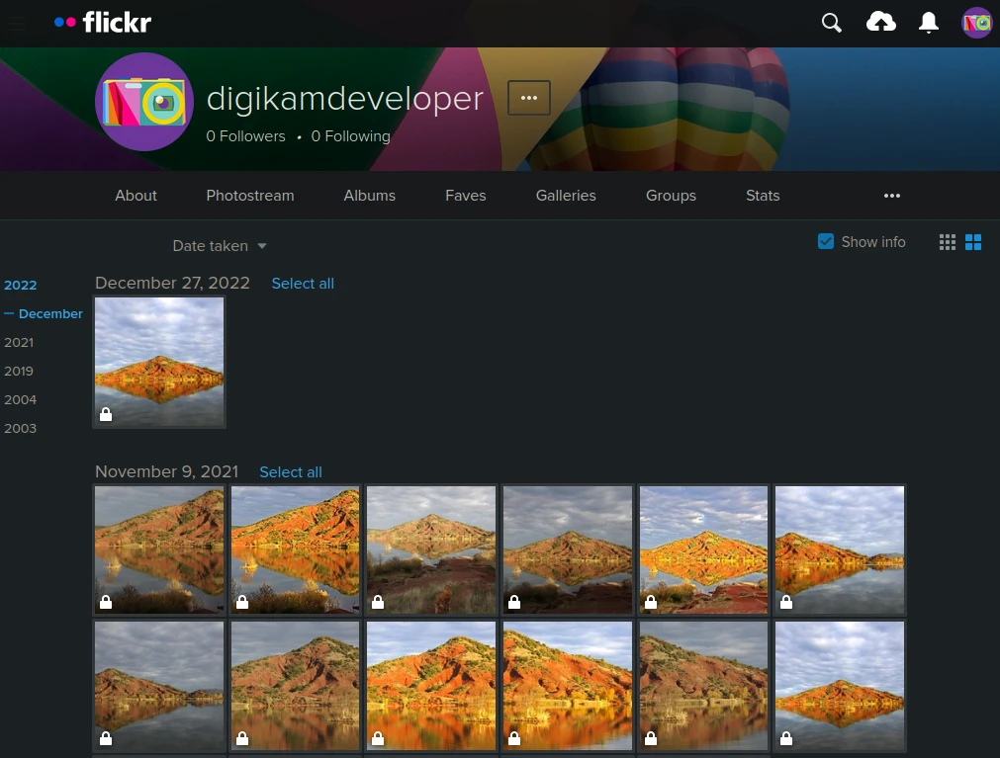

.. meta::
   :description: digiKam Export to Flickr Web-Service
   :keywords: digiKam, documentation, user manual, photo management, open source, free, learn, easy, flickr, export

.. metadata-placeholder

   :authors: - digiKam Team

   :license: see Credits and License page for details (https://docs.digikam.org/en/credits_license.html)

.. _flickr_export:

Export To Flickr
================

.. contents::

This tool allows the user to upload photos to the Flickr web service.

`Flickr <https://en.wikipedia.org/wiki/Flickr>`_  is an online photo management application. Flickr is a way to get your photos to the people who matter to you. With Flickr you can show off your favorite photos to the world, blog the photos you take with a smartphone, and securely and privately show photos to your friends and family around the world.

The tool can be used to upload a selection of images from your collection to the remote Flickr server using the Internet.

When accessing the tool for the first time by the :menuselection:`Export --> Export to Flickr` :kbd:`Ctrl+Alt+Shift+R` menu entry, you are taken through the process of obtaining a token which is used for authentication purposes. The following dialog will popup and a browser window will be launched you will log in to Flickr:

    The Flickr Export Login Dialog

After successful signup digiKam will be allowed to send photos to the Flickr website. You will be presented with the following page on successful signup:

    The Flickr Export Authorize Dialog

Then, simply authorize application and close the web browser. Return to the host application dialog, you will see the interface used to upload photos to Flickr.

When the tool is invoked for second time or later you are greeted with the following dialog, which shows the current account already used previously. Just select one from the list to be connected.

    The Flickr Export Dialog to Select the Previously Registered Account

The main upload dialog is shown below:

    The Flickr Export Tool Dialog

By default, the tool proposes to export the currently selected items from the icon-view. The **+** Photos button can be used to append more items on the list.

With the **Album** options, you can select the online folder to store files to upload. You can **Create** new one and **Reload** the list on the combo-box if online contents have been changed in Flickr web interface.

The **Tag options** section can be used to apply digiKam keywords to the flickr upload. More keywords can be assigned with a series of words (comma separated).

The **Public**, **Friends**, and **Family** check-boxes can be turned on to assign appropriate access permissions to the images you upload. By default the images uploaded are private.

If the **Resize photos before uploading** option is selected, the photos will be resized before transferring to Flickr. The values will be read from the **JPEG quality** and **Maximum Dimension** settings, which can be used to adjust the maximum height and the compression. The width calculation will be done so as to have the aspect ratio conserved.

    The Flickr Export Uploading in Progress

Press **Start Uploading** button to transfer items. You can click on the **Close** button to abort the uploading of photos.

Finally, you can view the uploaded photos by visiting the Flickr website.

    The Flickr Online Account Displaying the Uploaded Contents
