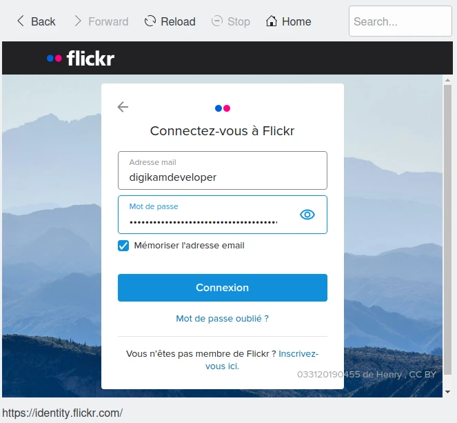

.. meta::
   :description: digiKam Export to Flickr Web-service
   :keywords: digiKam, documentation, user manual, photo management, open source, free, learn, easy, flickr

.. metadata-placeholder

   :authors: - digiKam Team (see Credits and License for details)

   :license: Creative Commons License SA 4.0

.. _flickr_export:

Export To Flickr
================

.. contents::

This tool allows the user to upload photos to the Flickr web service.

Flickr is an online photo management application. Flickr is a way to get your photos to the people who matter to you. With Flickr you can show off your favorite photos to the world, blog the photos you take with a cameraphone, and securely and privately show photos to your friends and family around the world.

The tool can be used to upload an image collection from your computer to the remote flickr server using the Internet.

When accessing the tool for the first time you are taken through the process of obtaining a token which is used for authentication purposes. The following dialog will popup and a browser window will be launched you will log in to Flickr:

After successful signup FlickrUploadr will be allowed to send photos to the flickr website. You will be presented with the following page on successful signup:

.. figure:: images/export_flickr_authorize.webp

Then, simply close the browser windows and return to the host application dialog. After clicking Yes, you will see the interface used to upload photos to Flickr, described in the next section.

When the the tool is invoked for second time or later you are greeted with the following dialog, which shows the current access permissions the Flickr Export tool has. The uploading process requires “write” permissions. The tool doesn't allow any other permissions as of now. You are then asked if they want to proceed with their current permissions.

.. figure:: images/export_flickr_account.webp

After clicking Yes, you will see the interface to upload photos to Flickr.

After clicking No, the authentication process is repeated.

The Main upload dialog is shown below:

.. figure:: images/export_flickr_dialog.webp

The Add Photos button should be clicked once user has set the other options in the dialog. After clicking this button an image selector dialog opens up where you can select the photos you want to upload and click OK, whereupon the image uploading starts.

The Tags field can be filled with a series of words (comma separated) which will be assigned as tags to the images uploaded.

The Public, Friends, and Family checkboxes can be checked to assign appropriate access permissions to the images you upload. By default the images uploaded are private.

If the Resize photos before uploading option is selected, the photos will be resized before uploading. The values will be read from the Maximum dimension combobox.

The Maximum Dimension combobox can be used to adjust the maximum height to which the photos will be resized before uploading. The width calculation will be done so as to have the aspect ratio conserved.

.. figure:: images/export_flickr_progress.webp

You can click Cancel button to abort the uploading of photos.

Finally, you can view the uploaded photos by visiting the Flickr website.
