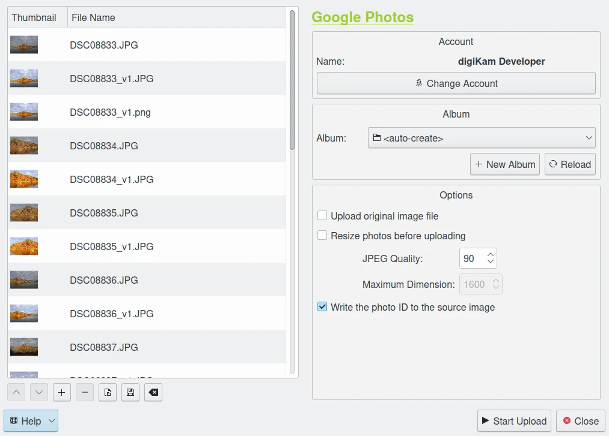
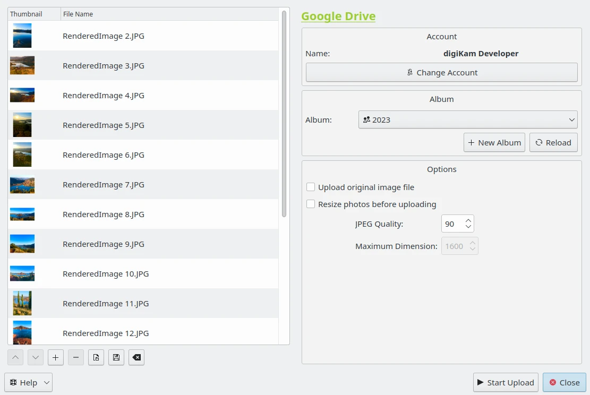

.. meta::
   :description: digiKam Export to Flickr Web-Service
   :keywords: digiKam, documentation, user manual, photo management, open source, free, learn, easy, google, export

.. metadata-placeholder

   :authors: - digiKam Team

   :license: see Credits and License page for details (https://docs.digikam.org/en/credits_license.html)

.. _google_export:

Export To Google
================

.. contents::

Overview
--------

This tool allows the user to upload photos to the Google web services. Two online application are supported: `Google Photo <https://en.wikipedia.org/wiki/Google_Photos>`_ and `Google Drive <https://en.wikipedia.org/wiki/Google_Drive>`_.

**Google Photos** is a photo sharing which automatically analyzes photos, identifying various visual features and subjects. Users can search for anything in photos including faces and group similar ones together.

**Google Drive** allows users to store files in the cloud, synchronize files across devices, and share files. Users can change privacy settings for individual files and can search for a content by describing its visuals, and use natural language to find specific files.

The tools can be used to upload an image collection from your computer to the remote Google server using the Internet. Use respectively the :menuselection:`Export --> Export to Google Photo` and by the :menuselection:`Export --> Export to Google Drive` menu entries to access to these tools,

Login to your Account
---------------------

When accessing the tool for the first time you are taken through the process of obtaining a token which is used for authentication purposes. The following dialog will popup and a browser window will be launched you will log in to Google:

.. figure:: images/export_google_login.webp
    :alt:
    :align: center

    The Google Dialog to Select Account

After successful signup digiKam will be allowed to send photos to the Google website. You will be presented with the following page on successful signup:

.. figure:: images/export_google_authorize.webp
    :alt:
    :align: center

    The Google Dialog to Authorize Application

Then, simply authorize application and close the web browser. Return to the host application dialog, you will see the interface used to upload photos to Google.

.. note::

    When the tool is invoked for second time, it will remember the previous account automatically.

Upload to your Account
----------------------

The upload dialogs for **Google Photo** and **Google Drive** will show the same interface:

    The Google Photo Export Dialog

    The Google Drive Export Dialog

By default, the tools proposes to export the currently selected items from the icon-view. The **+** Photos button can be used to append more items on the list.

With the **Album** options, you can select the online folder to store files to upload. You can **Create** new one an **Reload** the list on the combo-box if online contents have been changed in Google web interface.

If the **Resize photos before uploading** option is selected, the photos will be resized before transferring to Google. The values will be read from the **Maximum Dimension** combo-box, which can be used to adjust the maximum height. The width calculation will be done so as to have the aspect ratio conserved.
