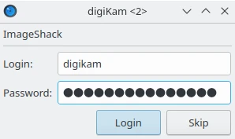
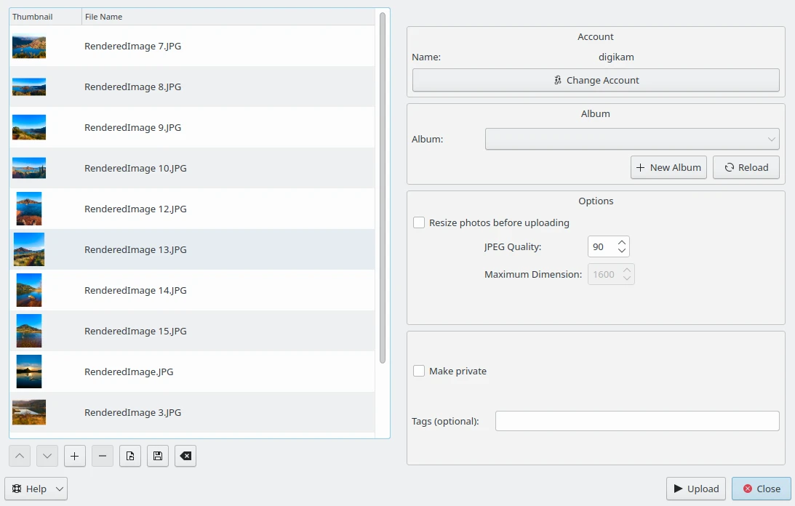
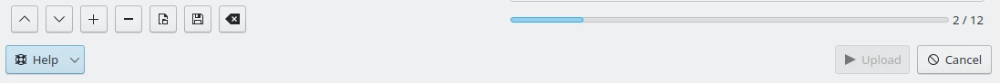
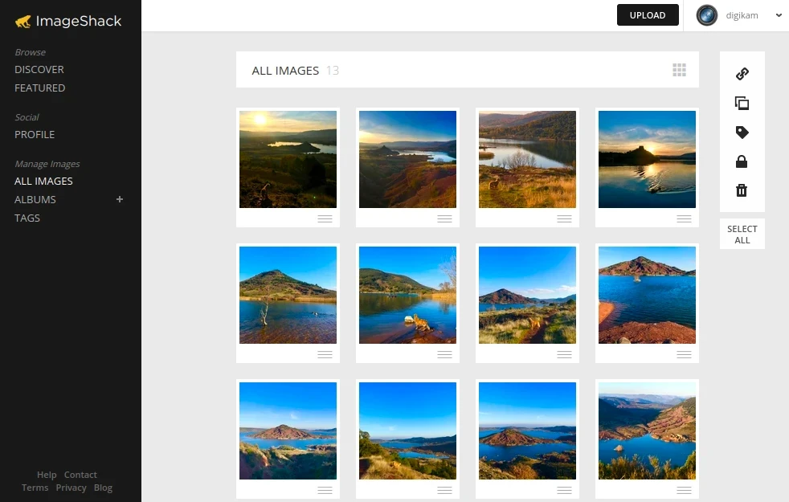

.. meta::
   :description: digiKam Export to ImageShack Web-Service
   :keywords: digiKam, documentation, user manual, photo management, open source, free, learn, easy, imageshack, export

.. metadata-placeholder

   :authors: - digiKam Team

   :license: see Credits and License page for details (https://docs.digikam.org/en/credits_license.html)

.. _image_shack:

Export To ImageShack
====================

.. contents::

This tool allows the user to upload photos to the ImageShack web-service.

`ImageShack <https://en.wikipedia.org/wiki/ImageShack>`_ is a subscription-based image hosting website. The company also facilitates the sale of digital and print media for amateur and professional photographers.

The tool can be used to upload a selections of images from your collection to the remote ImageShack server using the Internet.

When accessing the tool for the first time by the :menuselection:`Export --> Export to ImageShack` :kbd:`Ctrl+Alt+Shift+M` menu entry, you are taken through the process of obtaining a token which is used for authentication purposes. The following dialog will popup and a browser window will be launched you will log in to ImageShack:

    The ImageShack Login Dialog

After successful sign-up digiKam will be allowed to send photos to the ImageShack website. Then, simply authorize application and close the web browser. Return to the host application dialog, you will see the interface used to upload photos to ImageShack.

    The ImageShack Export Tool Dialog

By default, the tool proposes to export the currently selected items from the icon-view. The **+** Photos button can be used to append more items on the list.

With the **Album** options, you can select the online folder to store files to upload. You can **Create** new one and **Reload** the list on the combo-box if online contents have been changed in ImageShack web interface.

If the **Resize photos before uploading** option is selected, the photos will be resized before transferring to ImageShack. The values will be read from the **JPEG quality** and **Maximum Dimension** settings, which can be used to adjust the maximum height and the compression. The width calculation will be done so as to have the aspect ratio conserved.

The **Make private** option set an ImageShack flag for image to be non public. The **Tags** text field allows to assign if necessary extra keywords to images in ImageShack hosting web-service.

    The ImageShack Export Uploading in Progress

Press **Upload** button to transfer items. You can click on the **Cancel** button to abort the uploading of photos.

Finally, you can view the uploaded photos by visiting the ImageShack website.

    The ImageShack Online Account Displaying the Uploaded Contents
