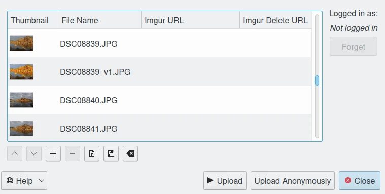
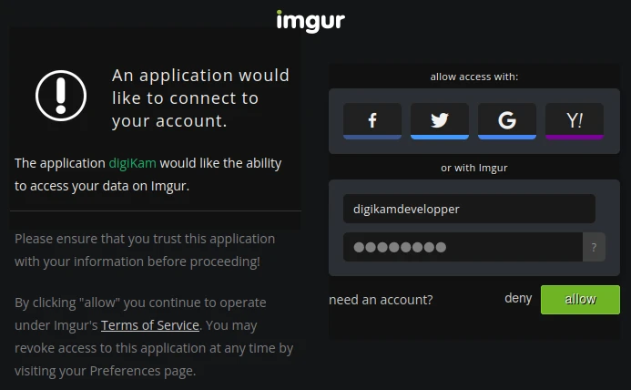
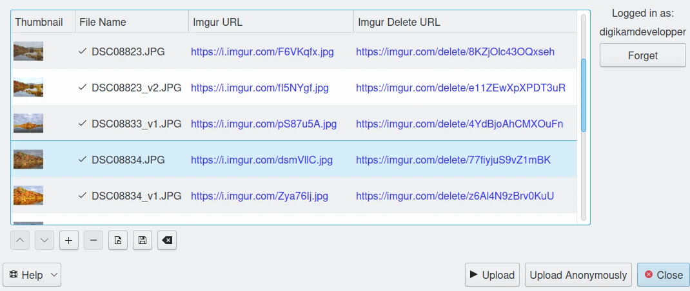
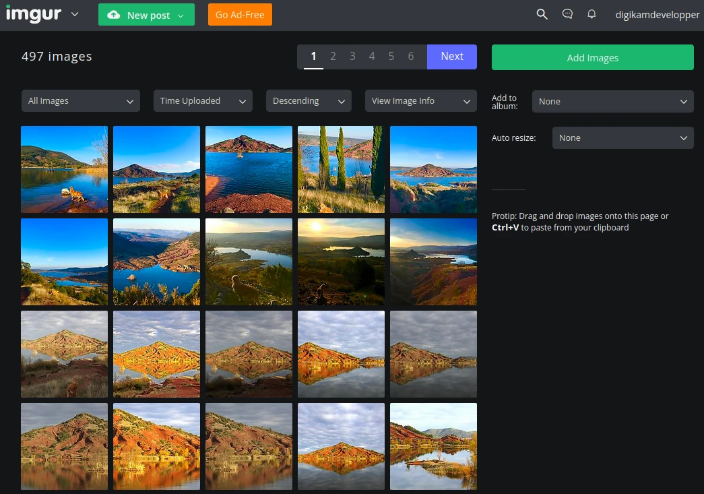

.. meta::
   :description: digiKam Export to Imgur Web-Service
   :keywords: digiKam, documentation, user manual, photo management, open source, free, learn, easy, imgur, export

.. metadata-placeholder

   :authors: - digiKam Team

   :license: see Credits and License page for details (https://docs.digikam.org/en/credits_license.html)

.. _imgur_export:

Export To Imgur
===============

.. contents::

This tool allows the user to upload photos to the Imgur web-service.

`Imgur <https://en.wikipedia.org/wiki/Imgur>`_ is an online image sharing and image hosting service with a focus on social gossip.

The tool can be used to upload a selection of images from your collection to the remote Imgur server using the Internet. Files transfer can be anonymous or connected with an account.

When accessing the tool for the first time by the :menuselection:`Export --> Export to Imgur` menu entry, this dialog will appear:

    The Imgur Export Tool Dialog

You can directly upload contents without to be connected with an account using **Upload Anonymously** button. By default, the tool proposes to export the currently selected items from the icon-view. The **+** Photos button can be used to append more items on the list.

To be connected with an account, press **Upload** button, you will be taken through the process of obtaining a token which is used for authentication purposes. The following dialog will popup and a browser window will be launched you will log in to Imgur:

    The Imgur Authorize and Login Dialog

After successful sign-up digiKam will be allowed to send photos to the Imgur website. Then, simply authorize application and close the web browser. Return to the host application dialog, you will see the interface uploading photos to Imgur. You can click on the **Close** button to abort the uploading of photos.

When items are uploaded to Imgur, the dialog will populate on the list the urls to access directly to the images and the urls to delete online items. Use the context menu over items list to copy urls on clipboard for future usage outside digiKam.

    The Imgur Export Tool Dialog After Downloading Contents with an Account

Finally, you can view the uploaded photos by visiting the Imgur website.

    The Imgur Online Account Displaying the Uploaded Contents
