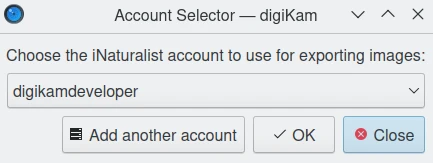
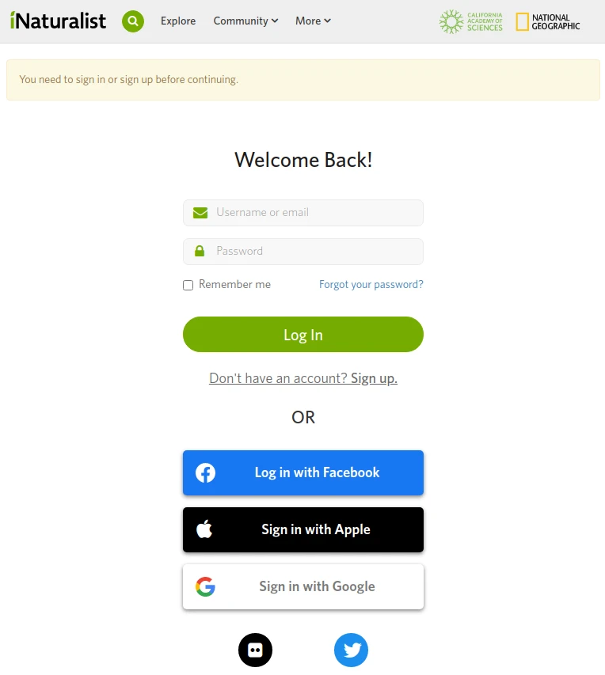
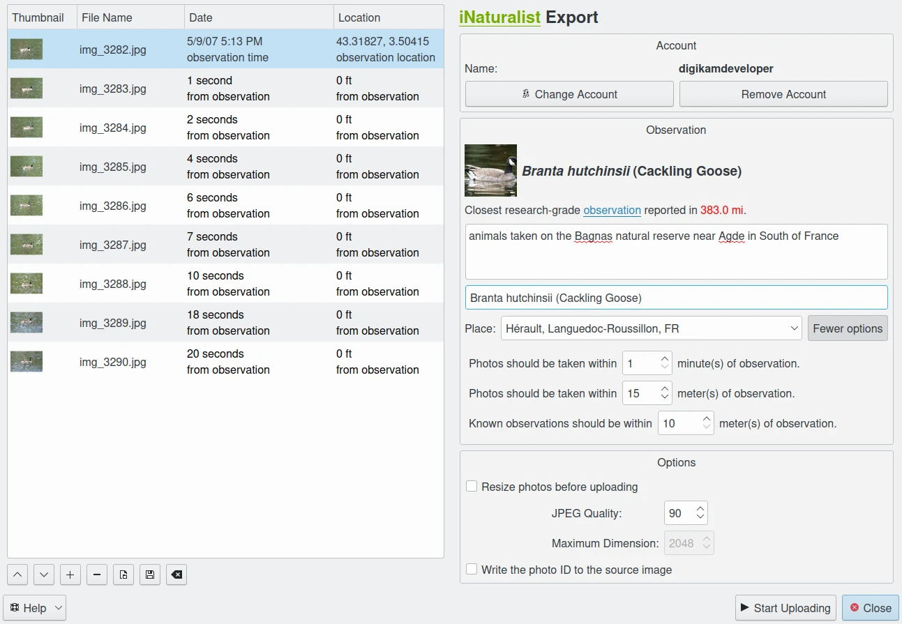
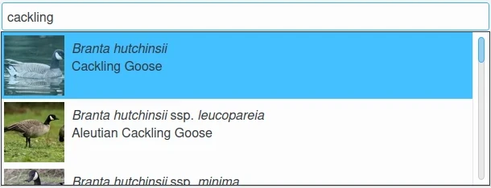
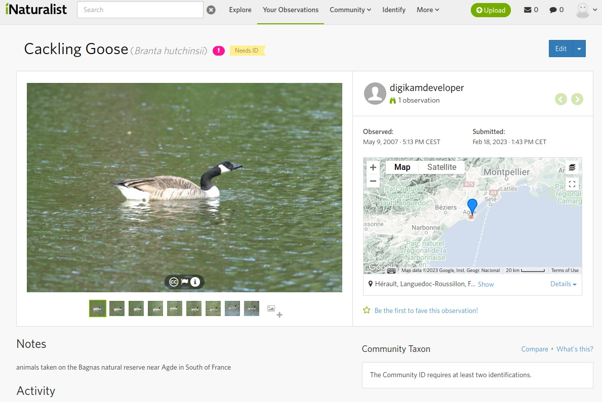

.. meta::
   :description: digiKam Export to iNaturalist Web-Service
   :keywords: digiKam, documentation, user manual, photo management, open source, free, learn, easy, inaturalist, export

.. metadata-placeholder

   :authors: - digiKam Team

   :license: see Credits and License page for details (https://docs.digikam.org/en/credits_license.html)

.. _inaturalist_export:

Export To iNaturalist
=====================

.. contents::

`iNaturalist <https://en.wikipedia.org/wiki/INaturalist>`_ is a social network of naturalists, citizen scientists, and biologists built on the concept of mapping and sharing observations of biodiversity across the globe. iNaturalist users contribute to share observations of plants, animals, fungi, and other organisms worldwide.

The iNaturalist platform is based on crowd-sourcing of observations and identifications. An iNaturalist **observation** records a person's encounter with an individual organism at a particular time and place.

To upload observation shots from your collection to the remote iNaturalist server using the Internet, uses the :menuselection:`Export --> Export to iNaturalist` :kbd:`Ctrl+Alt+Shift+N` menu entry, or the corresponding icon from the **Tools** tab in Right Sidebar.

.. important::

    To push an **observation** to iNaturalist repository, shots must be geo-localized, taken in same conditions, separated by a brief delay, and surrounding the same subject. A description of observation must be provided, including the main topic.

When you launch the tool, the following dialog will popup to select the account to use with the web-service.

    The iNaturalist Export Dialog

If no account previously used is available, press **Add another account** button and a web-browser instance will be started with the iNaturalist login page.

    The iNaturalist Web Page to Login in Your Account

Fill the account and password properties and validate the settings to continue to the main tool dialog:

    The iNaturalist Export Dialog

On the right side, you can see the settings view to use to upload observation shots on the iNaturalist server. Even if you can use the basic settings to process files, we recommend to expand the settings with the **Fewer options** button, to tune precisely the observation properties.

On the top of the settings view, you can see the login **Account** properties used to be connected to iNaturalist. You can switch to another account using the **Change Acoount** button. The **Remove Account** button will allows to delete cached information by the tool to be connected automatically on the server in later session.

On the bottom of the settings view, you can set the upload **Options** for the images. If the **Resize photos before uploading** option is selected, the photos will be resized before transferring to iNaturalist. The values will be read from the **JPEG quality** and **Maximum Dimension** settings, which can be used to adjust the maximum height and the compression. The width calculation will be done so as to have the aspect ratio conserved.

On the middle of the settings view, you can tune the **Observation** properties. The most important one is to identify the subject using the iNaturalist database by entering words in **Identification** text field. The tool will query the remote server to search the best entries with a preview. If one item match with the observation subject, just select it.

    The iNaturalist Export Tool Searching About Contents on Online Database

On the left side, you can see the list of observation shots taken from digiKam collection. From the **Date** column, the tool scan the items to found the most older one as reference, and compute the delay of all other shots compared to this one. The maximum delay between the reference and the most recent shot must be lesser than value set in the **Photo should be taken within** from the settings view.

In the way way, the tool scan also the items to found the original place of observation using the reference image. It computes the distance of all other shots compared to this one. The maximum meters between the reference and the most recent shot must be lesser than value set in the **Photo should be taken within** from the settings view.

    The iNaturalist Online Account Displaying the Observed Publications
