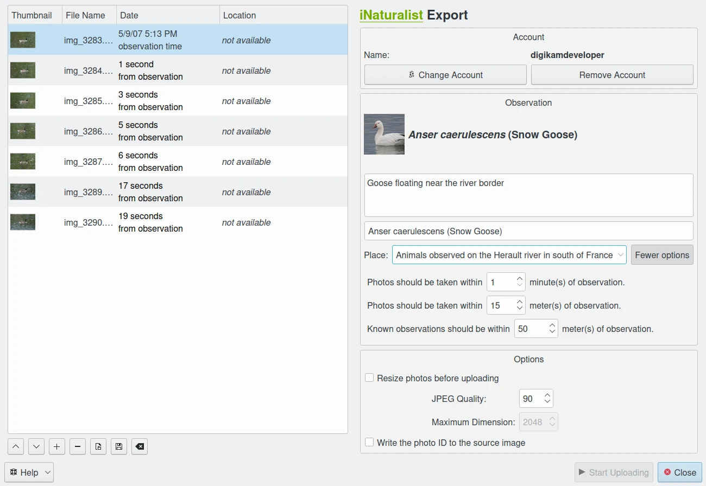

.. meta::
   :description: digiKam Export to iNaturalist Web-Service
   :keywords: digiKam, documentation, user manual, photo management, open source, free, learn, easy, inaturalist, export

.. metadata-placeholder

   :authors: - digiKam Team

   :license: see Credits and License page for details (https://docs.digikam.org/en/credits_license.html)

.. _inaturalist_export:

Export To iNaturalist
=====================

.. contents::

    The iNaturalist Export Dialog
