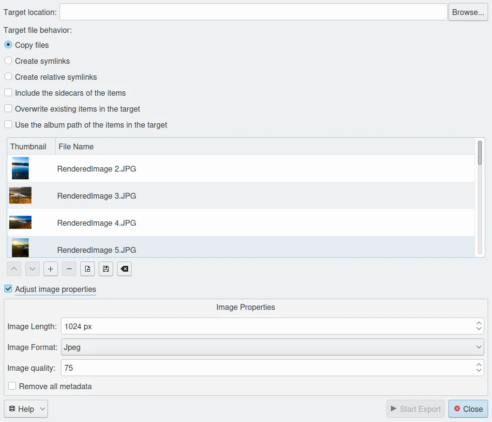

.. meta::
   :description: digiKam Export to Local Computer tool: copy or link files, adjust properties, and manage metadata.
   :keywords: digiKam, documentation, user manual, photo management, open source, free, export, local computer, export settings, file management, symbolic links, metadata

.. metadata-placeholder
   :authors: - digiKam Team
   :license: see Credits and License page for details (https://docs.digikam.org/en/credits_license.html)

.. _local_export:

:ref:`Export To Local Computer <export_tools>`
==============================================

This tool allows you to copy or link files from your digiKam collections to another location on your computer (typically outside your collections). You can also modify file properties during the export process. Access this tool via the **Export → Export to local storage** menu (:kbd:`Ctrl+Alt+Shift+L`) or the corresponding icon in the **Tools** tab of the Right Sidebar.

    The Export to Local Computer dialog.

Export Dialog Overview
----------------------

The **Export to Local Computer** dialog is divided into two main sections:

- **Left Panel:** Displays a list of files selected for export. By default, the tool includes the currently selected items from the icon-view. Use the **+** button to add more items to the list.
- **Right Panel:** Configure the export settings, including the target location and file behavior.

Target Location
---------------

- Use the **Target location** text field to specify the destination folder for your files.
- Click the **Browse** button to open a file selection dialog and navigate to your desired directory.

Target File Behavior
--------------------

Choose how files are handled at the target location:

- **Copy files:** Creates duplicates of the original files.
- **Create symlinks:** Adds absolute symbolic links to the original files, avoiding data duplication.
- **Create relative symlinks:** Adds relative symbolic links to the original files, avoiding data duplication.
- **Include the sidecars of the items:** Copies any associated sidecar files (e.g., XMP, PP3) along with the main files.
- **Overwrite existing items in the target:** Replaces files at the target location if they already exist.
- **Use the album path of the items in the target:** Renames exported files using the original album path as part of the filename.

Adjust Image Properties
-----------------------

Enable this option to convert files to another format (JPEG or PNG) and resize them before exporting:

- **Image format:** Select the desired output format.
- **Image quality:** Adjust the compression level for JPEG files.
- **Image length:** Set the maximum height for the exported images. The width is automatically calculated to maintain the aspect ratio. *Leave blank to preserve the original dimensions.*
- **Write sidecar metadata to the items:** Embeds metadata from sidecar files (e.g., XMP) into the exported image.

Remove all Metadata
-------------------

Check this option to strip all Exif, IPTC, and XMP metadata from the exported files. Note that the image data itself remains unchanged.

Platform-Specific Notes
-----------------------

- **Directory creation:** digiKam does not create target directories automatically. Ensure the target path exists before starting the export.
- **Symbolic links:** On Windows, creating symlinks may require administrator privileges or an NTFS-formatted drive. If symlinks fail, use **Copy files** instead.
- **Path format:** On Windows, use forward slashes or double backslashes for paths (e.g., ``C:\\NewFolder`` or ``C:/NewFolder``).

Error Handling
--------------

- If the target directory does not exist, digiKam will display an error. Either create the directory manually or select an existing folder using the **Browse** button.
- If the export fails, check the target path and permissions, then retry.
