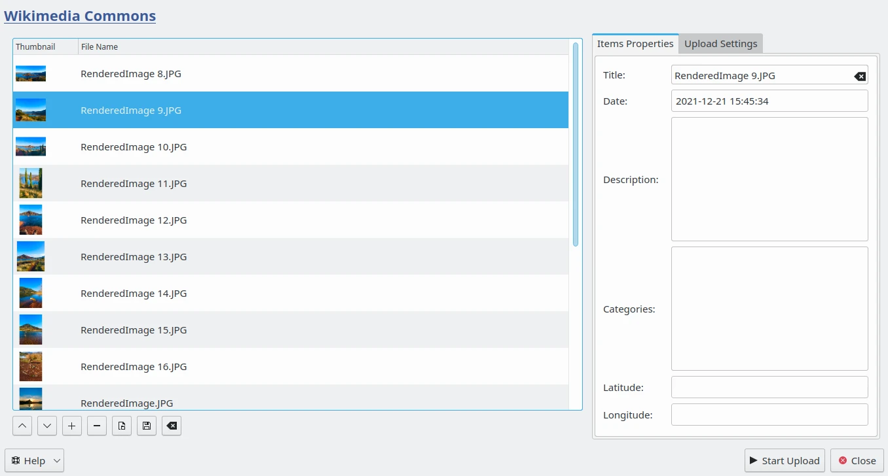
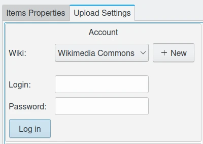
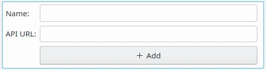
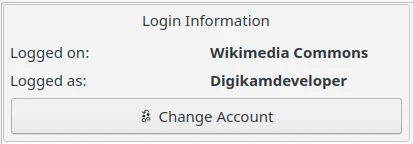
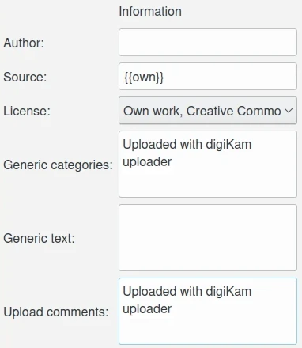
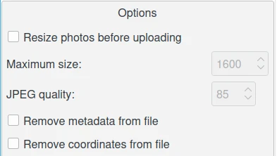
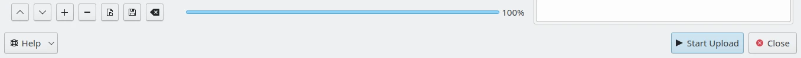
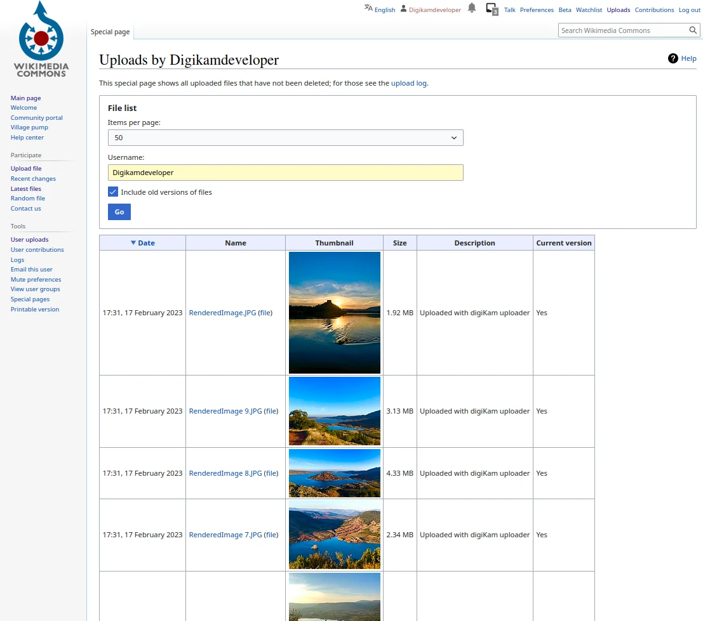

.. meta::
   :description: digiKam Export to MediaWiki Web-Service
   :keywords: digiKam, documentation, user manual, photo management, open source, free, learn, easy, mediawiki, export

.. metadata-placeholder

   :authors: - digiKam Team

   :license: see Credits and License page for details (https://docs.digikam.org/en/credits_license.html)

.. _media_wiki:

Export To MediaWiki
===================

.. contents::

Sharing is caring, and there is probably no better way to share your photographic masterpieces with the world than adding them to a `MediaWiki <https://en.wikipedia.org/wiki/MediaWiki>`_ pool. While the project’s website features its own tool for uploading photos, digiKam’s MediaWiki Export tool can come in rather handy when you need to export multiple photos in one fell swoop without leaving the convenience of your favorite photo management application.

MediaWiki are the base of `Media Repositories <https://en.wikipedia.org/wiki/Digital_library>`_ available on the Internet where free-to-use images can be uploaded. The goal of these digital libraries is to share contents used across all of the Wikimedia projects as the famous **Wikipedia** encyclopedia for example.

To upload a selection of images from your collections to a remote MediaWiki server using the Internet, use the :menuselection:`Export --> Export to MediaWiki` menu entry, or the corresponding icon from the **Tools** tab in Right Sidebar. 

    The MediaWiki Export Dialog

The **Items Properties** tab of the right side allows to customize MediaWiki metadata of each items present from the upload list. Select one item on the left side to see the properties populated by digiKam, and adjust values if necessary. When all is ready, switch to the **Upload Settings** tab to be connected to the remote server and transfer files.

    The MediaWiki Export Account Settings

First, you needs to be connected to the server with an **Account**. From this view, you can select the MediaWiki service to use with the **Login** and **Password** properties. By default, the tool propose a list of popular MediaWiki servers available on the Internet, as:

    - `Wikimedia Commons <https://commons.wikimedia.org/>`_
    - `Wikimedia Meta <https://meta.wikimedia.org/>`_
    - `Wikipedia <https://en.wikipedia.org/>`_
    - `Wikibooks <https://en.wikibooks.org/>`_
    - `Wikinews <https://en.wikinews.org/>`_
    - `Wikiquote <https://en.wikiquote.org/>`_
    - `Wikisource <https://en.wikisource.org/>`_
    - `Wiktionary <https://en.wiktionary.org/>`_
    - `MediaWiki Organization <https://www.MediaWiki.org/>`_
    - `Wikia Foto <https://foto.wikia.com/>`_
    - `Wikia Uncyclopedia <https://en.uncyclopedia.co/>`_

With the **+ NEW** button, you can append on the list a new MediaWiki based server from Internet or on your local network. The tool will shown a widget to customize the **Name** and the **API Url**. Just press on **+ Add** button to confirm values.

    The MediaWiki Export View to create a New Server Settings

When you are connected to the remote Web service with the **Log in** button, the **Account** view must become like this:

    The MediaWiki Export Connected to an Account from Wikimedia Commons Web Service

While transferring the files, you can customize some **Information** used by the MediaWiki server to identify the uploading operation. The fields available are listed below:

    - **Author**: the author name of the contents as text.
    - **Source**: the original source of the contents as text.
    - **License**: the license of the contents. Use one entry from the list provided by the tool.
    - **Generic categories**: The categories that will be added to the contents as text.
    - **Generic text**: The text that will be added to the contents below the Information template.
    - **Upload comments**: The text that will be used as upload comments. The value *Uploaded via digiKam uploader* will be used if empty.

    The MediaWiki Export Information Settings

During uploading the files, you can also apply some operations listed in **Options** view. If the **Resize photos before uploading** option is selected, the photos will be resized before transferring to MediaWiki. The values will be read from the **Maximum Size** and **JPEG quality** settings, which can be used to adjust the compression and maximum height. The width calculation will be done so as to have the aspect ratio conserved. You can also drop **metadata** and GPS **coordinates** information from the files.

    The MediaWiki Export Options Settings

Press **Start Upload** button to transfer items. You can click on the **Close** button to abort the uploading of photos.

    The MediaWiki Export Uploading Contents to the Web Service

Finally, you can view the uploaded photos by visiting the MediaWiki website.

    The Wikimedia Commons Online Account Displaying the Uploaded Contents
