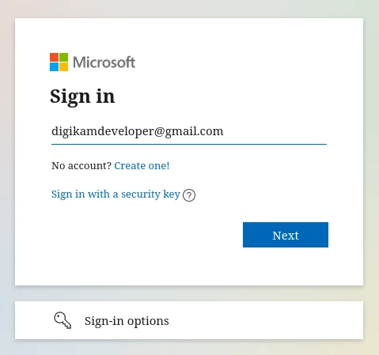
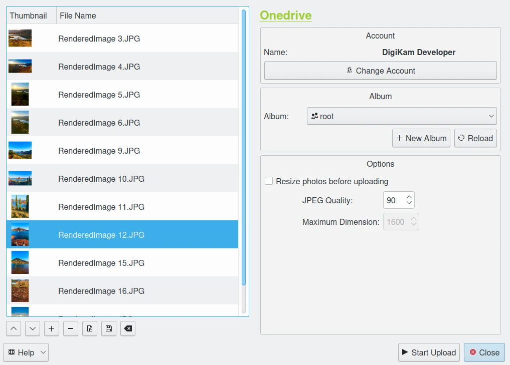
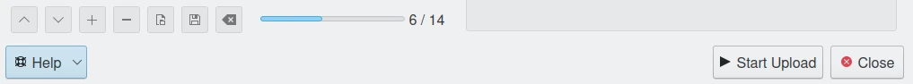
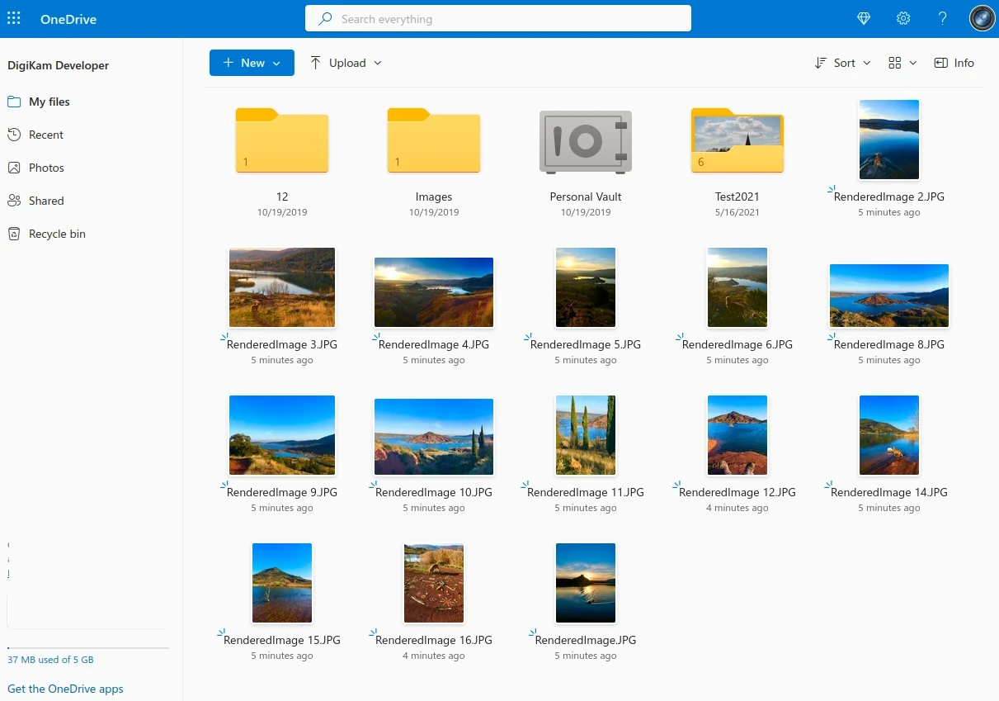

.. meta::
   :description: digiKam Export to OneDrive Web-Service
   :keywords: digiKam, documentation, user manual, photo management, open source, free, learn, easy, onedrive, export

.. metadata-placeholder

   :authors: - digiKam Team

   :license: see Credits and License page for details (https://docs.digikam.org/en/credits_license.html)

.. _one_drive:

Export To OneDrive
==================

.. contents::

This tool allows the user to upload photos to the OneDrive web-service.

`OneDrive <https://en.wikipedia.org/wiki/OneDrive>`_ is a file hosting service. It enables registered users to share and synchronize their files.

The tool can be used to upload a selection of images from your collections to the remote OneDrive server using the Internet.

.. important::

    OneDrive file storage is currently limited to host only files with a size lower than 4Mb.

When accessing the tool for the first time by the :menuselection:`Export --> Export to OneDrive` :kbd:`Ctrl+Alt+Shift+O` menu entry, you are taken through the process of obtaining a token which is used for authentication purposes. The following dialog will popup and a browser window will be launched you will log in to OneDrive:

    The OneDrive Login Dialog

After successful sign-up digiKam will be allowed to send photos to the OneDrive website.

Then, simply authorize application and close the web browser. Return to the host application dialog, you will see the interface used to upload photos to OneDrive.

    The OneDrive Export Tool Dialog

By default, the tool proposes to export the currently selected items from the icon-view. The **+** Photos button can be used to append more items on the list.

With the **Album** options, you can select the online folder to store files to upload. You can **Create** new one and **Reload** the list on the combo-box if online contents have been changed in OneDrive web interface.

If the **Resize photos before uploading** option is selected, the photos will be resized before transferring to OneDrive. The values will be read from the **JPEG quality** and **Maximum Dimension** settings, which can be used to adjust the maximum height and the compression. The width calculation will be done so as to have the aspect ratio conserved.

    The OneDrive Export Uploading in Progress

Press **Start Upload** button to transfer items. You can click on the **Close** button to abort the uploading of photos.

Finally, you can view the uploaded photos by visiting the OneDrive website.

    The OneDrive Online Account Displaying the Uploaded Contents
