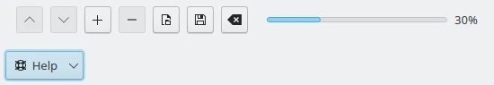
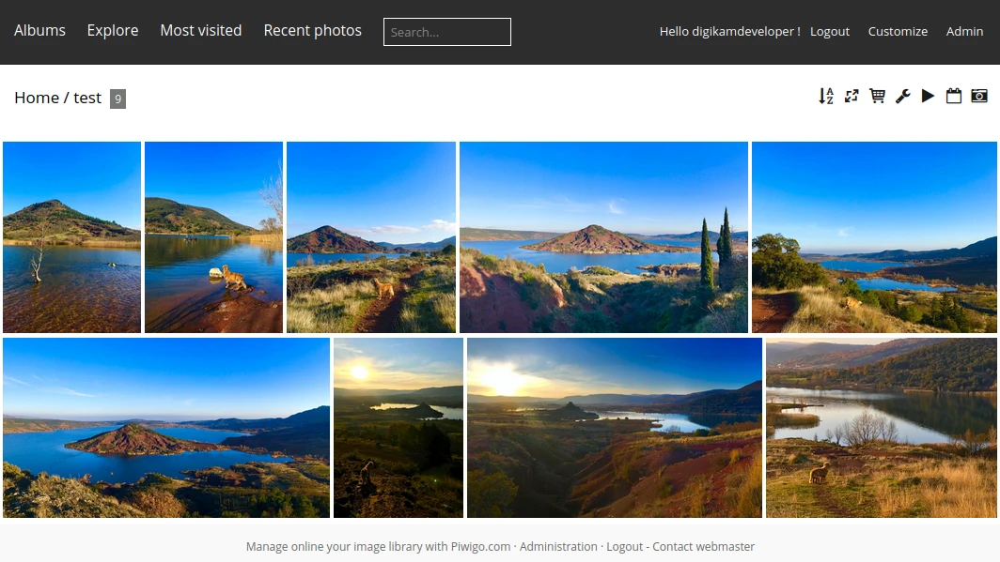

.. meta::
   :description: digiKam Export to Piwigo Web-Service
   :keywords: digiKam, documentation, user manual, photo management, open source, free, learn, easy, piwigo, export

.. metadata-placeholder

   :authors: - digiKam Team

   :license: see Credits and License page for details (https://docs.digikam.org/en/credits_license.html)

.. _piwigo_export:

Export To Piwigo
====================

.. contents::

This tool allows the user to upload photos to the Piwigo web-service.

`Piwigo <https://en.wikipedia.org/wiki/Piwigo>`_ is a subscription-based image hosting website. The company also facilitates the sale of digital and print media for amateur and professional photographers.

The tool can be used to upload a selections of images from your collection to the remote Piwigo server using the Internet.

    The Selection of Item to Upload to Piwigo Web-Service

When accessing the tool by the :menuselection:`Export --> Export to Piwigo` menu entry or the icon from the **Tools** tab from Right Sidebar, the main tool dialog will appears:

    The Piwigo Export Tool Dialog

The first stage to export content is to obtaining a token which is used for authentication purposes. Press **Change Account** button and the following dialog will popup to log in to Piwigo:

    The Piwigo Login Dialog

.. note::

    If you have been already logged to a Piwigo web-service in a previous session, the tool will remember the settings and use it automatically.

After successful sign-up digiKam will be allowed to send photos to the Piwigo website. With the **Remote Album** view, you must select the online folder to store files to upload.

If the **Resize photos before uploading** option is selected, the photos will be resized before transferring to Piwigo. The values will be read from the **JPEG quality**, **Maximum width** and **Maximum height** settings, which can be used to adjust the maximum sizes and the compression. The size calculation will be done so as to have the aspect ratio conserved.

    The Piwigo Export Uploading in Progress

Press **Start Upload** button to transfer items. You can click on the **Cancel** button from the progress dialog to abort the uploading of photos.

Finally, you can view the uploaded photos by visiting the Piwigo website.

    The Piwigo Online Account Displaying the Uploaded Contents
