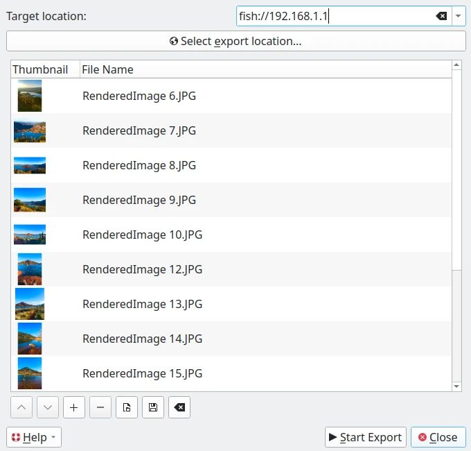
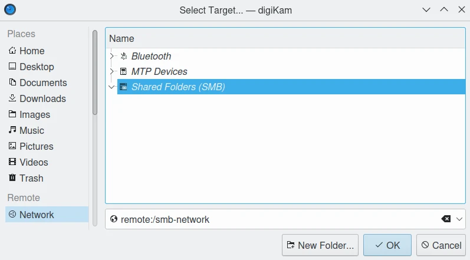

.. meta::
   :description: digiKam Export to Remote Computer
   :keywords: digiKam, documentation, user manual, photo management, open source, free, learn, easy, remote, computer, export

.. metadata-placeholder

   :authors: - digiKam Team

   :license: see Credits and License page for details (https://docs.digikam.org/en/credits_license.html)

.. _remote_export:

:ref:`Export To Remote Computer <export_tools>`
===============================================

.. contents::

This tool allows you to upload files from your collections to a remote computer using a network. It is available from the :menuselection:`Export --> Export to remote storage` :kbd:`Ctrl+Alt+Shift+K` menu entry or the corresponding icon in the **Tools** tab in the Right Sidebar.

    The Export to Remote Computer Dialog

Protocols such as **fish** (ssh), **ftp**, **smb**, etc, can be used to connect to the **Target Location** url. For example:

    - **fish://user_name@remote_computer**: connect to the *remote_computer* with *user_name* using SSH protocol (Secure SHell).
    - **ftp://user_name@remote_computer**: connect to the *remote_computer* with *user_name* using FTP protocol (File Transfer Protocol).

Instead of using the **Target Location** url field, you can use the native desktop url selector by pressing the **Select Export Location** button. A dialog will appear where you can see and select remote devices in the network section of the dialog:

    The Export to Remote Computer Url Selector Dialog Under Linux.

.. note::

    The native url selector dialog is only available if you turn on the right option in :menuselection:`Settings --> Configure digiKam... --> Miscellaneous page --> Appearance tab` as described in the :ref:`appearance settings <appearance_settings>` section of this manual.

By default, the tool proposes to export the currently selected items from the icon-view. The **+** Photos button can be used to append more items to the list.

Once you have selected the right target to upload the files, press the **Start Export** button to process the files. You can abort the operation by pressing the **Close** button.
