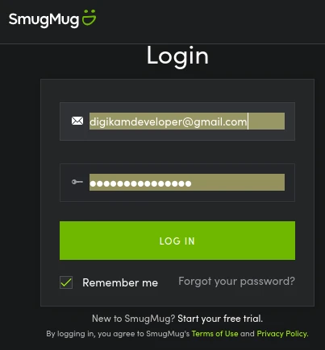
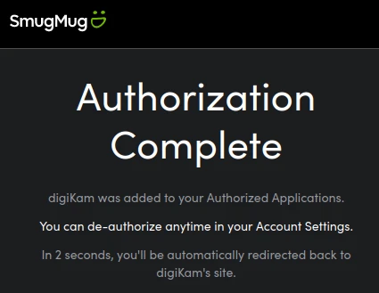
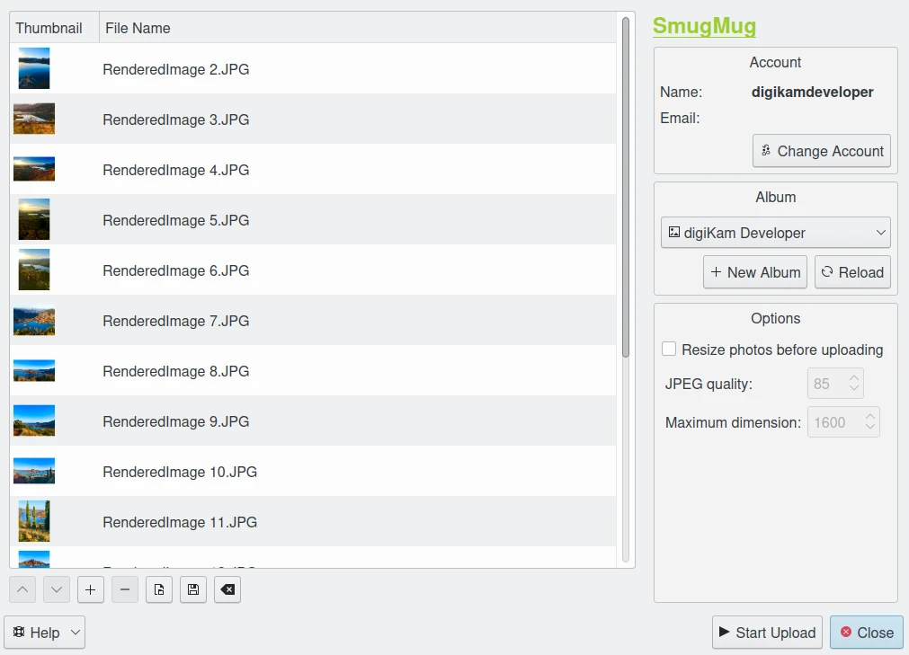
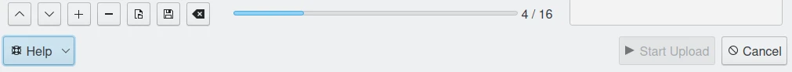
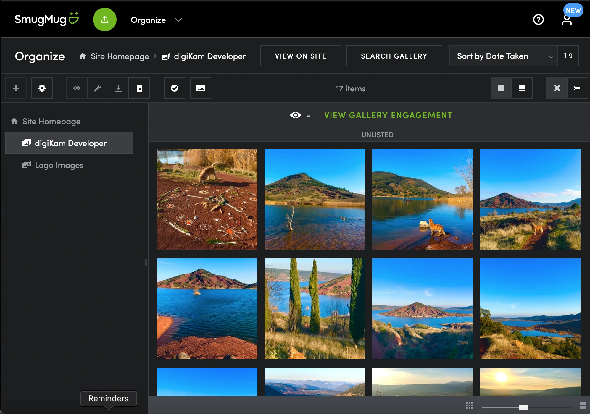

.. meta::
   :description: digiKam Export to SmugMug Web-Service
   :keywords: digiKam, documentation, user manual, photo management, open source, free, learn, easy, smugmug, export

.. metadata-placeholder

   :authors: - digiKam Team

   :license: see Credits and License page for details (https://docs.digikam.org/en/credits_license.html)

.. _smugmug_export:

Export To SmugMug
=================

.. contents::

This tool allows the user to upload photos to the SmugMug web-service.

`SmugMug <https://en.wikipedia.org/wiki/SmugMug>`_ is an image sharing, image hosting service, and online video platform on which users can upload photos and videos. The company also facilitates the sale of digital and print media for amateur and professional photographers.

The tool can be used to upload a selections of images from your collection to the remote SmugMug server using the Internet.

When accessing the tool for the first time by the :menuselection:`Export --> Export to SmugMug` :kbd:`Ctrl+Alt+Shift+S` menu entry, you are taken through the process of obtaining a token which is used for authentication purposes. The following dialog will popup and a browser window will be launched you will log in to SmugMug:

    The SmugMug Login Dialog

After successful sign-up digiKam will be allowed to send photos to the SmugMug website. You will be presented with the following page:

    The SmugMug Authorize Dialog

Then, simply authorize application and close the web browser. Return to the host application dialog, you will see the interface used to upload photos to SmugMug.

    The SmugMug Export Tool Dialog

By default, the tool proposes to export the currently selected items from the icon-view. The **+** Photos button can be used to append more items on the list.

With the **Album** options, you can select the online folder to store files to upload. You can **Create** new one and **Reload** the list on the combo-box if online contents have been changed in SmugMug web interface.

If the **Resize photos before uploading** option is selected, the photos will be resized before transferring to SmugMug. The values will be read from the **JPEG quality** and **Maximum Dimension** settings, which can be used to adjust the maximum height and the compression. The width calculation will be done so as to have the aspect ratio conserved.

    The SmugMug Export Uploading in Progress

Press **Start Upload** button to transfer items. You can click on the **Close** button to abort the uploading of photos.

Finally, you can view the uploaded photos by visiting the SmugMug website.

    The SmugMug Online Account Displaying the Uploaded Contents
