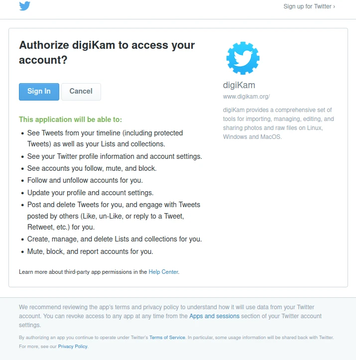
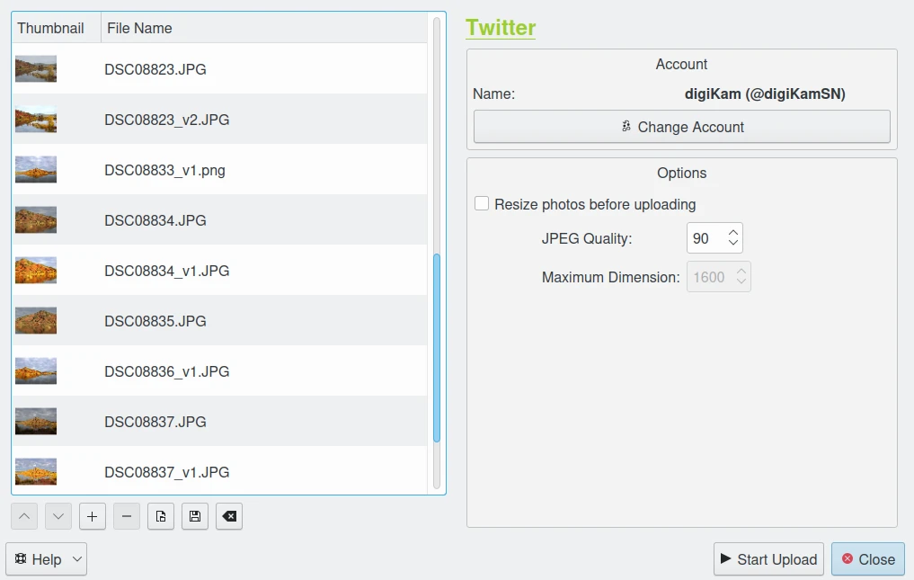
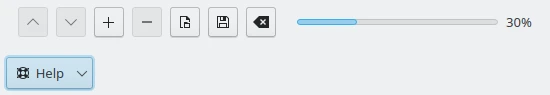

.. meta::
   :description: digiKam Export to Twitter Web-Service
   :keywords: digiKam, documentation, user manual, photo management, open source, free, learn, easy, twitter, export

.. metadata-placeholder

   :authors: - digiKam Team

   :license: see Credits and License page for details (https://docs.digikam.org/en/credits_license.html)

.. _twitter_export:

:ref:`Export To Twitter (X) <export_tools>`
===========================================

This tool allows the user to upload photos to the Twitter (now known as X) social network.

`Twitter <https://en.wikipedia.org/wiki/Twitter>`_ is an online social media and social networking service. Users can send, and respond publicly or privately to, texts, images and videos known as *tweets*. Publication is publicly visible by default, but senders can restrict message delivery to only their followers. Twitter supports a photo-sharing service that enables users to upload a photo and attach it to a tweet.

The tool can be used to upload and tweet a selection of images from your collections to the remote Twitter server using the Internet.

When accessing the tool for the first time from the :menuselection:`Export --> Export to Twitter` menu entry, you are taken through the process of obtaining a token which is used for authentication purposes. The following dialog will popup and a browser window will be launched so you can log in to Twitter:

    The Twitter Authorize Dialog

After successful sign-up, digiKam will be allowed to send photos to the Twitter website. You will be presented with the following page:

    The Twitter Login Dialog

Then, simply authorize the application and close the web browser. Returning to the host application dialog, you will see the interface used to upload photos to Twitter.

    The Twitter Export Tool Dialog

By default, the tool proposes to export the currently selected items from the icon-view. The **+** Photos button can be used to append more items to the list.

If the **Resize photos before uploading** option is selected, the photos will be resized before transferring to Twitter. The values will be read from the **JPEG quality** and **Maximum Dimension** settings, which can be used to adjust the maximum height and the compression. The width calculation will be done so as to maintain the aspect ratio.

    The Twitter Export Uploading in Progress

Press the **Start Upload** button to transfer items. You can click on the **Close** button to abort the uploading of photos.

Finally, you can view the uploaded photos by visiting the Twitter website.

    The Twitter Online Account Displaying the Uploaded Contents
