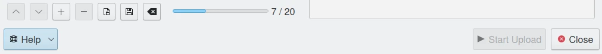

.. meta::
   :description: digiKam Export to Twitter Web-Service
   :keywords: digiKam, documentation, user manual, photo management, open source, free, learn, easy, twitter, export

.. metadata-placeholder

   :authors: - digiKam Team

   :license: see Credits and License page for details (https://docs.digikam.org/en/credits_license.html)

.. _twitter_export:

Export To Twitter
=================

.. contents::

This tool allows the user to upload photos to the Twitter social network.

`Twitter <https://en.wikipedia.org/wiki/Twitter>`_ is an online social media and social networking service. Users can send and respond publicly or privately texts, images and videos known as *tweets*. Publication are publicly visible by default, but senders can restrict message delivery to only their followers. Twitter supports photo-sharing service that enables users to upload a photo and attach it to a tweet.

The tool can be used to upload and tweet a selection of images from your collection to the remote Twitter server using the Internet.

When accessing the tool for the first time by the :menuselection:`Export --> Export to Twitter` menu entry, you are taken through the process of obtaining a token which is used for authentication purposes. The following dialog will popup and a browser window will be launched you will log in to Twitter:

.. figure:: images/export_twitter_authorize.webp
    :alt:
    :align: center

    The Twitter Authorize Dialog

After successful sign-up digiKam will be allowed to send photos to the Twitter website. You will be presented with the following page:

.. figure:: images/export_twitter_login.webp
    :alt:
    :align: center

    The Twitter Login Dialog

Then, simply authorize application and close the web browser. Return to the host application dialog, you will see the interface used to upload photos to Twitter.

.. figure:: images/export_twitter_dialog.webp
    :alt:
    :align: center

    The Twitter Export Tool Dialog

By default, the tool proposes to export the currently selected items from the icon-view. The **+** Photos button can be used to append more items on the list.

If the **Resize photos before uploading** option is selected, the photos will be resized before transferring to Twitter. The values will be read from the **JPEG quality** and **Maximum Dimension** settings, which can be used to adjust the maximum height and the compression. The width calculation will be done so as to have the aspect ratio conserved.

    The Twitter Export Uploading in Progress

Press **Start Upload** button to transfer items. You can click on the **Close** button to abort the uploading of photos.

Finally, you can view the uploaded photos by visiting the Twitter website.

.. figure:: images/export_twitter_stream.webp
    :alt:
    :align: center

    The Twitter Online Account Displaying the Uploaded Contents
