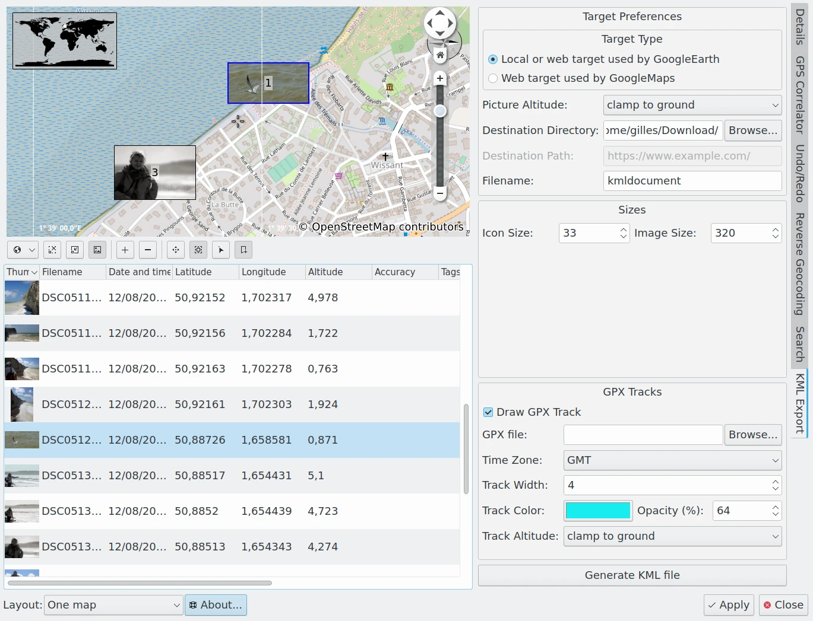
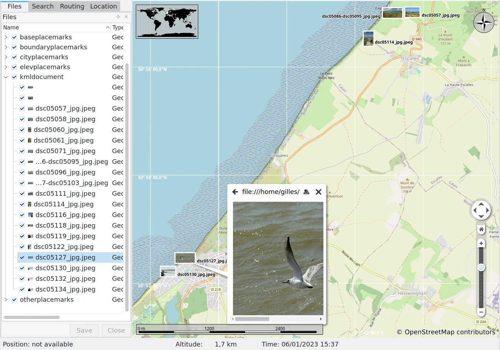

.. meta::
   :description: digiKam Geolocation Editor KML Export Tool
   :keywords: digiKam, documentation, user manual, photo management, open source, free, learn, easy, location, kml, export

.. metadata-placeholder

   :authors: - digiKam Team

   :license: see Credits and License page for details (https://docs.digikam.org/en/credits_license.html)

.. _geoeditor_kmlexport:

:ref:`KML Export Tool <geolocation_editor>`
===========================================

The **KML Export** tab allows you to export location and image data as a KML files for use in other applications. `**KML** <https://en.wikipedia.org/wiki/Keyhole_Markup_Language>`_, which stands for Keyhole Markup Language, is an XML format for storing geographic and visualization data for display on two-dimensional maps and three-dimensional Earth browsers. KML was developed for use with Google Earth but open-source applications can also use the format. KML is an open standard from the `Open Geospatial Consortium <https://en.wikipedia.org/wiki/Open_Geospatial_Consortium>`_.

    The digiKam Geolocation Editor Exporting GPS Info into a KML File

The **KML Export** tab on the right sidebar provides several settings to generate a KML file from the list of selected items in the Geolocation Editor.

    - **Target Type**: specifies which of two types of KML files should be generated: one for use with a local application such as Google Earth running on your computer, or another for use with a Web Application such as Google Maps.

    - **Picture Altitude**: specifies how to record the altitude of items. Options include **Clamp To The Ground**, **Relative To Ground**, or in **Absolute**.

    - **Destination Directory**: specifies the folder on your computer where you want to store the KML file.

    - **Destination Path**: specifies the url where you want to store the KML file. This option is enabled only if the Target Type is a Web Application.

    - **Filename**: the name of the KML file.

    - **Icon Size**: The dimensions of the image icon stored in the KML file and used by the KML viewer application to display thumbnails on the map.

    - **Image Size**: The dimensions of the image stored in the KML file and used by the KML viewer application to render images on the map.

    - **Draw GPX Track**: enable this option to include information from a GPX track in your KML container.

    - **GPX File**: the location of the GPX track file on your computer.

    - **Time Zone**: the world time zone used to record the GPX track.

    - **Track Width**: the width of the GPX track in pixels.

    - **Track Color**: the color used to render the GPX track.

    - **Opacity**: the opacity used to render the GPX track.

    - **Track Altitude**: specifies how the altitude of GPX track items should be displayed. Options include **Clamp To The Ground**, **Relative To Ground**, or in **Absolute**.

Click the **Generate KML File** button to generate the KML file. If errors occur, a dialog will be displayed with the list of problems. Once exported, the KML file can be opened in a Viewer as in the screenshot below.

    The `Open Source Marble Application <https://marble.kde.org/>`_ Importing a KML File Generated From digiKam
