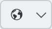
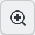
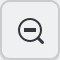
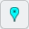
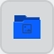
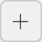
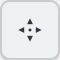
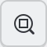
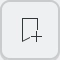

.. meta::
   :description: digiKam Geolocation Editor Map
   :keywords: digiKam, documentation, user manual, photo management, open source, free, learn, easy, gps, geolocation, map, world, group, reverse, geocoding

.. metadata-placeholder

   :authors: - digiKam Team

   :license: see Credits and License page for details (https://docs.digikam.org/en/credits_license.html)

.. _geoeditor_map:

:ref:`Geolocation Map <geolocation_editor>`
===========================================

.. |decrease_thumbnail| image:: images/geoeditor_icon_decrease_thumbnail.webp
    :height: 20px

.. contents::

The Map Utils
-------------

The Geolocation Editor can be used to add or edit GPS coordinates stored in picture metadata. The geo-data is stored in the image as Exif tags and the location can be displayed in an internal or external browser map. The Geolocation Editor also offers a :ref:`Reverse Geocoding <geoeditor_reverse>` tool.

The Geolocation Editor can be opened from :menuselection:`Item --> Edit Geolocation` or by pressing :kbd:`Ctrl+Shift+G`. It requires at least one image to be selected, otherwise it will not open.

.. figure:: images/geoeditor_edit_coordinates.webp
    :alt:
    :align: center

    The digiKam Geolocation Tool Used to Edit Item Coordinates Using OpenStreeMap

The Geolocation Editor provides the tools to localize pictures geographically in the common spherical coordinate system (used by GPS/Galileo). All of the GPS fields: **Altitude**, **Latitude**, **Longitude**, **Speed**, **Number of Satellites**, **Fix Type**, and **DOP** are editable.

The editor has two methods to encode coordinates into pictures:

    - Semi-automatic coordinate attribution to single pictures, accessible via the **Details** tab on the Right Sidebar.

    - Batch correlation of GPS tracking data with a series of images you will find in the :ref:`GPS Correlator <gps_correlator>` tab.

Furthermore, the Right Sidebar offers four more tools:

    - The **Undo/Redo** tab.

    - The **Reverse Geocoding** tab which allows you to find geographic names (cities, street names, ...) by using a public reverse geocoding service and the GPS data of an image. These names can then be used for additional photo tagging.

    - The **Search** tab which allows you to find positions on the map from geographic names (cities, monuments, ...) by using a public geoname service (GeoNames and OpenStreetMap at the time of writing).

     - The **KML Export** tab which allows you to export a set of positions and thumbnails into a standard KML file for use in other mapping programs.

The Map View
------------

Drag to move any displayed map, and use the zoom control to zoom in or out. More details on navigating on the map are provided in the :ref:`Map Search <mapsearch_view>` section of this manual.

Right under the map you find a row of buttons. From left to right we have:

    - The **Map Settings** button |map_settings| opens a small menu which allows you to choose between OpenStreeMap and Off-line Maps, and depending on that choice to choose the kind of map you want to use. Furthermore, you can select the projection (**Spherical**, **Mercator**, **Equi-Rectangular**) and you can display a few additional tools like compass and scale on the map.

    - The **Zoom In** button |zoom_in|.

    - The **Zoom Out** button |zoom_out|.

    - The **Switch Between Markers And Thumbnails** button, will display as |markers| or |thumbnails| to let you choose whether you want the positions of your images indicated by a marker symbol or by a thumbnail on the map. If you choose thumbnails, the next two buttons are of particular interest.

    .. note::

        The Markers color over the map depends of the number of items grouped at a location, and it depends on the zoom level. The meanings of the colors are listed below:

        =========== =======================
        Color       Number of Grouped Items
        =========== =======================
        Cyan        1
        Green       2
        Yellow      10
        Orange      50
        Red         100
        =========== =======================

    - The **Increase The Thumbnail Size On The Map** button |increase_thumbnail| and the **Decrease The Thumbnail Size On The Map button** |decrease_thumbnail| change the size of the thumbnails.

    - The **Pan Mode** button |pan_mode| lets you move the map by clicking and dragging. The cursor symbol will change to a hand.

    - The **Zoom Into A Group** button |zoom_into_group| is useful if you have images so close to each other on the map that all but the topmost are obscured. Once you click on the visible image, the zoom factor will be adjusted so that all the other images behind it become visible. If you click on a group of images and nothing really happens they either have exactly the same geographic position and/or the zoom factor is already at its maximum.

    .. note::

        **Group** in this context *has nothing to do* with grouped images as described in :ref:`this section <grouping_photograph>` of the manual. Here the term refers to images which are very close to each other on the map (depending on the zoom factor) or have exactly the same geographic position.

    - The **Select Images** button |select_images| toggles the selection of an image, or a group of images, in the list of images right below the buttons once you click on it on the map. The selection status of all other images in the list remain unchanged. Be aware of the fact that there is a kind of two-stage selection! If you click on a thumbnail or marker on the map, the selected image(s) in the list of images will be displayed with a light blue background. If you click on it in the list, the background will become a darker blue and if there were more than one image with a light blue background before, the other images will be de-selected. Only clicking on an image in the list will let its preview appear to the right of the list.

    - The **Display Bookmarked Positions On The Map** button |display_bookmarks| can be used to display places on the map that are already registered in the :ref:`Bookmarks Manager <geoeditor_bookmarks>`.

The map's context menu, selected by right clicking on the map, contains other items of interest:
    - **Copy Coordinates** copies the geographic coordinates at the cursor position to the clipboard, e.g. 4° 29' 11.1"W,48° 22' 48.5"N
    - **Copy geo: URL** copies the geographic coordinates at the cursor position to the clipboard in decimal degrees, e.g. geo:48.3800450672,-4.4865371254
    - **Address Details** performs a reverse location lookup to display the address of the selected location in a dialog.
    - **Info Boxes** allows you to select which widgets to display on the map, including compass, scale bar, navigation widget, overview map, and a progress indicator.
    - **Add Measure Point** add a measure point at the clicked location. Add a second point to measure distance between the two points. Add a third point to measure total distance and angles between the points.
    - **Remove Last Measure Point** remove the last measure point to be added.
    - **Remove Measure Points** removes all measure points.

Additional information on the map view is available from the `Marble handbook <https://docs.kde.org/trunk5/en/marble/marble/index.html>`_.

Note that you can change the layout from one map to two maps, beside or above each other via the little drop-down menu at the bottom of the Geolocation Editor.

.. _geoeditor_bookmarks:

The Bookmarks Manager
---------------------

The digiKam geolocation **Bookmarks Manager** is a tool to register a nested list of favorite places which can be reused later to geolocalize items taken at the same positions.

The digiKam Bookmarks Manager is available from the items list context menu as you can see in the screenshot below.

.. figure:: images/geoeditor_bookmark_menu.webp
    :alt:
    :align: center

    The digiKam Geolocation Bookmarks Manager Available from the Items List Context Menu

From this menu you can:

    - **Add Bookmark**: if the current selected item from the list has GPS information, this location can be bookmarked with this option. A dialog to populate the bookmark properties then appears.

    .. figure:: images/geoeditor_bookmark_add.webp
        :alt:
        :align: center

        The digiKam Geolocation Bookmarks Manager Dialog To Register A New Entry

    You can customize the name, add a comment to describe the location, and specify the place in the bookmark hierarchy.

    - **Edit Bookmarks**: displays a dialog with the complete hierarchy of managed bookmarks. You can change item properties, the place in the hierarchy using drag and drop, and display the corresponding location on a map from the right side. In the Hierarchy you can append new branches using the **Add Folder** button. The **Remove** button allows you to delete an item in the hierarchy.

    .. figure:: images/geoeditor_bookmark_edit.webp
        :alt:
        :align: center

        The digiKam Geolocation Bookmarks Editor Dialog

    - Quickly access the bookmarks hierarchy to assign a location to the current selected item.

