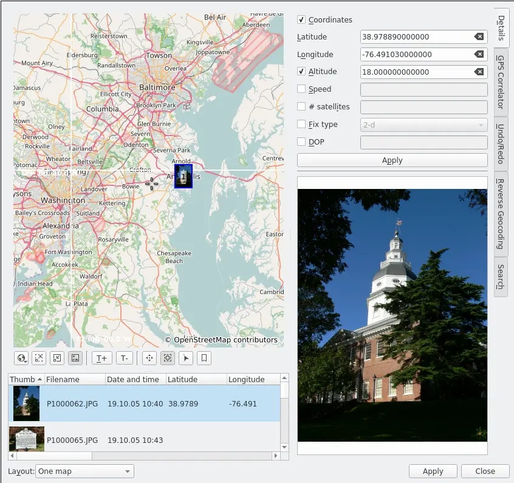

.. meta::
   :description: digiKam Geolocation Editor Map
   :keywords: digiKam, documentation, user manual, photo management, open source, free, learn, easy

.. metadata-placeholder

   :authors: - digiKam Team (see Credits and License for details)

   :license: Creative Commons License SA 4.0

.. _geoeditor_map:

Geolocation Map
===============

.. contents::

The Map Utils
-------------

The Geolocation Editor allows for adding and editing GPS coordinates of picture metadata. The geo-data is stored into the image (EXIF tags) and the location can be displayed in an internal or external browser map. The Geolocation Editor also offers a Reverse Geocoding tool.

Geolocation Editor can be opened via menu entry Item → Edit Geolocation or via pressing Ctrl+Shift+G. It requires at least one image to be selected otherwise it will not open.

The Geolocation Editor provides the tools to localize pictures geographically in the common spherical coordinate system (used by GPS/Galileo). Altitude, latitude and longitude, speed, number of satellites, fix type and DOP are editable.

The editor has two methods to mark the pictures with coordinates:

    Semi-automatic coordinate attribution to single pictures, accessible via the Details tab on the Right Sidebar.

    Batch correlation of GPS tracking data with a series of images you will find in the GPS Correlator tab. 

Furthermore the Right Sidebar offers three more tools:

    The Undo/Redo tab.

    The Reverse Geocoding tab which allows to find geographic names (cities, street names, ...) by using a public reverse geocoding service and the GPS data of an image.

    The Search tab which allows to find positions on the map from geographic names (cities, monuments, ...) by using a public geoname service (GeoNames and OpenStreetMap at the time of writing). 

The Map View
------------

For navigating on the map refer to Marble handbook, Chapter 2. Also for the sky context menu see Marble documentation.

Right under the map you find a row of buttons. I shall use the tooltip texts as designations in the following description. From left to right we have

    The Map-settings button opens a small menu which allows you to choose between Google Maps and Marble and depending on that choice to choose the kind of map you want to use. Furthermore you can select the projection for Marble (spherical, Mercator, equirectangular) and you can display a few additional tools like compass and scale on the map.

    The Zoom-in button.

    The Zoom-out button.

    The Switch-between-markers-and-thumbnails button lets you choose whether you want the positions of your images indicated by a marker symbol or by a thumbnail on the map. If you choose thumbnails the next two buttons are of particular interest.

    The Increase-the-thumbnail-size-on-the-map button is doing just that and ...

    ... the Decrease-the-thumbnail-size-on-the-map button as well.

    The Pan-mode button lets you move the map by click with the left mouse button and holding on it and then drag it with the mouse to where you need it. The cursor symbol will change to a hand.

    The Zoom-into-a-group button is useful if you have images so close to each other on the map that all but the topmost are obscured. Once you click on the visible image the zoom factor will be adjusted so that all the other images behind it become visible. If you click on a group of images and nothing really happens they either have exactly the same geographic position and/or the zoom factor is already at its maximum.

    Note that “group” in this context here has nothing to do with grouped images as described in chapter 2 of the digiKam Handbook. Here the term refers to images which are very close to each other on the map (depending on the zoom factor) or have exactly the same geographic position.

    The Select-images button toggles the selection of an image or a group of images in the list of images right below the buttons once you click on it on the map. The selection status of all other images in the list remain unchanged. Be aware of the fact that there is a kind of two-stage selection! If you click on a thumbnail or marker on the map the selected image(s) in the list of images will become a light blue background. If you click on it in the list the background will become a darker blue and if there where more than one image with light blue background before the others will become un-selected. Only clicking on an image in the list will let its preview appear to the right of the list.

    The Display-bookmarked-positions-on-the-map button is not working at the time of writing because the whole bookmark issue needs to be reorganized. This also affects the Bookmarks → Edit Bookmarks... item in the context menu on the list of images below the map and the Add Bookmark item in the context menu on the map. 

.. warning::

    The use of Add Bookmark in the context menu on the map can lead to loss of your bookmarks in Marble!

From the context menu on the map only Copy Coordinates is of interest for geotagging. It copies the geographic coordinates at the cursor position to the clipboard. For all other menu items see Marble handbook.

Note that you can change the layout from one map to two maps, beside or above each other via the little drop-down menu at the bottom of the Geolocation Editor.
