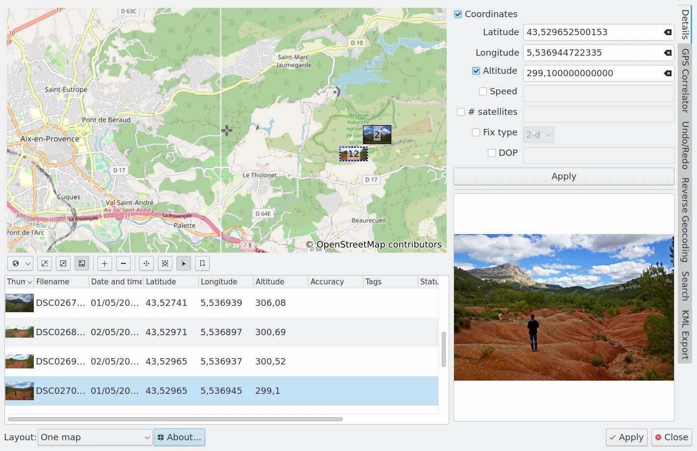
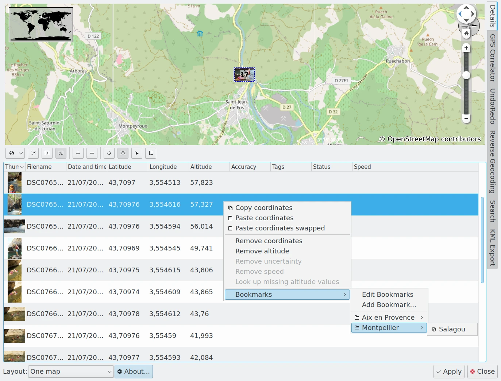

.. meta::
   :description: digiKam Geolocation Editor Map
   :keywords: digiKam, documentation, user manual, photo management, open source, free, learn, easy, gps, geolocation, map, world, group, reverse, geocoding

.. metadata-placeholder

   :authors: - digiKam Team

   :license: see Credits and License page for details (https://docs.digikam.org/en/credits_license.html)

.. _geoeditor_map:

Geolocation Map
===============

.. contents::

The Map Utils
-------------

The Geolocation Editor allows for adding and editing GPS coordinates of picture metadata. The geo-data is stored into the image (Exif tags) and the location can be displayed in an internal or external browser map. The Geolocation Editor also offers a :ref:`Reverse Geocoding <geoeditor_reverse>` tool.

Geolocation Editor can be opened via menu entry :menuselection:`Item --> Edit Geolocation` or via pressing :kbd:`Ctrl+Shift+G`. It requires at least one image to be selected otherwise it will not open.

    The digiKam Geolocation Tool Used to Edit Item Coordinates Using OpenStreeMap

The Geolocation Editor provides the tools to localize pictures geographically in the common spherical coordinate system (used by GPS/Galileo). **Altitude**, **Latitude**, **Longitude**, **Speed**, **Number of Satellites**, **Fix Type**, and **DOP** are editable.

The editor has two methods to mark the pictures with coordinates:

    - Semi-automatic coordinate attribution to single pictures, accessible via the **Details** tab on the Right Sidebar.

    - Batch correlation of GPS tracking data with a series of images you will find in the :ref:`GPS Correlator <gps_correlator>` tab.

Furthermore the Right Sidebar offers three more tools:

    - The **Undo/Redo** tab.

    - The **Reverse Geocoding** tab which allows to find geographic names (cities, street names, ...) by using a public reverse geocoding service and the GPS data of an image.

    - The **Search** tab which allows to find positions on the map from geographic names (cities, monuments, ...) by using a public geoname service (GeoNames and OpenStreetMap at the time of writing).

The Map View
------------

For navigating on the map, refer to the :ref:`Map Search section <mapsearch_view>`.

Right under the map you find a row of buttons. I shall use the tooltip texts as designations in the following description. From left to right we have:

    - The Map-settings button opens a small menu which allows you to choose between OpenStreeMap and Off-line Maps, and depending on that choice to choose the kind of map you want to use. Furthermore you can select the projection (**Spherical**, **Mercator**, **Equi-Rectangular**) and you can display a few additional tools like compass and scale on the map.

    - The **Zoom In** button.

    - The **Zoom Out** button.

    - The **Switch Between Markers And Thumbnails** button lets you choose whether you want the positions of your images indicated by a marker symbol or by a thumbnail on the map. If you choose thumbnails the next two buttons are of particular interest.

    .. note::

        The Markers color over the map depends of the number of items grouped at a location, and it depends of the zoom level. Colors available are listed below:

        =========== =======================
        Color       Number of Grouped Items
        =========== =======================
        Cyan        1
        Green       2
        Yellow      10
        Orange      50
        Red         100
        =========== =======================

    - The **Increase The Thumbnail Size On The Map** button is doing just that and the **Decrease The Thumbnail Size On The Map button** as well.

    - The **Pan Mode** button lets you move the map by click with the left mouse button and holding on it and then drag it with the mouse to where you need it. The cursor symbol will change to a hand.

    - The **Zoom Into A Group** button is useful if you have images so close to each other on the map that all but the topmost are obscured. Once you click on the visible image the zoom factor will be adjusted so that all the other images behind it become visible. If you click on a group of images and nothing really happens they either have exactly the same geographic position and/or the zoom factor is already at its maximum.

    .. note::

        **Group** in this context here *has nothing to do* with grouped images as described in :ref:`this chapter from the manual <grouping_photograph>`. Here the term refers to images which are very close to each other on the map (depending on the zoom factor) or have exactly the same geographic position.

    - The **Select Images** button toggles the selection of an image or a group of images in the list of images right below the buttons once you click on it on the map. The selection status of all other images in the list remain unchanged. Be aware of the fact that there is a kind of two-stage selection! If you click on a thumbnail or marker on the map the selected image(s) in the list of images will become a light blue background. If you click on it in the list the background will become a darker blue and if there where more than one image with light blue background before the others will become un-selected. Only clicking on an image in the list will let its preview appear to the right of the list.

    - The **Display Bookmarked Positions On The Map** button can be used to display on the map the places already registered in the :ref:`Bookmarks Manager <geoeditor_bookmarks>`.

From the context menu on the map only Copy Coordinates is of interest for geotagging. It copies the geographic coordinates at the cursor position to the clipboard. For all other menu items see Marble handbook.

Note that you can change the layout from one map to two maps, beside or above each other via the little drop-down menu at the bottom of the Geolocation Editor.

.. _geoeditor_bookmarks:

The Bookmarks Manager
---------------------

The digiKam geolocation **Bookmarks Manager** is a tool to register a nested list of favorite places which can be re-used later to geolocalize items taken at the same positions.

The digiKam Bookmarks Manager is available from the items list context menu as you can see to the screenshot below.

    The digiKam Geolocation Bookmarks Manager Available From The Items List Context Menu

From this menu you can:

    - **Add Bookmark**: if the current selected item from list has GPS information, these ones can be registered to the manager with this option. A dialog to populate the bookmark properties must appears.

    .. figure:: images/geoeditor_bookmark_add.webp
        :alt:
        :align: center

        The digiKam Geolocation Bookmarks Manager Dialog To Register A New Entry

    You can customize the name, a comment to describe the location, and the place in the bookmarks hierarchy

    - **Edit Bookmarks**: this will show you a dialog with the complete hierarchy of bookmarks managed. You can change item properties, the place in hierarchy using drag and drop, and display the corresponding location on a map from the right side. In the Hierarchy you can append new branches using **Add Folder** button. The **Remove** button allows you to delete an item in the hierarchy.

    .. figure:: images/geoeditor_bookmark_edit.webp
        :alt:
        :align: center

        The digiKam Geolocation Bookmarks Editor Dialog

    - Access quickly to the bookmarks hierarchy to assign a location to the current selected item.

.. important::

    The **Map View** provide also a **Add Bookmark** option in the context menu available over the map. This feature do not come from digiKam and works independently of the digiKam **Bookmarks Manager** feature.
