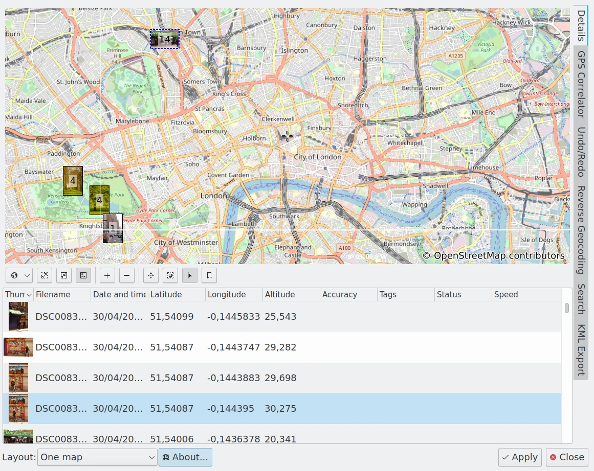

.. meta::
   :description: Overview to digiKam Geolocation Editor
   :keywords: digiKam, documentation, user manual, photo management, open source, free, learn, easy, gps, geolocation, editor, coordinates

.. metadata-placeholder

   :authors: - digiKam Team

   :license: see Credits and License page for details (https://docs.digikam.org/en/credits_license.html)

.. _geoeditor_overview:

Overview
========

.. contents::

Geolocation means assigning, editing and using metadata which describe the geographic place where images or videos were taken. The source of these metadata can be your camera, a separate GPS receiver or other means of geographical information, in particular maps.

Not only for professional photographers can it be interesting to link an image to a precise geographical location. Not everybody uses an airplane to overfly and scan a certain area with automatic GPS data recording. Environmental planners, military, police, construction bureaus, real estate agencies, all will have an immediate application.

But if, after some time, one has forgotten where the image was taken, if one loves the nice feature to open with a simple click a browser displaying a zoom of the area, if you like to send your image as a postcard to another digiKam user (who is then able to locate your shot), or if you simply need the documentation aspect of it - having position data stored in a photo is great.

GPS (global positioning system) is used as a generic term throughout this document. It just means a location in the common spherical coordinate system that can be displayed on a map. The actual technical implementation that provides the data can be the American GPS, the Russian GLONAS, the European GALILEO or any other system.

There are four tools regarding geolocation in digiKam and two in Showfoto:

    The Map mode of the Image Area which displays images with GPS data on a map depending on the selection on the Left Sidebar, e.g. the images in the album you selected in the Album View, the images with a certain tag assigned (selected in the Tag View), with a certain label and so on. This is only available in digiKam.

    The Map View on the Left Sidebar of digiKam which is the search tool for finding images by their GPS data. This is also only available in digiKam.

    The Geolocation Editor we describe a little bit further below and which is accessible via :menuselection:`Item --> Edit Geolocation...` :kbd:`(Ctrl+Shift+G)` (:menuselection:`File --> Edit Geolocation...` in Showfoto).

    The Map tab on the Right Sidebar which shows the location of the image on a map and is purely informative.

    The digiKam Geolocation Editor Main Dialog

.. note::

    These tools work for image formats that have EXIF or XMP metadata supports or with items using sidecar file.
