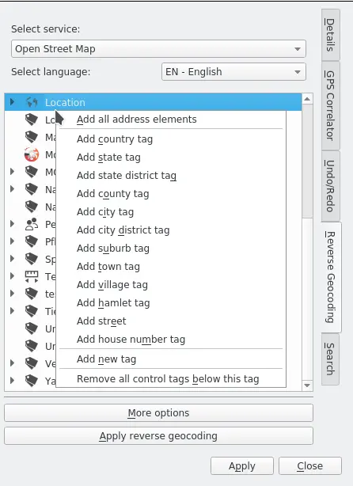
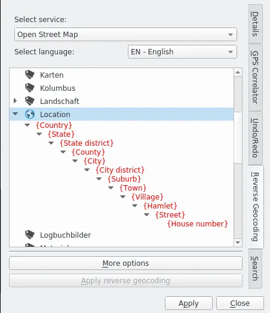
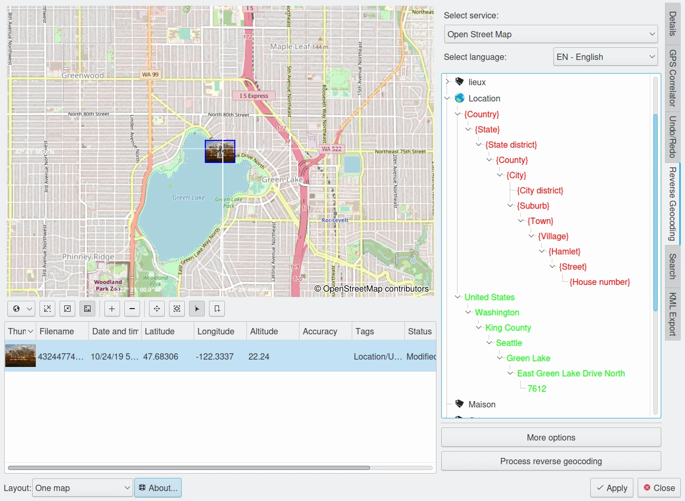

.. meta::
   :description: digiKam Geolocation Editor Reverse Geocoding
   :keywords: digiKam, documentation, user manual, photo management, open source, free, learn, easy

.. metadata-placeholder

   :authors: - Gilles Caulier <caulier dot gilles at gmail dot com>

   :license: Creative Commons License SA 4.0

.. _geoeditor_reverse:

Reverse Geocoding
=================

.. contents::

In this tab you can use a public geoname service to look up address details of the geographic position of one or more images and convert them into tags. In order to do that you need a few preparations. You should be already familiar with the idea of tags and how to create, edit and use them. The best entry into this issue you find in the Tags View section of Chapter 2 of the digiKam handbook.

First you should create a root tag in the Tag Manager or in the tag tree of the Left or Right Sidebar. You might name it Location or Places or ...

Then you select the image(s) you want to tag (they need to have GPS data assigned), open the Geolocation Editor and click the Reverse Geocoding tab. You will see your tag tree and if you click with the right mouse button over a tag, preferable the one you created for the geo tags, you will see this context menu:

In the main section the tags you can add are sorted from the largest region (country) down to the smallest (house number). If you choose Add all address elements and then fold out the Location tag and all the sub-tags you will have this:

These red tags in curly brackets are called control tags. They determine which address elements you want the reverse geolocation service you have chosen at the top under Select service to look for. You can still delete some of them with the help of the context menu if you feel that you don't need them or modify the structure by deleting some control tags and add them in other places of the tree or even build a new tree parallel to the first by adding a control tag to the root tag (here: Location). Arranging the control tags on the same level instead of a tree structure can save a lot of redundant tags since the same city or town name exists in more than one state or country let alone street names. But it can make the whole location branch of your tag tree quite long and therefore incalculable. This is to say that you have to find your own solution to this problem depending on your needs, maybe a mix, and the sooner you find it the less work you have to invest in editing your tag tree and the control tags.

Let us assume you use the control tags as shown in the above screenshot, select the images you want to tag from the list of images to the left and click Apply reverse geocoding. Then the tag tree might look similar to this:

The green tags represent the search result of the selected public reverse geocoding service and are already assigned to the image(s). To save these tags to the image file and the digiKam database click Apply. The tags will appear as regular tags in your tag tree which you can see already here or in the tag tree of the Left or Right Sidebar. Of course you can still edit them like any other tag in the Tag Manager or in the Left or Right Sidebar, but not here in the Geolocation Editor.
