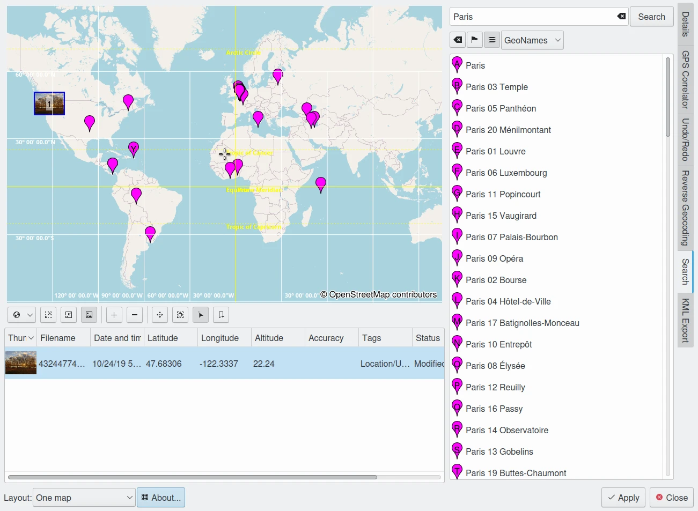

.. meta::
   :description: digiKam Geolocation Editor Search Tool
   :keywords: digiKam, documentation, user manual, photo management, open source, free, learn, easy, location, search, geoname

.. metadata-placeholder

   :authors: - digiKam Team

   :license: see Credits and License page for details (https://docs.digikam.org/en/credits_license.html)

.. _geoeditor_search:

:ref:`Search Tool <geolocation_editor>`
=======================================

The **Search** tab allows you to look up places by their geographic names using public geoname services **GeoNames** and **OpenStreetMap**. You just type in a name of a place (city, monument, hotel, ...) into the input field at the top and click on the **Search** button. The results of one such search are shown below:

    The digiKam Geolocation Editor Searching for a Place Named *Paris* Over The World

Obviously *Paris* does not only exist in France. So if you were looking for the capital of France you can either scroll down the list until you find an entry that undoubtedly belongs there, like *Arc de Triomphe*, and click on it. Or you can refine your search to make it a bit more precise, like *Paris, Arc de Triomphe* or *Paris, France*. Once you click on an entry in the list, the map will shift to center on that place and you can now zoom in with the zoom-in button (second from the left below the map). Using this example with GeoNames you will notice that you still get a lot of results and even two labeled only *Arc de Triomphe*, the second one a street a few hundred meters away from the arch. With OpenStreetMap you get only one result. You will have to play a bit using more or less precise search terms with the different services in different regions in order to get an idea about how to best conduct your searches.

Refer to the tooltips, for descriptions of the buttons right above the result list. The context menu on search result entries includes:

    - **Copy Coordinates** which you can paste later to one or more images in the image list under the map

    - **Move Selected Images To This Position** which is basically the same but more straightforward provided you have the images already loaded into the geolocation editor

    - **Remove From Results List** which is particular useful in conjunction with the Keep-the-results-of-old-searches-... button above the results list.
