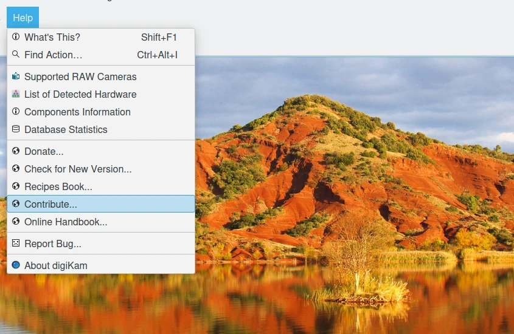

.. meta::
   :description: Contribute to digiKam project
   :keywords: digiKam, documentation, user manual, photo management, open source, free, help, learn, contribute, translate, write contents

.. metadata-placeholder

   :authors: - digiKam Team

   :license: see Credits and License page for details (https://docs.digikam.org/en/credits_license.html)

.. _get_involved:

Get Involved
============

.. contents::

Maintaining this Manual
-----------------------

digiKam is a powerful tool with a lot of features but all the different menu entries, buttons and shortcuts can be sometimes confusing. The User Manual is important for beginners as well as advanced users searching for a specific feature. However maintaining the manual is a big task the digiKam core team can't handle alone...

And that’s were you come in. If you are an advanced user then we need you to update old sections or write explanations of new features. But even if you have the feeling you are not experienced enough to write something, you can still update screenshots or translate in different languages. If you benefit from the work others did on digiKam it is a great (and easy) opportunity to give something back to the project and the community.

The `README file <https://invent.kde.org/documentation/digikam-doc/-/blob/master/README.md>`_ from the documentation repository lists all details to help with this manual.

Reporting Bug
-------------

digiKam is an Open Source project. This means that it relies on its users to play their part by, at least, reporting problems and suggesting possible improvements.

digiKam makes it as easy as possible for you to report bugs or suggest improvements. Wherever you are in the application the main menu will include the :menuselection:`Help --> Report Bug` option. This will display a message box with a highlighted link. Click on the link and your web browser will open the page for the reporting system. All the information required will already be filled in, just follow the instructions for completing your report.

.. figure:: images/index_get_involved_report_bug.webp
    :alt:
    :align: center

    The digiKam Reporting Bug Dialog

Contribute
----------

There are many ways that you can get involved with the continued development of digiKam. You do not need to be a software developer. You can help with documentation, translation and user interface design, or just contribute really good ideas to the wish-list. You can also get involved by testing early development code as it is being developed and providing feedback to the developers. Of course, if you are a software developer then you can help to make digiKam the best digital photograph application there is.

The `Contribute page <https://www.digikam.org/contribute/>`_ from project web-site group all necessary information to be involved on the project.

