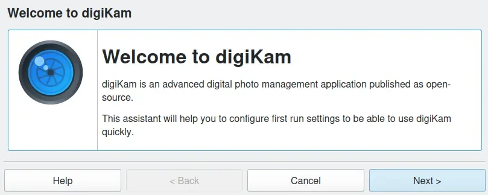

.. meta::
   :description: Do Your First Steps in digiKam Photo Management Program
   :keywords: digiKam, documentation, user manual, photo management, open source, free, help, learn

.. metadata-placeholder

   :authors: - digiKam Team

   :license: see Credits and License page for details (https://docs.digikam.org/en/credits_license.html)

.. _getting_started:

###############
Getting Started
###############

This section give an overview to start with digiKam.

.. toctree::
   :maxdepth: 2
   :caption: Contents:
   :glob:

   getting_started/introduction.rst
   getting_started/installation.rst
   getting_started/quick_start.rst
   getting_started/database_intro.rst
