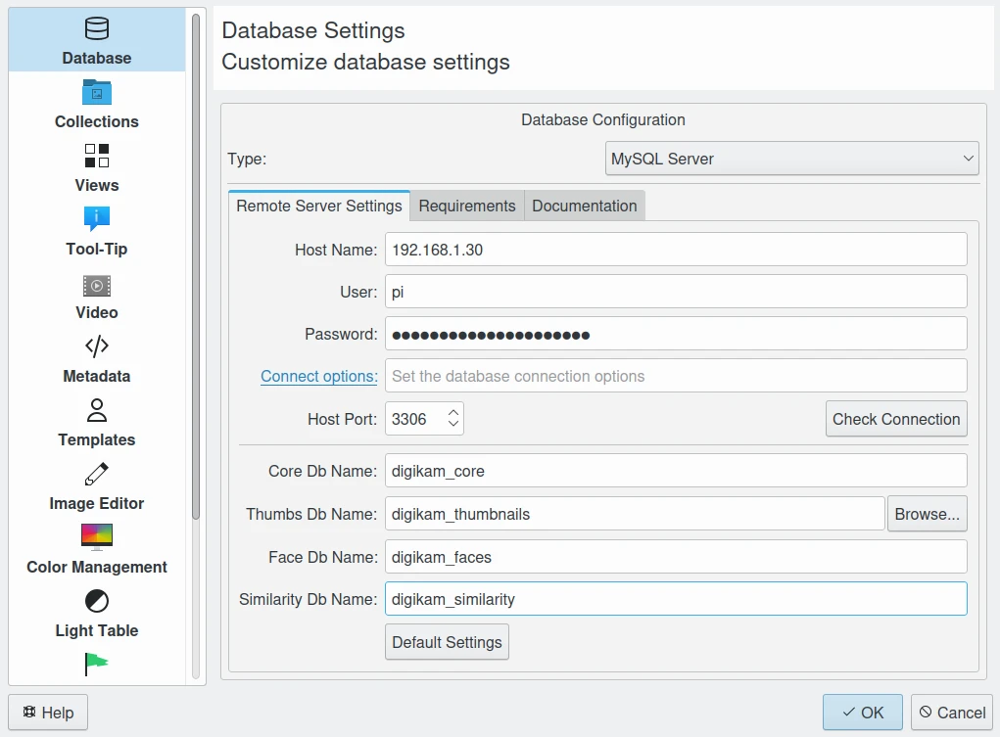

.. meta::
   :description: How to quickly start digiKam photo management program
   :keywords: digiKam, documentation, user manual, photo management, open source, free, learn, easy, database, intro

.. metadata-placeholder

   :authors: - digiKam Team

   :license: see Credits and License page for details (https://docs.digikam.org/en/credits_license.html)

.. _database_intro:

Database
========

Overview
--------

Everyone knows about a database; it is used to store data. As all other photographs management programs, digiKam too uses the database for some obvious reasons like avoiding data duplication, reducing data redundancy, a quick search engine, and greater data integrity. Moreover, the cost of data entry, storage and retrieval are drastically reduced. Additionally, any user can access the data using query language.

Talking in particular about digiKam, the Albums, Album Roots, Tags, Thumbnails, Face Recognition Data, Image Metadata, File Paths, Settings etc. are all stored in different database files.

The digiKam actually manages more than one database. For convenience, it is broadly categorized in three:

    - Core database for all collection properties, i.e. it hosts all albums, images and searches data.

    - Thumbnails database for compressed thumbnails i.e. to host image thumbs using wavelets compression images (**PGF** format).

    - Similarity database to store image finger-prints for fuzzy search engine.

    - Face database for storing face recognition metadata i.e. to host face histograms for faces recognition. 

    Example of digiKam Remote MySQL Configuration Hosted on a NAS From The Local Network

The whole details of database settings are mostly given in the :ref:`Database Setup section <database_settings>`.

Migrating From Other Software
-----------------------------

To populate the digiKam database from file properties managed by another software, it's recommend to write all metadata in XMP sidecar files for the best interoperability. digiKam cannot parse the proprietary and closed source database. XMP sidecar is standardized and well documented.

In digiKam, check well the :ref:`Metadata Setup section <metadata_settings>` to use XMP sidecar. The Advanced panel offers a profiles management to handle special cases while importing and exporting metadata with 3rd-party software.

Typically, from a fresh installation of digiKam, you can create a new root collection based on your path where images managed by your extra software. The contents will be parsed and the database will be populated with the information found in the XMP sidecar.

When scan of items is done (this can take a while), you must to see all tags, labels, comments in digiKam items properties.

.. note:

    It's recommend to make test first, on small collection, and to process step by step by adjusting the settings if necessary.
