.. meta::
   :description: How to Install the digiKam Photo Management Program
   :keywords: digiKam, documentation, user manual, photo management, open source, free, learn, easy, install, linux, windows, macos, requirements, configurations, update

.. metadata-placeholder

   :authors: - digiKam Team

   :license: see Credits and License page for details (https://docs.digikam.org/en/credits_license.html)

.. _application_install:

:ref:`Installation <getting_started>`
=====================================

.. contents::

Visit `the download page <https://www.digikam.org/download/>`_ of the digiKam Web site for up to date information on installing the current version of **digiKam**.

You’ll find all previous digiKam versions in the `attic <https://download.kde.org/Attic/digikam/>`_.

.. note::

    Bundles with **-debug** in the file-name include `debug symbols <https://en.wikipedia.org/wiki/Debug_symbol>`_ that allow developers to interpret debugger traces when the application stops working. The bundles that include debug symbols are large, but they can will help developers find and fix coding errors. See the :ref:`Get Involved <get_involved>` section for details.

Minimum System Requirements
---------------------------

- **Operating System**: 64-bit Windows 10 or newer, Apple macOS 64-bit based on Intel or Apple Silicon (M1 or later), or 64-bit Linux. See details below.

- **CPU**: x86 Intel, AMD, or Arm; at least one 2 GHz core for standard photo processing, 4 cores for large photo or panorama processing, 8 cores for Artificial Intelligence usages, such as Face Workflow, Auto-Tags, Aesthetic Detection, Red Eye Removal, and Auto-Transform features.

- **GPU**: `OpenGL <https://en.wikipedia.org/wiki/OpenGL>`_ 2.0 that works correctly and is compatible. On Windows, you can also use a card with good, compatible `DirectX <https://en.wikipedia.org/wiki/DirectX>`_ 9 or 11 drivers. It's highly recommended to use a device with `OpenCL <https://en.wikipedia.org/wiki/OpenCL>`_ support (as CUDA based device like NVIDIA cards) to speed-up Artificial Intelligence engine.

- **RAM**: At least 4 GB for standard photo processing, 8 GB for large photo or panorama processing, 16 GB for Artificial Intelligence capabilities.

.. note::

    If your computer is at the lower end of the CPU and RAM requirements, you can reduce preview lag by adjusting two digiKam configuration settings. To access these settings under Linux, select :menuselection:`Settings --> Configure digiKam...` from the menu-bar. (Under MacOS you instead select :menuselection:`digiKam --> Preferences...` from the menu-bar.) The configuration options are separated into categories displayed on independent pages. To minimize preview lag, uncheck the **Use large thumbnail size for high screen resolution** option on the *Configure/Views/Icons* page, and select the **Preview shows embedded view if possible (faster)** option on the *Configure/Views/Preview* page.

- **Monitors**: Although the application can be used on a single screen, using multiple screens will improve the experience especially when reviewing items.

.. figure:: images/multi_screens_linux_station.webp
    :alt:
    :align: center

    A Double-Screen Linux Station with **Main Window** on the Left and **Light Table** on the Right

.. tip::

    If your screen provides HDPI support, check options :ref:`Use high DPI scaling from the screen factor <system_settings>` and :ref:`Application font <appearance_settings>`.

- **Storage**: NVMe and SSD are the best choice for robust and speedy hosting of the digiKam database and collection.

.. _linux_requirements:

digiKam on Linux
----------------

**digiKam** can be installed on non-KDE Desktops without any issues. The application is offered in the form of 2 binaries:

    - Qt6 as main version based on last Qt framework. The minimum Ubuntu 22.04 has no such minimal requirements.
    - Qt5 as prior version based on older Qt framework. The minimum Ubuntu 20.04 has no such minimal requirements.

`AppImage <https://en.wikipedia.org/wiki/AppImage>`_ is a bundle hosting all the necessary dependencies to run digiKam. Nothing else is installed on your system.
Turn on the **executable** property of the AppImage file and run it. That's all...

.. figure:: videos/appimage_startup.webp
    :width: 500px
    :alt:
    :align: center

    Screencast of AppImage Startup

.. _windows_requirements:

.. tip::

    The AppImage bundle also includes the :ref:`Showfoto Stand-Alone Image Editor <showfoto_editor>`. To run it, instead of digiKam, just add **showfoto** as an argument to the AppImage command line, like this:

    .. code-block:: bash

        ./digiKam-X.Y.Z-Qt6-x86-64.appimage showfoto

.. note::

    The AppImage bundle provides more startup options which can be listed with the **help** argument from the command line.

digiKam on Windows
-------------------

Using on a Standard Desktop
~~~~~~~~~~~~~~~~~~~~~~~~~~~

**digiKam** runs only on 64-bit versions of Windows 10 and newer. We cannot guarantee that digiKam runs on server or embedded versions of Windows.

The application is offered in the form of 2 installers:

    - Qt6 as main version based on last Qt framework.
    - Qt5 as prior version based on older Qt framework.

digiKam is available as a non-signed **installable** (Setup Program) version and as a **standalone** (Archive) version.

    - **Installable** version: **Needs** administrator rights and gets installed on your local machine. It's also listed as a program.

        - It's available for all users on your computer.

        - The digiKam files are always located in the same folder.

        When the file is downloaded, and the installer is started, a security warning will appear because the installer does not come from the Windows Store.

        .. figure:: images/windows_setup_protection.webp
            :width: 400px
            :alt:
            :align: center

            The Windows Warning When you Try to Run digiKam Installer after Downloading

        You need to set the **Windows Config Panel/Applications and Features** to allow applications to be installed from sources outside the Microsoft store.

        .. figure:: images/windows_setup_security.webp
            :width: 400px
            :alt:
            :align: center

            The Windows Applications and Features Panel to Authorize digiKam Installation

        Because the installer is not signed, Microsoft Windows Defender will display an information dialog when the installer is started a second time.

        .. figure:: images/windows_setup_information.webp
            :width: 400px
            :alt:
            :align: center

            The Windows Information When you Run digiKam Installer

        Once the installer is running, follow the instructions from the assistant to install digiKam on your computer.

        .. note::

            If a previous version of digiKam is present on your system, the Windows installer will warn you to uninstall the previous version before proceeding with the new installation.

        .. figure:: images/windows_setup_prepare.webp
            :width: 300px
            :alt:
            :align: center

            The Windows Warning When you Try to Install digiKam When a Previous Version is Present

        .. figure:: images/windows_setup_uninstall.webp
            :width: 300px
            :alt:
            :align: center

            The Windows Dialog to Uninstall Previous Version of digiKam

        .. figure:: images/windows_setup_installer.webp
            :width: 300px
            :alt:
            :align: center

            The Windows Dialog to Install Newer Version of digiKam

    - **Standalone** version: **Doesn't** need administrator rights and isn't installed or listed as a program, but is only accessible by the user who has downloaded the file.

        - Allows a normal user to use digiKam without a full installation.

        - You can also copy the digiKam folder onto any external drive and run it on a different computer without installing it. However, your personal settings and downloads within digiKam are limited to the computer you work on.

Using in a Windows Domain
~~~~~~~~~~~~~~~~~~~~~~~~~

If you want to use digiKam with domain users based on Windows Active Directory and/or Group Policies (`GPOs <https://learn.microsoft.com/en-us/previous-versions/windows/desktop/policy/group-policy-objects>`_) make sure all users have read/write access to the following folders:

.. epigraph::

   %AppData%\\digikam

   %LocalAppData%\\digikam

   %LocalAppData%\\digikamrc

   %LocalAppData%\\digikam_systemrc

   %LocalAppData%\\kxmlgui5\\digikam\\digikamui.rc

Similar requirements also exist for the :ref:`Showfoto stand Alone Image Editor <showfoto_editor>`:

.. epigraph::

   %AppData%\\showfoto

   %LocalAppData%\\showfoto

   %LocalAppData%\\showfotorc

   %LocalAppData%\\showfoto_systemrc

   %LocalAppData%\\kxmlgui5\\digikam\\showfotoui.rc

Also make sure no GPO is blocking the access to these folders.

.. _macos_requirements:

digiKam on macOS
-----------------

The non-Signed Package
~~~~~~~~~~~~~~~~~~~~~~

**digiKam** runs with on Apple-silicon based Macs (Qt6) and also on legacy Intel-based Macs 64-bit (Qt5). Minimum system requirements depend on the version of digiKam being installed:

    =============== =========== ============================================================================================================
    digiKam version Qt version  Supported macOS Release
    =============== =========== ============================================================================================================
    >= 8.5.0        Qt6 and Qt5 macOS 11.3  Silicon and Intel (`BigSur <https://en.wikipedia.org/wiki/MacOS_Big_Sur>`_) or newer
    >= 7.10.0       Qt5 only    macOS 10.15 Intel             (`Catalina <https://en.wikipedia.org/wiki/MacOS_Catalina>`_) or newer
    >= 7.0.0        Qt5 only    macOS 10.13 Intel             (`High Sierra <https://en.wikipedia.org/wiki/MacOS_High_Sierra>`_) or newer
    >= 6.4.0        Qt5 only    macOS 10.12 Intel             (`Sierra <https://en.wikipedia.org/wiki/MacOS_Sierra>`_) or newer
    >= 6.1.0        Qt5 only    macOS 10.11 Intel             (`El Capitan <https://en.wikipedia.org/wiki/OS_X_El_Capitan>`_) or newer
    >= 6.0.0        Qt5 only    macOS 10.8  Intel             (`Mountain Lion <https://en.wikipedia.org/wiki/OS_X_Mountain_Lion>`_) or newer
    =============== =========== ============================================================================================================

.. note::

    `Macports <https://www.macports.org/>`_ , which was used to build the digiKam PKG, has a rolling release policy making it difficult to provide binary compatibility with older versions of macOS. Macports packages are frequently updated for security reasons, and this can require a more recent macOS SDK.

    Since macOS Ventura, the System Preference control panel has changed and share the same interface between all Apple devices. As digiKam can be installed with prior version than Ventura, screenshots for both are provided.

GateKeeper Rules
~~~~~~~~~~~~~~~~

When the **PKG** file is downloaded, and the installer is started, Apple Gatekeeper will display a security warning because the package is not signed.

+-------------------------------------------------------+--------------------------------------------------------+
|    .. figure:: images/macos_legacy_pkg_warning.webp   |    .. figure:: images/macos_ventura_pkg_warning.webp   |
|       :width: 250px                                   |       :width: 250px                                    |
|       :alt:                                           |       :alt:                                            |
|       :align: center                                  |       :align: center                                   |
+-------------------------------------------------------+--------------------------------------------------------+
|       The prior and later Ventura macOS Warning When you Try to Run the digiKam Installer after Downloading    |
+-------------------------------------------------------+--------------------------------------------------------+

You need to allow the installer to run by clicking on **Open Anyway** in the macOS **System Settings/Security and Privacy** dialog (scroll down to see the **Security** section).

+-------------------------------------------------------+--------------------------------------------------------+
|    .. figure:: images/macos_legacy_pkg_security.webp  |    .. figure:: images/macos_ventura_pkg_security.webp  |
|       :width: 250px                                   |       :width: 250px                                    |
|       :alt:                                           |       :alt:                                            |
|       :align: center                                  |       :align: center                                   |
+-------------------------------------------------------+--------------------------------------------------------+
|       The prior and later Ventura macOS Security Panel to Authorize digiKam PKG Installation                   |
+-------------------------------------------------------+--------------------------------------------------------+

Under macOS Ventura and later, the system will double-ask you to confirm to run the application with the dialog below.

.. figure:: images/macos_pkg_ventura_2nd_warning.webp
    :width: 400px
    :alt:
    :align: center

    The digiKam macOS Ventura and Later 2nd confirmation to run the Application

Once the installer is running, follow the instructions from the assistant to install digiKam onto your computer.

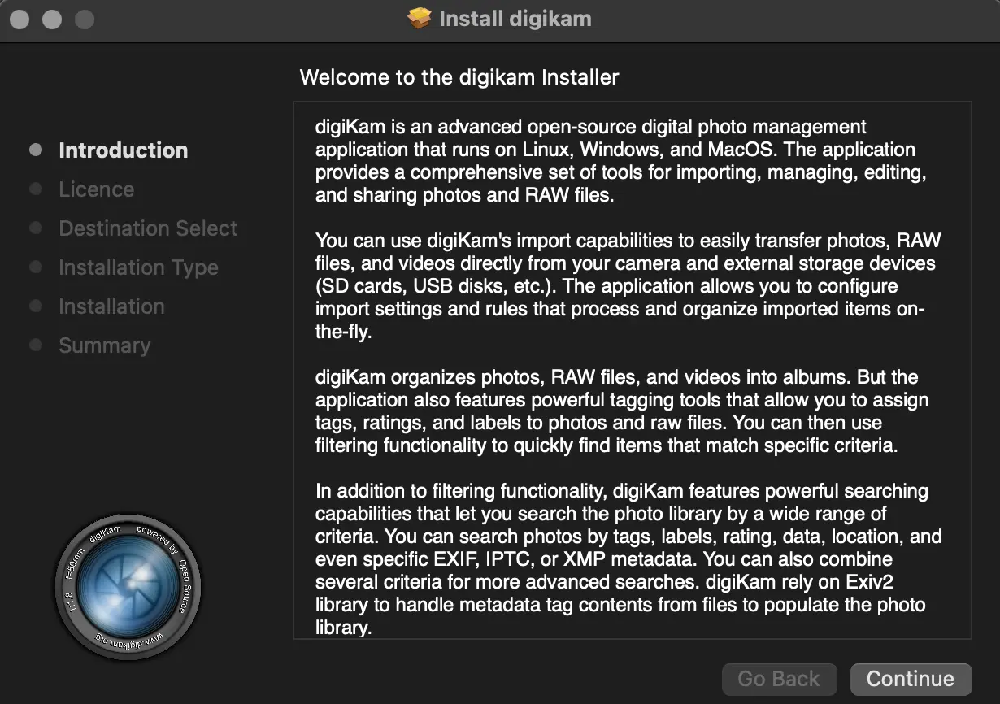

    The digiKam macOS PKG is running and Ready to Install

Application Permissions
~~~~~~~~~~~~~~~~~~~~~~~

Once installed, digiKam will need to access some system resources to run properly. The system will ask for permissions when digiKam is run, depending on actions performed by user. See below for some examples of permissions that may need to be set in the macOS **Security and Privacy** policy configuration panel:

- **Automation**: You must allow digiKam to control Apple's Finder app when you try to open an album in the Finder file manager through digiKam.

+----------------------------------------------------------------+-----------------------------------------------------------------+
|    .. figure:: images/macos_legacy_privacy_automation.webp     |    .. figure:: images/macos_ventura_privacy_automation.webp     |
|       :width: 250px                                            |       :width: 250px                                             |
|       :alt:                                                    |       :alt:                                                     |
|       :align: center                                           |       :align: center                                            |
+----------------------------------------------------------------+-----------------------------------------------------------------+
|       The prior and later Ventura macOS Security and Privacy Panel with the Automation Permissions                               |
+----------------------------------------------------------------+-----------------------------------------------------------------+

- **Accessibility**: You must allow digiKam to control your computer if you want to change the desktop wallpaper with digiKam.

+----------------------------------------------------------------+-----------------------------------------------------------------+
|    .. figure:: images/macos_legacy_privacy_accessibility.webp  |    .. figure:: images/macos_ventura_privacy_accessibility.webp  |
|       :width: 250px                                            |       :width: 250px                                             |
|       :alt:                                                    |       :alt:                                                     |
|       :align: center                                           |       :align: center                                            |
+----------------------------------------------------------------+-----------------------------------------------------------------+
|       The prior and later Ventura macOS Security and Privacy Panel with the Accessibility Permissions                            |
+----------------------------------------------------------------+-----------------------------------------------------------------+

- **Full Disk**: You must allow digiKam to access files and folders outside the Photos directory, if you place your collections elsewhere on your computer. Also, full disk acess allow digiKam to access data from other applications if you use the gPhoto2 driver to communicate with your camera for example.

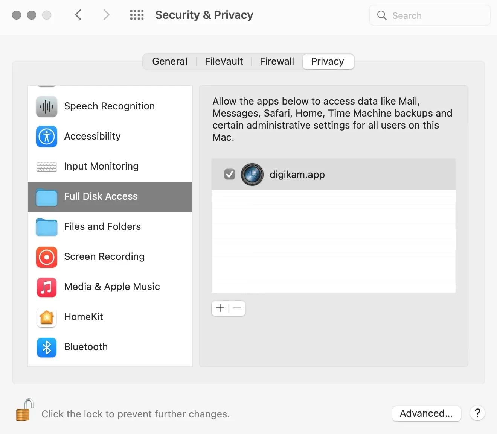

    The macOS Security and Privacy Panel with the Full Disk Access Permissions

- **Photos**: You must allow digiKam to access your photos if you want digiKam to include the Apple Photos collection in your personal account.

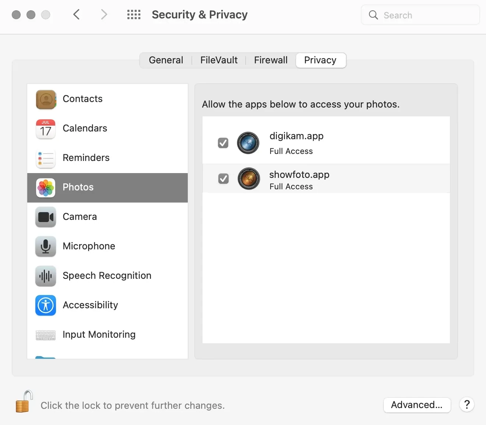

    The macOS Security and Privacy Panel with the Photos Access Permissions

.. note::

    When digiKam is first run, if you point your collection to the standard Apple Photo library, MacOS will automatically ask you to grant access to the library.

    .. figure:: images/macos_legacy_grant_access_photos.webp
        :width: 250px
        :alt:
        :align: center

        The macOS dialog to grant access to Apple Photo library

GateKeeper Rules from macOS Ventura and Later
~~~~~~~~~~~~~~~~~~~~~~~~~~~~~~~~~~~~~~~~~~~~~

When the **PKG** file is downloaded, and the installer is started, Apple Gatekeeper will display a security warning because the package is not signed.

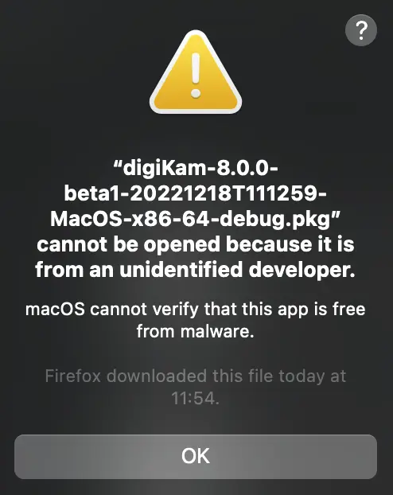

    The macOS Warning When you Try to Run the digiKam Installer after Downloading

You need to allow the installer to run by clicking on **Open Anyway** in the macOS **System Settings/Security and Privacy** dialog (scroll down to see the **Security** section).

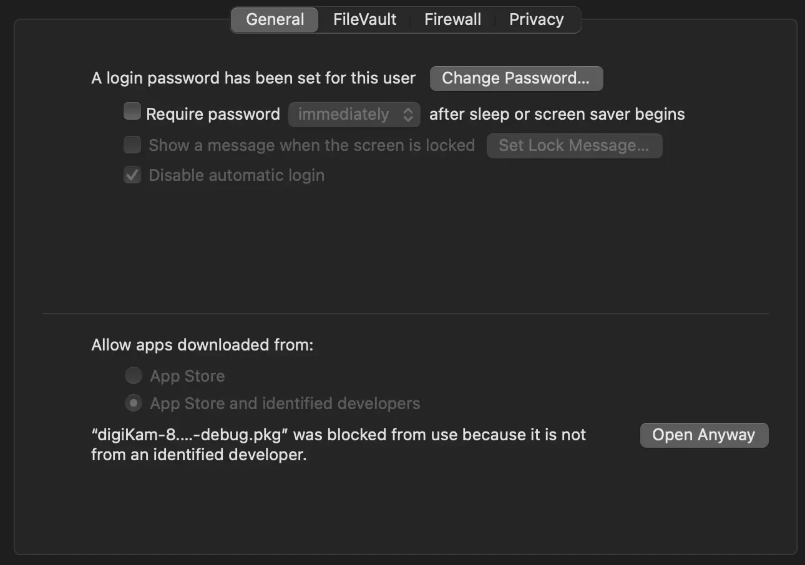

    The macOS Security Panel to Authorize digiKam PKG Installation

Once the installer is running, follow the instructions from the assistant to install digiKam onto your computer.

    The digiKam macOS PKG is running and Ready to Install

Application Permissions from macOS Ventura and Later
~~~~~~~~~~~~~~~~~~~~~~~~~~~~~~~~~~~~~~~~~~~~~~~~~~~~

Once installed, digiKam will need to access some system resources to run properly. The system will ask for permissions when digiKam is run, depending on actions performed by user. See below for some examples of permissions that may need to be set in the macOS **Security and Privacy** policy configuration panel:

- **Automation**: You must allow digiKam to control Apple's Finder app when you try to open an album in the Finder file manager through digiKam.

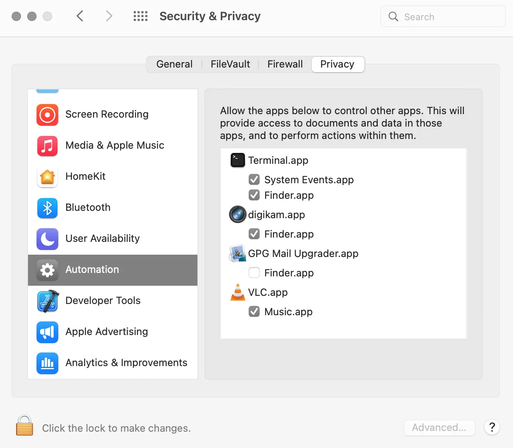

    The macOS Security and Privacy Panel with the Automation Permissions

- **Accessibility**: You must allow digiKam to control your computer if you want to change the desktop wallpaper with digiKam.

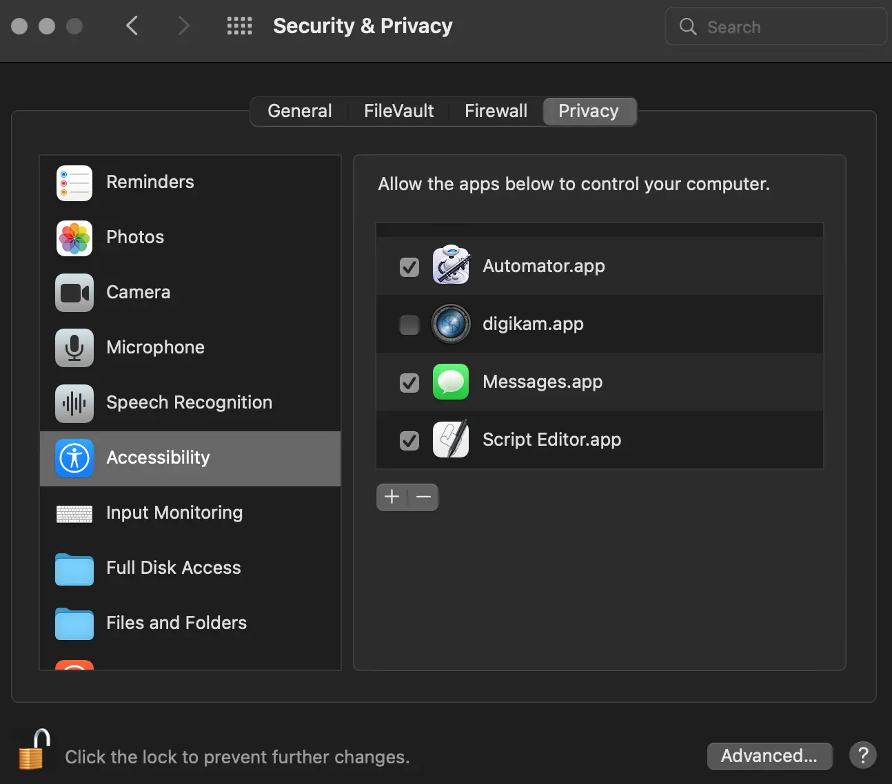

    The macOS Security and Privacy Panel with the Accessibility Permissions

- **Files And Folders**: You must allow digiKam to access files and folders outside the Photos directory, if you place your collections elsewhere on your computer.

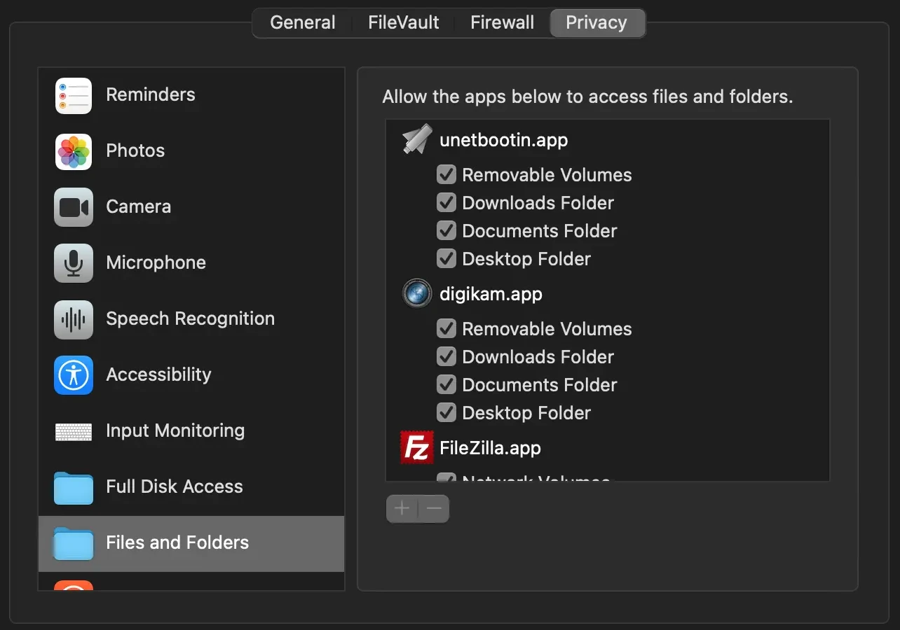

    The macOS Security and Privacy Panel with the Files and Folders Access Rights

- **Full Disk**: You must allow digiKam to access data from other applications if you use the gPhoto2 driver to communicate with your camera.

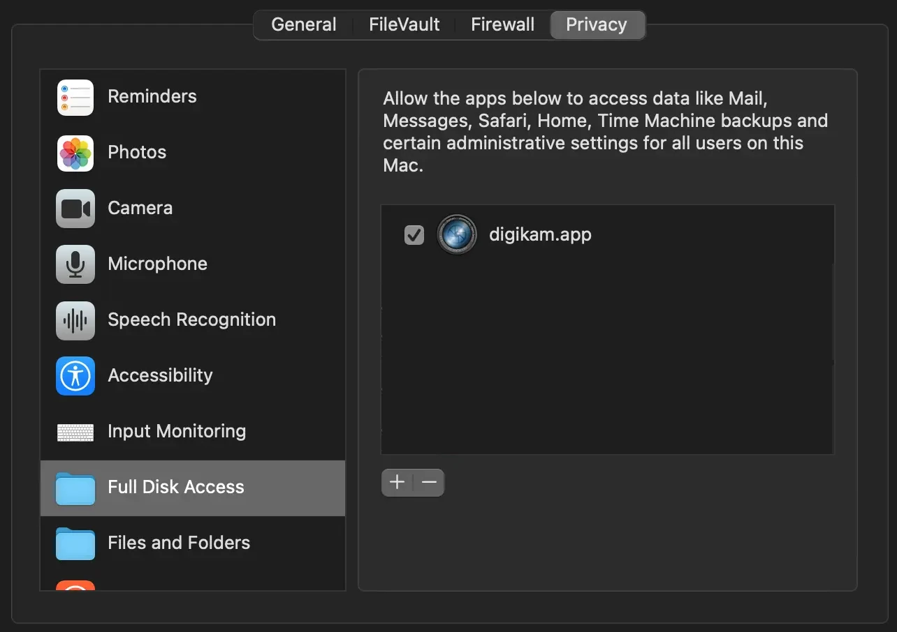

    The macOS Security and Privacy Panel with the Full Disk Access Permissions

- **Photos**: You must allow digiKam to access your photos if you want digiKam to include the Apple Photos collection in your personal account.

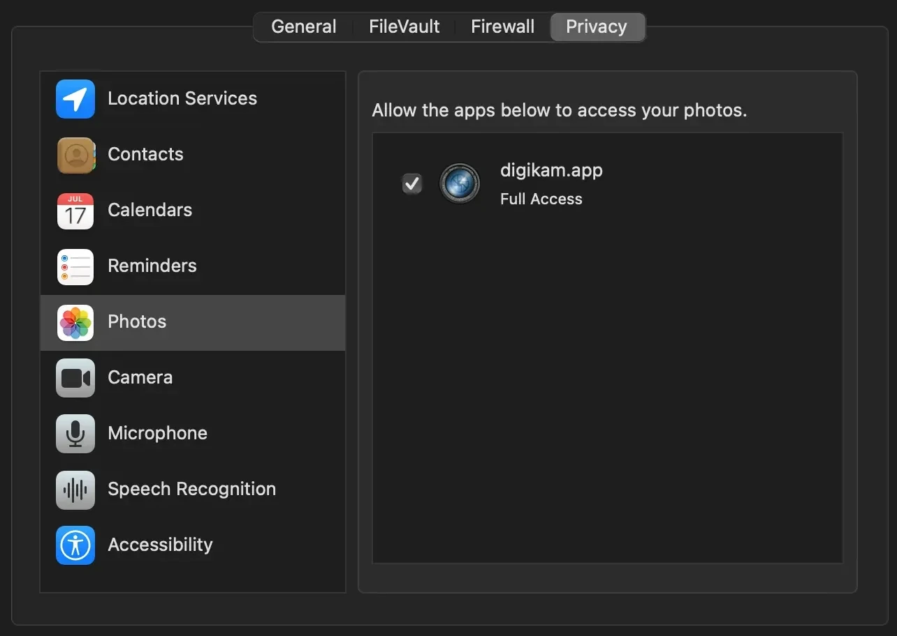

    The macOS Security and Privacy Panel with the Photos Access Permissions

.. note::

    When digiKam is first run, if you point your collection to the standard Apple Photo library, MacOS will automatically ask you to grant access to the library.

    .. figure:: images/macos_grant_access_photos.webp
        :width: 250px
        :alt:
        :align: center

        The macOS dialog to grant access to Apple Photo library

.. _configuration_files:

Configuration Files
-------------------

**digiKam**'s application-wide persistent settings are stored in the following locations, depending on your platform.

* **General settings** for mostly all the application configuration. Delete this file and restart digiKam to reset the application to *factory* settings
    - Linux:   :file:`~/.config/digikamrc`
    - Windows: :file:`%LocalAppData%\\digikamrc`
    - macOS:   :file:`~/Library/Preferences/digikamrc`

* **System settings** for the application refering to the all configuration available from *Setup/Miscs/System* dialog page. Delete this file and restart digiKam to reset the application to *factory* settings
    - Linux:   :file:`~/.config/digikam_systemrc`
    - Windows: :file:`%LocalAppData%\\digikam_systemrc`
    - macOS:   :file:`~/Library/Preferences/digikam_systemrc`

* **Cache location** storing temporary files
    - Linux:   :file:`~/.cache/digikam`
    - Windows: :file:`%LocalAppData%\\digikam`
    - macOS:   :file:`~/Library/Caches/digikam`

* Contains **internal configuration files** and downloaded deep-learning models
    - Linux:   :file:`~/.local/share/digikam`
    - Windows: :file:`%AppData%\\digikam`
    - macOS:   :file:`~/Library/Application Support/digikam`

* Contains **UI configuration** eg. the toolbar contents and positions. If your UI is broken, delete this file
    - Linux:   :file:`~/.local/share/kxmlgui5/digikam/digikamui5.rc`
    - Windows: :file:`%LocalAppData%\\kxmlgui5\digikam\\digikamui5.rc`
    - macOS:   :file:`~/Library/Application Support/digikam/kxmlgui5/digikam/digikamui5.rc`

Similar to digiKam, the :ref:`Showfoto stand Alone Image Editor <showfoto_editor>` also has persistent settings stored at the following locations:

* **General settings** for mostly all the application configuration. Delete this file and restart digiKam to reset the application to *factory* settings
    - Linux:   :file:`~/.config/showfotorc`
    - Windows: :file:`%LocalAppData%\\showfotorc`
    - macOS:   :file:`~/Library/Preferences/showfotorc`

* **System settings** for the application refering to the all configuration available from *Setup/Miscs/System* dialog page. Delete this file and restart digiKam to reset the application to *factory* settings
    - Linux:   :file:`~/.config/showfoto_systemrc`
    - Windows: :file:`%LocalAppData%\\showfoto_systemrc`
    - macOS:   :file:`~/Library/Preferences/showfoto_systemrc`

* **Cache location** storing temporary files
    - Linux:   :file:`~/.cache/showfoto`
    - Windows: :file:`%LocalAppData%\\showfoto`
    - macOS:   :file:`~/Library/Caches/showfoto`

* Contains **internal configuration files** and downloaded deep-learning models
    - Linux:   :file:`~/.local/share/showfoto`
    - Windows: :file:`%AppData%\\showfoto`
    - macOS:   :file:`~/Library/Application Support/showfoto`

* Contains **UI configuration** eg. the toolbar contents and positions. If your UI is broken, delete this file
    - Linux:   :file:`~/.local/share/kxmlgui5/showfoto/showfoto ui5.rc`
    - Windows: :file:`%LocalAppData%\\kxmlgui5\showfoto\\showfotoui5.rc`
    - macOS:   :file:`~/Library/Application Support/showfoto/kxmlgui5/showfoto/showfotoui5.rc`

.. note::

    The character '**~**' indicates the home directory on the system of the current user.

Application Updates
-------------------

.. important::

    If you update digiKam to a new major version, for example from version 7 to version 8, we recommend you first backup :ref:`your database files <database_intro>`, since the internal schema may have changed. Typically, digiKam is able to migrate tables from an older version to a new one, and all of this is done automatically at startup. But it's always better to save these important files before upgrading the application. See the :ref:`Database Backup <database_backup>` section in this manual for more recommendations.

If you use a bundle such as the official Linux AppImage, macOS package, or Windows installer, the application can be updated using the :menuselection:`Help --> Check For New Version menu entry`. See the updates settings :ref:`on the Behavior page <behavior_settings>` of the configuration dialog.

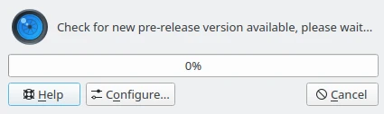

    The Dialog to Update Application Using Online Weekly Builds
