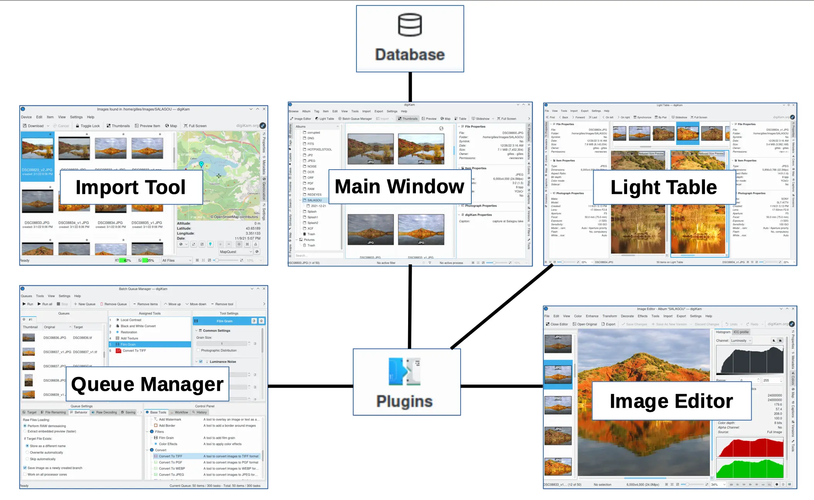

.. meta::
   :description: Introduction to the digiKam Photo Management Program
   :keywords: digiKam, documentation, user manual, photo management, open source, free, learn, easy

.. metadata-placeholder

   :authors: - digiKam Team

   :license: see Credits and License page for details (https://docs.digikam.org/en/credits_license.html)

.. _application_intro:

:ref:`Introduction <getting_started>`
=====================================

.. contents::

Background
----------

**digiKam** is an advanced digital photo management application for Linux, macOS and Windows desktop. It provides a simple interface which makes importing and organizing digital photographs a *snap*. digiKam enables you to manage large numbers of digital photographs in Albums, organizing these photographs for easy retrieval using tags (keywords), captions, collections, dates, geolocation. It has many features for searching, viewing, organizing, processing and sharing your images. Thus, digiKam is a formidable :ref:`Digital Asset Management <asset_management>` (DAM) program that also includes powerful image editing functions.

The **Import Tool** is an easy-to-use camera interface that will connect to your digital camera and download photographs directly into digiKam Albums. `More than 2000 digital cameras <http://www.gphoto.org/proj/libgphoto2/support.php>`_ are supported by the gPhoto library. Of course, any media or card reader supported by your operating system will also interface with digiKam.

digiKam incorporates a fast **Image Editor** with many image editing tools. You can use the Image Editor to view your photographs, comment and rate them, correct, enhance and alter them. The **Batch Queue Manager** can easily post process images using a variety of tools. And there are many import and export tools dedicated to working with remote web services.

The **Light Table** allows you to visually compare images side by side, making it easy to select the best shots taken from a series.

    The digiKam Architecture

While digiKam remains easy to use, it provides dozens of professional level features. All digiKam tools are fully 16-bit enabled. digiKam also supports RAW format conversion through libraw, DNG export and an ICC color management :ref:`work flow <rawprocessing_workflow>`.

Support
-------

digiKam is a community supported project, which means that users and developers support one another. If you become a regular user of digiKam you are encouraged to join the digiKam Users Mailing List. You can start off by asking questions to other digiKam users and hopefully soon you will be answering the support questions of others.

See the `digiKam Users Mailing List joining instructions <https://mail.kde.org/mailman/listinfo/digikam-users>`_ for details.

You can also visit the `digiKam Home Page <https://www.digikam.org/>`_ for news of new releases and other digiKam related information.

.. _privacy_policy:

Privacy Policy
--------------

We Respect your Works
~~~~~~~~~~~~~~~~~~~~~

**digiKam respects your privacy and is fully committed to protecting your personal data:**

- **No Telemetry:** The application does **not** include any tracking, analytics, or telemetry features.
- **No Data Sharing:** We **do not** collect, store, or transmit any of your personal data over the Internet.
- **Local Data Storage:** All your photos, metadata, and settings remain **exclusively on your device**.

Plugins and External Services
~~~~~~~~~~~~~~~~~~~~~~~~~~~~~

Some optional plugins or modules (e.g., for exporting to remote web services) may require an Internet connection to function. If you choose to use these features, we recommend reviewing the privacy policies of the third-party services involved, as digiKam has no control over their data practices.

Application Compliance
~~~~~~~~~~~~~~~~~~~~~~

digiKam is designed to be **`GDPR-compliant<https://en.wikipedia.org/wiki/General_Data_Protection_Regulation>`_**. As an open-source project, we prioritize transparency, user control, and the protection of personal data.

Your Rights
~~~~~~~~~~~

You retain **full ownership and control** of your data at all times.

.. figure:: images/privacy_policy.webp
    :width:
    :alt:
    :align: left
